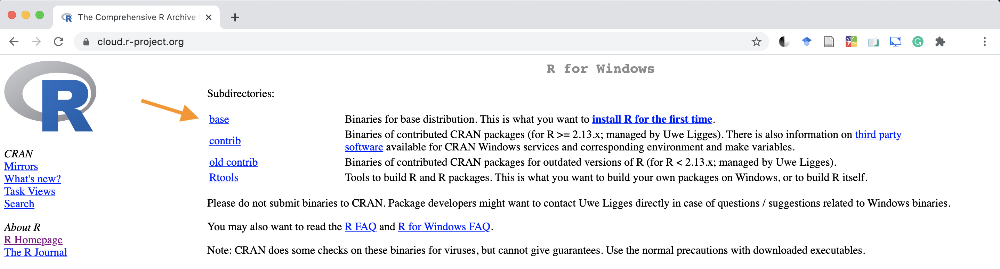
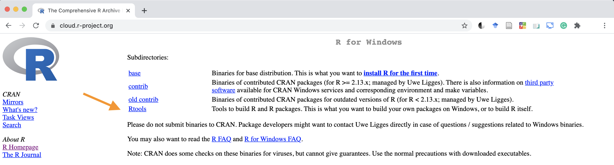
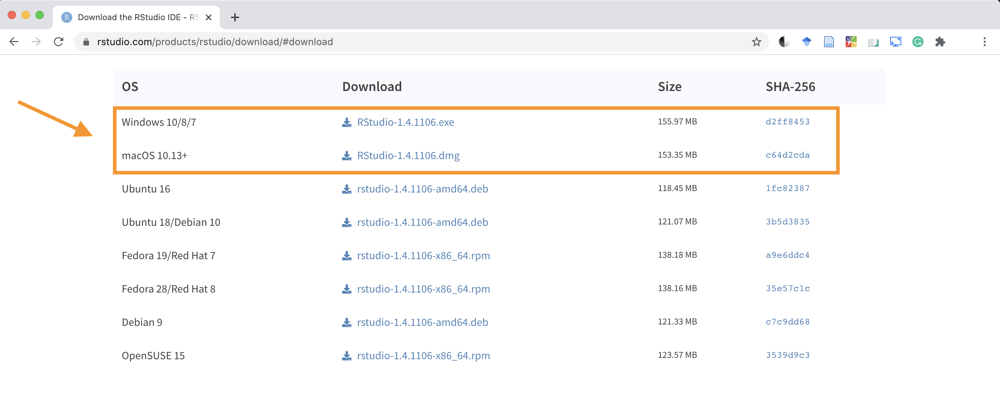

# Installare R e RStudio {#install}

R ed RStudio sono due software distinti. R è un linguaggio di programmazione usato in particolare in ambiti quali la statistica. RStudio invece è un'interfaccia *user-friendly* che permette di utilizzare R.
R può essere utilizzato autonomamente tuttavia è consigliato l'utilizzo attraverso RStudio. Entrambi vanno installati separatamente e la procedura varia a seconda del proprio sistema operativo (Windows, MacOS o Linux). Riportiamo le istruzioni solo per Windows, MacOS e Linux (Ubuntu). Ovviamente R è disponibile per tutte le principali distribuzioni di Linux. Le istruzioni riportate per Ubuntu (la distribuzione più diffusa) sono valide anche per le distribuzioni derivate.

## Installare R {#install-r}

1. Accedere al sito https://www.r-project.org.
2. Selezionare la voce **CRAN** (Comprehensive R Archive Network) dal menù di sinistra sotto **Download**.

{ width=95% }

 

3. Selezionare il primo link https://cloud.r-project.org.

{ width=95% }

 
    
4. Selezionare il proprio sistema operativo.

{ width=95% }

 

### R Windows

1. Selezionare la voce **base**.

{ width=95% }

 
  
2. Selezionare la voce **Download** della versione più recente di R disponibile.

{ width=95% }

 

3. Al termine del download, eseguire il file e seguire le istruzioni fino al termine dell'installazione.

### R MacOS

1. Selezionare la versione più recente di R disponibile .

{ width=95% }

 

2. Al termine del download, eseguire il file e seguire le istruzioni fino al termine dell'installazione di R.
3. Successivamente è necessario installare anche una componente aggiuntiva **XQuartz** premendo il link all'interno del riquadro arancione riportato nella figura precedente.
4. Selezionare la voce **Download**.

{ width=95% }

 

5. Al termine del download, eseguire il file e seguire le istruzioni fino al termine dell'installazione.

### R Linux

Nonostante la semplicità di installazione di pacchetti su Linux, R a volte potrebbe essere più complicato da installare per via delle diverse distribuzioni, repository e chiavi per riconoscere la repository come sicura.

Sul **CRAN** vi è la guida ufficiale con tutti i comandi `apt` da eseguire da terminale. Seguendo questi passaggi non dovrebbero esserci problemi.

1. Andate sul [CRAN](https://cran.r-project.org/).
2. Cliccate **Download R for Linux**.
3. Selezionate la vostra distribuzione (Ubuntu in questo caso).
4. Seguite le istruzioni, principalmente eseguendo i comandi da terminale suggeriti.

Per qualsiasi difficoltà o errore, sopratutto con il mondo Linux, una ricerca su online risolve sempre il problema.

 

:::{.design title="R Tools" data-latex="[R Tools]"}
Utilizzi avanzati di R richiedono l'istallazione di una serie ulteriore software definiti **R tools**.

#### Windows {-}

Seleziona la voce **RTools** e segui le istruzioni per completare l'installazione.
 

{ width=95% }

 
Nota che sono richieste anche delle operazioni di configurazione affinché tutto funzioni correttamente.

#### MacOS {-}

Seleziona la voce **tools** e segui le istruzioni riportate.

 

{ width=95% }

 
Nota in particolare che con R 4.0 le seguenti indicazioni sono riportate.

 

{ width=95% }

:::

## Installare R Studio

1. Accedere al sito https://rstudio.com.
2. Selezionare la voce **DOWNLOAD IT NOW**.

{ width=95% }

 

3. Selezionare la versione gratuita di RStudio Desktop.

{ width=95% }

 

4. Selezionare la versione corretta a seconda del proprio sistema operativo.

{ width=95% }

 

5. Al termine del download, eseguire il file e seguire le istruzioni fino al termine dell'installazione.

### R Studio in Linux

In questo caso, come su Windows e MacOS l'installazione consiste nello scaricare ed eseguire il file corretto, in base alla distribuzione (ad esempio `.deb` per Ubuntu e derivate). Importante, nel caso di Ubuntu (ma dovrebbe valere anche per le altre distribuzioni) anche versioni successive a quella indicata (es. Ubuntu 16) sono perfettamente compatibili.
