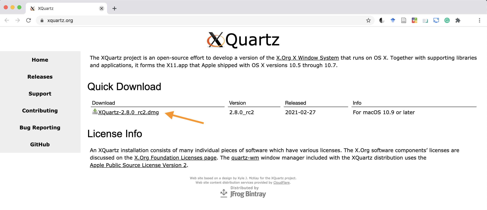
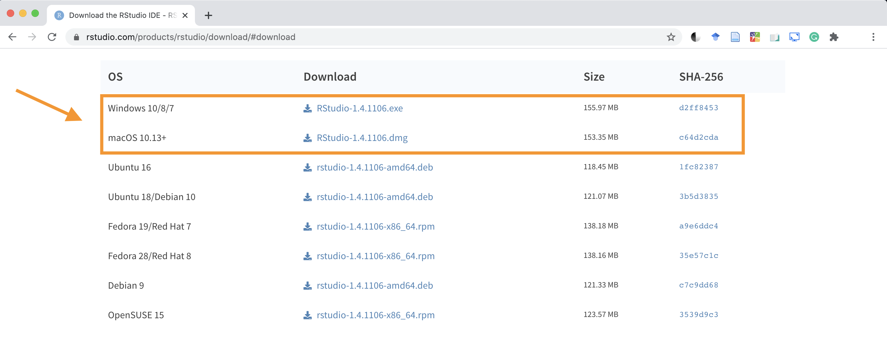

# Installare R e RStudio {#install}

R ed R-studio sono due software distinti. R è un linguaggio di programmazione usato in particolare in ambiti quali la statistica. R-studio invece è un'interfaccia *user-friendly* che permette di utilizzare R.
R può essere utilizzato autonomamente tuttavia è consigliato l'utilizzo attraverso R-studio. Entrambi vanno installati separatamente e la procedura varia a seconda del proprio sistema operativo (Windows, MacOS o Linux). Riportiamo le istruzioni solo per Windows e MacOS. Chi utilizza Linux sicuramente è autonomo nell'installazione di questi due semplici programmi.

## Installare R

1. Accedere al sito https://www.r-project.org
2. Selezionare la voce **CRAN** (Comprehensive R Archive Network) dal menù di sinistra sotto **Download**

{ width=95% }

 

3. Selezionare il primo link https://cloud.r-project.org/

{ width=95% }

 
    
4. Selezionare il proprio sistema operativo

{ width=95% }

 

### R Windows

1. Selezionare la voce **base**

{ width=95% }

 
  
2. Selezionare la voce **Download** della versione più recente di R disponibile

{ width=95% }

 

3. Al termine del download, eseguire il file e seguire le istruzioni fino al termine dell'installazione

### R MacOS

1. Selezionare della versione più recente di R disponibile 

{ width=95% }

 

2. Al termine del download, eseguire il file e seguire le istruzioni fino al termine dell'installazione di R
3. Successivamente è necessario installare anche una componente aggiuntiva **XQuartz** premendo il link all'interno del riquadro arancione riportato nella figura precedente
4. Selezionare la voce Download

{ width=95% }

 

5. Al termine del download, eseguire il file e seguire le istruzioni fino al termine dell'installazione

 

:::{.design title="R Tools" data-latex="[R Tools]"}
Utilizzi avanzati di R richiedono l'insallazione di una serie ulteriore software definiti **R tools**.

#### Windows{-}

Seleziona la voce **Rtools** e segui le istruzioni per completare l'installazione.
 

{ width=95% }

 
Nota che sono richieste anche delle operazioni di configurazione affinchè tutto funzioni correttamente.

#### MacOS{-}

Seleziona la voce **tools** e segui le istruzioni riportate.

 

{ width=95% }

 
Nota in particolare che con R 4.0 le seguenti indicazioni sono riportate.

 

{ width=95% }

:::

## Installare R Studio

1. Accedere al sito https://rstudio.com
2. Selezionare la voce **DOWNLOAD IT NOW**

{ width=95% }

 

3. Selezionare la versione gratuita di RStudio Desktop

{ width=95% }

 

4. Selezionare la versione corretta a seconda del proprio sistema operativo

{ width=95% }

 

5. Al termine del download, eseguire il file e seguire le istruzioni fino al termine dell'installazione

