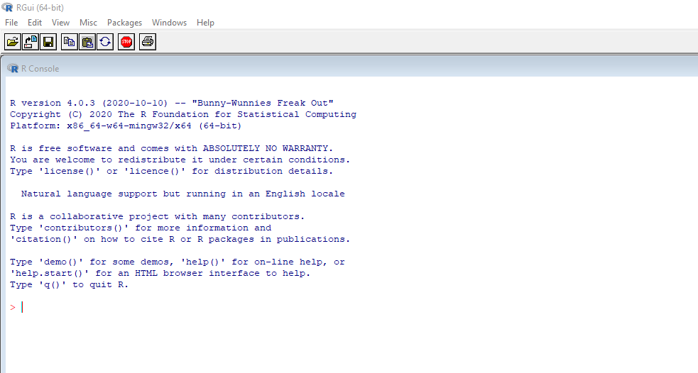

# Primi Passi in R {#first-commands}


```{r settings, echo = FALSE}
knitr::opts_chunk$set(
  echo = FALSE,
  cache = TRUE,
  fig.align="center"
)
```

In questo capitolo muoveremo i primi passi in R. Inizialmente verrà presentata l'interfaccia utente di RStudio. Successivamente, vedremo come eseguire operazioni matematiche (e logiche) in R. Introdurremo infine l'uso delle variabili e delle funzioni in R. 

Imparare R è un lungo percorso (scoop: questo percorso non termina mai dato che R è sempre in continua evoluzione). Soprattutto all'inizio può sembrare eccessivamente difficile poichè è si incontrano per la prima volta molti comandi e concetti di programmazione. Tuttavia, una volta famigliarizzato con i gli apetti di base, la progressione diventa sempre più veloce (inarrestabile direi!).

In questo capitolo introdurremo per la prima volta molti elementi che saranno poi ripresi e approfonditi nei seguenti capitoli. Quindi non preoccuparti se non tutto ti sarà chiaro fin da subito. Imparare il tuo primo linguaggio di programmazione è difficile ma da qualche parte bisogna pure iniziare. Pronto per le tue prime linee di codice? Let's become a useR!

## Interfaccia di RStudio

Come abbiamo visto nel Capitolo \@ref(install), R è il vero "motore computazionale" che ci permette di compiere tutte le operazioni di calcolo, analisi statistiche e magie varie. Tuttavia l'interfaccia di base di R, definita **Console** (vedi Figura \@ref(fig:r-console)), è per così dire *démodé* o meglio solo per veri intenditori.

```{r r-console, fig.cap="La console di R, solo per veri intenditori", out.width="85%"}

```


### Script: Il tuo Blocco Appunti
### Console: Il Cuore di R
### Environment e History: L'Ambiente di Lavoro
### File, Plots, Package, Help: System Management

#### approfondimento personalizzazione layout e theme

## Primi Comandi

### Operatori Matematici

### Operatori Logici

#### approfondimento operatore `%in%`

## Creazione di Variabili

concetto di variabile e assegnare i valori

#### approfondimento diversi modi di "assegnare un valore" (`<-`, `=`, `assign()`)

## Utilizzo di funzioni                                                             

###


