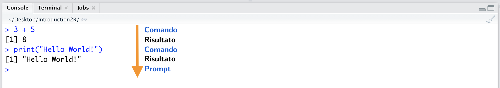
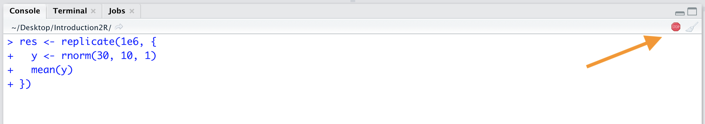

# Primi Passi in R {#first-comands}


```{r settings, echo = FALSE}
knitr::opts_chunk$set(
  echo = FALSE,
  cache = TRUE,
  fig.align="center"
)
```

In questo capitolo muoveremo i primi passi in R. Inizialmente verrà presentata l'interfaccia utente di RStudio. Successivamente, vedremo come eseguire operazioni matematiche (e logiche) in R. Introdurremo infine l'uso delle variabili e delle funzioni in R. 

Imparare R è un lungo percorso (scoop: questo percorso non termina mai dato che R è sempre in continua evoluzione). Soprattutto all'inizio può sembrare eccessivamente difficile poichè è si incontrano per la prima volta molti comandi e concetti di programmazione. Tuttavia, una volta famigliarizzato con i gli apetti di base, la progressione diventa sempre più veloce (inarrestabile direi!).

In questo capitolo introdurremo per la prima volta molti elementi che saranno poi ripresi e approfonditi nei seguenti capitoli. Quindi non preoccuparti se non tutto ti sarà chiaro fin da subito. Imparare il tuo primo linguaggio di programmazione è difficile ma da qualche parte bisogna pure iniziare. Pronto per le tue prime linee di codice? Let's become a useR!

## Interfaccia di RStudio

Come abbiamo visto nel Capitolo \@ref(install), R è il vero "motore computazionale" che ci permette di compiere tutte le operazioni di calcolo, analisi statistiche e magie varie. Tuttavia l'interfaccia di base di R, definita **Console** (vedi Figura \@ref(fig:r-console)), è per così dire *démodé* o meglio, solo per veri intenditori.

```{r r-console, fig.cap="La console di R, solo per veri intenditori", out.width="85%"}
knitr::include_graphics("images/r-console.png")
```

In genere, per lavorare con R viene utilizzato RStudio. RStudio è un programma (IDE - Integrated Development Environment) che integra in un unica interfaccia utente (GUI - Graphical User Interface) diversi strumenti utili per la scrittura ed esecuzione di codici. L'interfaccia di RStudio è costituita da 4 pannelli principali (vedi Figura \@ref(fig:rstudio-gui)):

```{r rstudio-gui, fig.cap="Interfaccia utente di Rstudio con i suoi 4 pannelli", out.width="85%"}
knitr::include_graphics("images/rstudio-gui.png")
```

#### 1. Console: il cuore di R {-} 

Qui ritroviamo la *Console* di R dove vengono effetivemente eseguiti tutti i tuoi codici e comandi. Nota come nell'ulitma riga della console appaia il carattere `>`. Questo è definito *prompt* è ci indica che R in attesa di nuovi comandi da eseguire. 

La Console di R è un'interfaccia a linea di comando. A differenza di altri programmi "*punta e clicca*", in R è necessario digitare i comandi utilizzando la tastiera. Per eseguire dei comandi possiamo direttamnte scrivere nella console le operazioni da eseguire e premere *invio*. R eseguirà immediatamente i nostro comando, riporterà il risultato e nella linea successiva apparirà nuovamente il *prompt* indicando che R è pronto ad eseguire un altro comando (vedi Figura \@ref(fig:comand-sequence)).

```{r comand-sequence, fig.cap="Esecuzione di comandi direttamente nella console", out.width="95%"}

```

Nel caso di comandi scritti su più righe, vedi l'esempio di Figura \@ref(fig:multiple-line-comand), è possibile notare come venga mostrato il simbolo `+` come *prompt*. Questo indica che R è in attesa che l'intero comando venga digitato prima che esso venga eseguito.   

```{r multiple-line-comand, fig.cap="Esecuzione di un comando su più righe", out.width="95%"}
knitr::include_graphics("images/multiple-line-comand.png")
```

Come avrai notato facendo alcune prove, i comandi digitati nella Console vengono eseguiti immediatamente ma non sono salvati. Per rieseguire un comando, possiamo navigare tra quelli precedentementemente eseguiti usando le freccie della tastiera $\uparrow\downarrow$. Tuttavia, in caso di errori dovremmo riscrivere e rieseguire tutti i comandi. Siccome scrivere codici è un continuo "*try and error*", lavorare unicamente dalla Console diventa presto caotico. Abbiamo bisogno quindi di una soluzione che ci permetta di lavrorare più comodamente sui nostri codici e di poter salvare i nostri comandi da eseguire all'occorrenza con il giusto ordine. La soluzione sono gli *Scripts*.

:::{.tip title="Interrompere un comando" data-latex="[Interrompere un comando]"}
Potrebbe accadere che per qualche errore nel digitare un comando o perchè sono richiesti lunghi tempi computazionali, la console di R diventi non responsiva. In questo caso è necessario interrompere la scrittura o l'esecuzione di un comando. Vediamo due situazioni comuni:

1. *Continua a comparire il prompt* `+`. Specialmente nel caso di utilizzo di parentesi e lunghi comandi, accade che una volta premuto *invio* R non esegua alcun comando ma resta in attesa mostrando il *prompt* `+` (vedi Figure \@ref(fig:comand-esc)). Questo è in genere dato da un errore nella sintassi del comando (e.g., un errore nell'uso delle parentesi o delle virgole). Per riprendere la sessione è necessario premere il tasto `esc` della tastiera. L'apprire del  *prompt* `>`, indica che R è nuovamente in ascolto pronto per esequire un nuovo comando ma attento a non ripetere lo stesso errore, la sintassi dei comandi è importante (vedi Sezione TODO).

```{r comand-esc, fig.cap="Tipica condizione in cui R resta in attesaed il comando non viene eseguito- Premere *esc* per riprendere la sessione", out.width="95%"}
knitr::include_graphics("images/comand-esc.png")
```

2. *R non risponde*. Alcuni calcoli potrebbero richiedere molto tempo o semplicemnte un qualche problema ha mandato in loop la tua sessione di lavoro. In questa situazione la *Console* di R diventa non responsiva. Nel caso fosse necessario interrompere i processi attualmente in esecuzione devi premere il pulsante *STOP* come indicato in Figura \@ref(fig:console-stop). R si fermerà e  ritornerà in attesa di nuovi comandi (*prompt* `>`).

```{r console-stop, fig.cap="Premi il pulsante stop per interrompere l'attuale processo", out.width="95%"}

```
:::

:::{.trick title="Force Quit" data-latex="[Force Quit]"}
In alcuni casi estremi in cui R sembra non rispondere, usa i comandi `Ctrl-C` per forzare R a interrompere il processo in esecuzione. 

Come ultima soluzione ricorda uno dei principi base dell'informatica "*spegni e riaccendi*" (a volte potrebbe bastare chiudere e riaprire RStudio).
:::

#### 2. Source: il tuo blocco appunti {-} 

In questa parte vengono mostrati i tuoi *Scripts*. Questi non sono altro che dei documenti  i tuoi codici e comandi che desideri successivamente eseguire in R. Gli *Scripts* ti permetteranno di lavorare comodamente

dove puoi scrivere e modificare

#### 3. Environment e History: l'ambiente di lavoro {-}

#### 4. File, Plots, Package, Help: system management{-}

#### approfondimento personalizzazione layout e theme

## Primi Comandi

### Operatori Matematici

### Operatori Logici

#### approfondimento operatore `%in%`

## Creazione di Variabili

concetto di variabile e assegnare i valori

#### approfondimento diversi modi di "assegnare un valore" (`<-`, `=`, `assign()`)

## Utilizzo di funzioni                                                             

###


