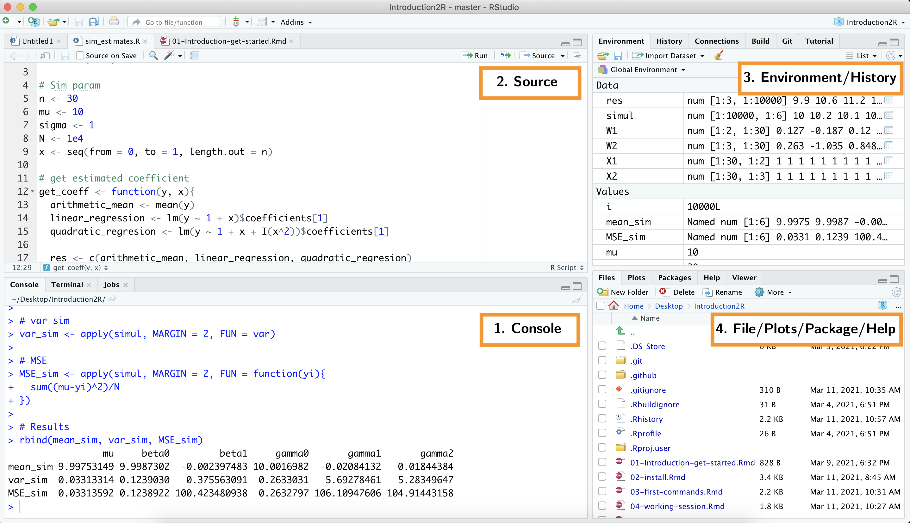
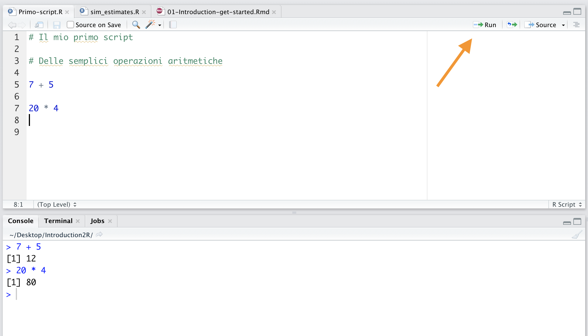
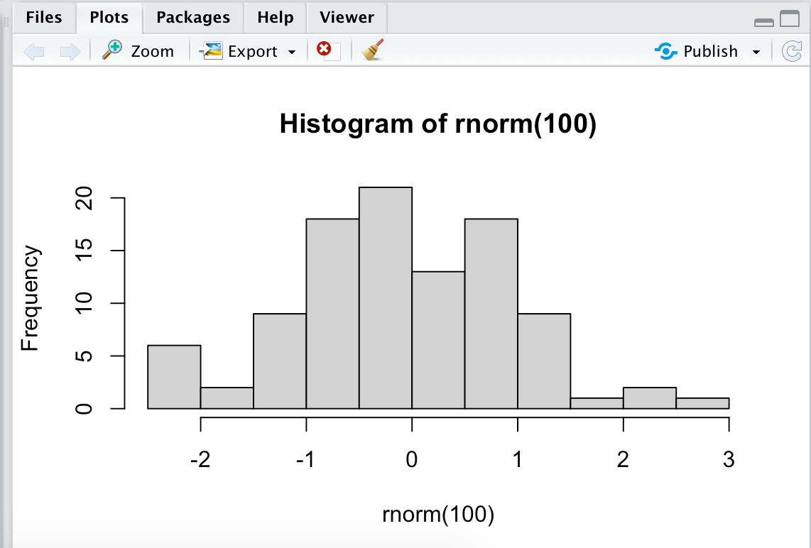
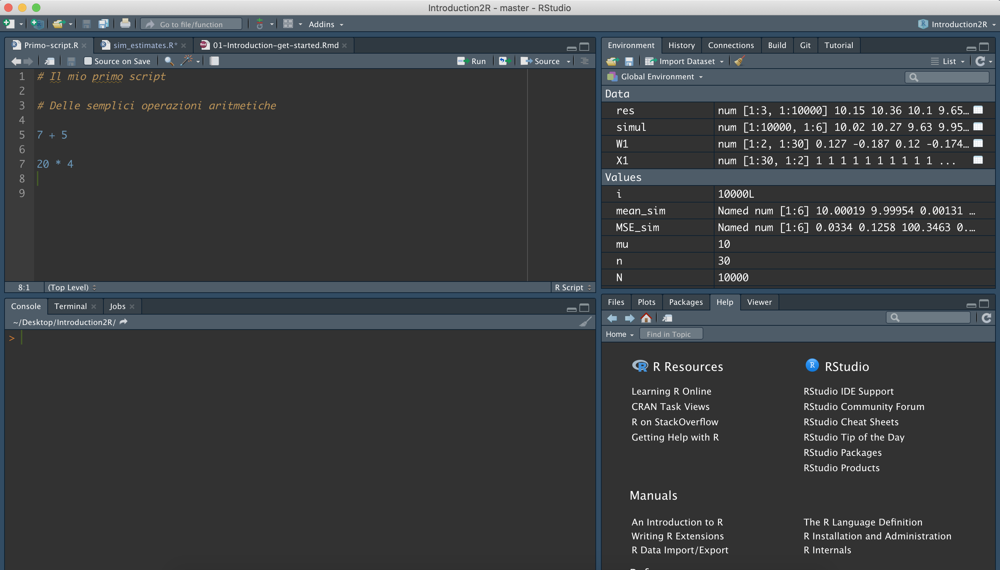

# Interfaccia RStudio {#rstudio-gui}


```{r settings, echo = FALSE}
knitr::opts_chunk$set(
  echo = FALSE,
  cache = TRUE,
  fig.align="center"
)
```

In questo capitolo presenteremo l'interfaccia utente di RStudio. Molti aspetti che introdurremo brevemente qui verranno discussi nei sucessivi capitoli. Adesso ci interessa solo famigliarizzare con l'interfaccia del nostro strumento di lavoro principale ovvero RStudio. 

Come abbiamo visto nel Capitolo \@ref(install), R è il vero "motore computazionale" che ci permette di compiere tutte le operazioni di calcolo, analisi statistiche e magie varie. Tuttavia l'interfaccia di base di R, definita **Console** (vedi Figura \@ref(fig:r-console)), è per così dire *démodé* o meglio, solo per veri intenditori.

```{r r-console, fig.cap="La console di R, solo per veri intenditori", out.width="85%"}
knitr::include_graphics("images/r-console.png")
```

In genere, per lavorare con R viene utilizzato RStudio. RStudio è un programma (IDE - Integrated Development Environment) che integra in un unica interfaccia utente (GUI - Graphical User Interface) diversi strumenti utili per la scrittura ed esecuzione di codici. L'interfaccia di RStudio è costituita da 4 pannelli principali (vedi Figura \@ref(fig:rstudio-gui)):

```{r rstudio-gui, fig.cap="Interfaccia utente di Rstudio con i suoi 4 pannelli", out.width="85%"}

```

#### 1. Console: il cuore di R {-}

Qui ritroviamo la *Console* di R dove vengono effetivemente eseguiti tutti i tuoi codici e comandi. Nota come nell'ulitma riga della *Console* appaia il carattere `>`. Questo è definito *prompt* è ci indica che R in attesa di nuovi comandi da eseguire.

La *Console* di R è un'interfaccia a linea di comando. A differenza di altri programmi "*punta e clicca*", in R è necessario digitare i comandi utilizzando la tastiera. Per eseguire dei comandi possiamo direttamnte scrivere nella *Console* le operazioni da eseguire e premere `invio`. R eseguirà immediatamente i nostro comando, riporterà il risultato e nella linea successiva apparirà nuovamente il *prompt* indicando che R è pronto ad eseguire un altro comando (vedi Figura \@ref(fig:comand-sequence)).

```{r comand-sequence, fig.cap="Esecuzione di comandi direttamente nella console", out.width="95%"}
knitr::include_graphics("images/comand-sequence.png")
```

Nel caso di comandi scritti su più righe, vedi l'esempio di Figura \@ref(fig:multiple-line-comand), è possibile notare come venga mostrato il simbolo `+` come *prompt*. Questo indica che R è in attesa che l'intero comando venga digitato prima che esso venga eseguito.

```{r multiple-line-comand, fig.cap="Esecuzione di un comando su più righe", out.width="95%"}
knitr::include_graphics("images/multiple-line-comand.png")
```

Come avrai notato facendo alcune prove, i comandi digitati nella *Console* vengono eseguiti immediatamente ma non sono salvati. Per rieseguire un comando, possiamo navigare tra quelli precedentementemente eseguiti usando le freccie della tastiera $\uparrow\downarrow$. Tuttavia, in caso di errori dovremmo riscrivere e rieseguire tutti i comandi. Siccome scrivere codici è un continuo "*try and error*", lavorare unicamente dalla *Console* diventa presto caotico. Abbiamo bisogno quindi di una soluzione che ci permetta di lavrorare più comodamente sui nostri codici e di poter salvare i nostri comandi da eseguire all'occorrenza con il giusto ordine. La soluzione sono gli *Scripts* che introdurremo vedremo nella prossima sezione.

:::{.tip title="Interrompere un comando" data-latex="[Interrompere un comando]"}
Potrebbe accadere che per qualche errore nel digitare un comando o perchè sono richiesti lunghi tempi computazionali, la *Console* di R diventi non responsiva. In questo caso è necessario interrompere la scrittura o l'esecuzione di un comando. Vediamo due situazioni comuni:

1. **Continua a comparire il prompt** `+`. Specialmente nel caso di utilizzo di parentesi e lunghi comandi, accade che una volta premuto `invio` R non esegua alcun comando ma resta in attesa mostrando il *prompt* `+` (vedi Figure seguente). Questo è in genere dato da un errore nella sintassi del comando (e.g., un errore nell'uso delle parentesi o delle virgole). Per riprendere la sessione è necessario premere il tasto `esc` della tastiera. L'apprire del  *prompt* `>`, indica che R è nuovamente in ascolto pronto per esequire un nuovo comando ma attento a non ripetere lo stesso errore, la sintassi dei comandi è importante (vedi Capitolo TODO).

```{r my-label, out.width="95%"}
# fig.cap="Tipica condizione in cui R resta in attesa ed il comando non viene eseguito - Premere esc per riprendere la sessione"

# LaTeX do not support figure in minipage so no add label
knitr::include_graphics("images/comand-esc.png")
```

2. **R non risponde**. Alcuni calcoli potrebbero richiedere molto tempo o semplicemnte un qualche problema ha mandato in loop la tua sessione di lavoro. In questa situazione la *Console* di R diventa non responsiva. Nel caso fosse necessario interrompere i processi attualmente in esecuzione devi premere il pulsante *STOP* come indicato nella Figura seguente. R si fermerà e  ritornerà in attesa di nuovi comandi (*prompt* `>`).

```{r console-stop, out.width="95%"}
# fig.cap="Premi il pulsante stop per interrompere l'attuale processo"

# LaTeX do not support figure in minipage so no add label
knitr::include_graphics("images/console-stop.png")
```

:::

:::{.trick title="Force Quit" data-latex="[Force Quit]"}
In alcuni casi estremi in cui R sembra non rispondere, usa i comandi `Ctrl-C` per forzare R a interrompere il processo in esecuzione.

Come ultima soluzione ricorda uno dei principi base dell'informatica "*spegni e riaccendi*" (a volte potrebbe bastare chiudere e riaprire RStudio).
:::

#### 2. Source: il tuo blocco appunti {-}

In questa parte vengono mostrati i tuoi *Scripts*. Questi non sono altro che degli speciali documenti (con estensione "**.R**") in cui sono salvati i tuoi codici e comandi che potrai eseguire quando necessario in R. Gli *Scripts* ti permetteranno di lavorare comodamente sui tuoi codici, scrivere i comandi, corregerli, organizzarli, aggiungere dei commenti e soprattutto salvarli.

Dopo aver terminato di scrivere i comandi, posiziona il cursore sulla stessa linea del comando che desideri eseguire e premi `command + invio` (MacOs) o `Ctrl+R` (Windows). Automaticamente il comando verà copiato nella *Console* ed eseguito. In alternativa potrai premere il tasto **Run**  indicato dalla freccia in Figura \@ref(fig:script-run).

```{r script-run, fig.cap="Esecuzione di un comando da script premi `command + invio` (MacOs)/ `Ctrl+R` (Windows) o premi il tasto indicato dalla freccia", out.width="95%"}

```

:::{.tip title="Commenti" data-latex="[Commenti]"}
Se hai guardato con attenzione lo script rappresentato in Figura \@ref(fig:script-run), potresti aver notato delle righe di testo verde precedute dal simbolo `#`. Questo simbolo può essere utlizzato per inserire dei *commenti* all'interno dello script. R ignorerà qualsiasi commento ed eseguirà soltato le parti di codici.

L'utilizzo dei commenti è molto importante nel caso di script complessi poichè ci permette di spiegare e documentare il codice che viene eseguito. Nel Capitolo TODO approfondiremo il loro utilizzo.
:::

#### 3. Environment e History: la sessione di lavoro {-}

Qui sono presentati una serie di pannelli utili per valutare informazioni inerenti alla propria sessione di lavoro. I pannelli principali sono *Environment* e *History* (gli altri pannelli presenti in Figura \@ref(fig:environment) riguardanno funzioni avanzate di RStudio).

- **Environment**: elenco tutti gli oggetti e variabili attualmente presenti nel'ambiente di lavoro. Approfondiremo i concetti di variabili e di ambiente di lavoro rispettivamente nel Capitolo \@ref(objects-functions) e Capitolo TODO.

```{r environment, fig.cap="*Environment* - Elenco degli oggetti e variabili presenti nel'ambiente di lavoro", out.width="60%"}
knitr::include_graphics("images/environment.png")
```

- **History**: elenco di tutti i comandi precedentemente eseguiti nella console. Nota che questo no equivale ad uno script, anzi, è semplicemente un elenco non modificabile (e quasi mai usato).

#### 4. File, Plots, Package, Help: system management{-}

In questa parte sono raccolti una serie di pannelli utilizzatti per interfacciarsi con ulteriori risorse del sistema (e.g., file e pacchetti) o produrre output quali grafici e tabelle.

- **Files**: pannello da cui è possibile navigare tra tutti i file del proprio computer

```{r files, fig.cap="*Files* - permette di navigare tra i file del proprio computer", out.width="60%"}
knitr::include_graphics("images/files.png")
```

- **Plots**: pannello i cui vengono prodotti i grafici e che è possibil esportare cliccando *Export*.

```{r plots, fig.cap="*Plots* - presentazione dei grafici", out.width="60%"}

```

- **Packages**: elenco dei pacchetti di R (questo argomento verrà approfondito nel Capitolo TODO).

```{r packages, fig.cap="*Packages* - elenco dei pacchetti di R", out.width="60%"}
knitr::include_graphics("images/packages.png")
```

- **Help**: utilizzato per navigare la documentazione interna di R (questo argomento verrà approfondito nel Capitolo TODO).

```{r help, fig.cap="*Help* -  documentazione di R", out.width="60%"}
knitr::include_graphics("images/help.png")
```

:::{.tip title="Personalizza tema e layout" data-latex="[Personalizza tema e layout]"}
RStudio permette un ampio grado di personalizzazione dell'intrafaccia grafica utilizzata. E' possibile cambiare tema, font e disposizione dei pannelli a seconda dei tuoi gusti ed esigenze.

Prova a cambiare il tema dell editor in *Idle Fingers* per utlizzare on background scuro che affatichi meno la vista (vedi Figura seguente). Clicca su RStudio > Preferenze > Appearence (MacOS) o Tools > Options > Appearence (Windows).

```{r dark-theme, out.width="90%"}

```

:::


