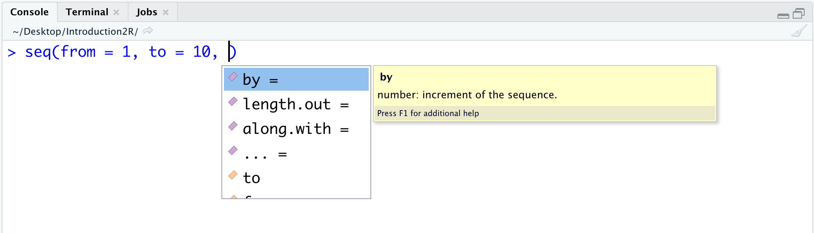

# Due Compagni Inseparabili {#objects-functions}

```{r settings, echo = FALSE}
knitr::opts_chunk$set(
  echo = FALSE,
  collapse=TRUE,
  fig.align="center"
)

```

In questo capitolo introdurremmo i concetti di oggetti e funzioni, due elementi alla base di R (e di ogni linguaggio di programmazione). Potremmo pensare agli oggetti in R come a delle variabili che ci permettono di mantenere in memoria dei valori (ad es. i risultati dei nostri calcoli o i nostri dati). Le funzioni in R, invece, sono analoghe a delle funzioni matematiche che, ricevuti degli oggetti in input, compiono delle azioni e restituiscono dei nuovi oggetti in output. 

Questa è una iper-semplificazione (e pure tecnicamente non corretta) che ci permettere però di capire come, partendo dai nostri dati o valori iniziali, possiamo manipolarli applicando delle funzioni per ottenere, attraverso differenti step, i risultati desiderati (ad es. analisi statistiche o grafici e tabelle).

Qui valuteremo gli aspetti fondamentali riguardanti l'utilizzo degli oggetti e delle funzioni che saranno successivamente approfonditi rispettivamente nel corso della [Seconda Sezione](#second-section) e della [Terza Sezione](#third-section) del libro.

## Oggetti {#objects-section}

Quando eseguiamo un commando in R, il risultato ottenuto viene immediatamente mostrato in *Console*. Tale risultato, tuttavia, non viene salvato in memoria e quindi non potrà essere riutilizzato in nessuna operazione futura. Condurre delle analisi in questo modo sarebbe estremamente complicato ed inefficiente. La soluzione più ovvia è quella di salvare in memoria i nostri risultati intermedi per poterli poi riutilizzare nel corso delle nostre analisi. Si definisce questo processo come *assegnare* un valore ad un oggetto.

### Assegnare e Richiamare un oggetto {#assign}

Per assegnare il valore numerico 5 all'oggetto `x` è necessario eseguire il seguente comando:

```{r, echo = TRUE}
x <- 5
```

La funzione `<-` ci permette di assegnare i valori che si trovano alla sua destra all'oggetto il cui nome è definito alla sinistra. Abbiamo pertanto il seguente pattern: `<nome-oggetto> <- <valore-assegnato>`.Notate come in *Console* appaia solo il comando appena eseguito ma non venga mostrato alcun risultato. 

Per utilizzare il valore contenuto nell'oggetto sarà ora sufficiente richiamare nel proprio codice il nome dell'oggetto desiderato.

```{r, echo = TRUE}
x + 3
```

E' inoltre possibile "aggiornare" o "sostituire" il valore contenuto in un oggetto. Ad esempio:

```{r, echo = TRUE}
# Aggiornare un valore
x <- x*10
x

# Sostituire un valore
x <- "Hello World!"
x
```

Nel primo caso, abbiamo utilizzato il vecchio valore contenuto in `x` per calcolare il nuovo risultato che è stato assegnato a `x`. Nel secondo caso, abbiamo sostituito il vecchio valore di `x` con un nuovo valore (nell'esempio una stringa di caratteri).

:::{.design title="Assegnare valori '<-' vs '='" data-latex="[Assegnare valori '<-' vs '=']"}
Esistono due operatori principali che sono usati per assegnare un valore ad un oggetto: l'operatore `<-` e l'operatore `=`. Entrambi sono validi e spesso la scelta tra i due diventa solo una questione di stile personale. 

```{r, echo=TRUE}
x_1 <- 45
x_2 = 45

x_1 == x_2 
```

Esistono, tuttavia, alcune buone ragioni per preferire l'uso di `<-` rispetto a `=` (attenti a non confonderlo con l'operatore relazionale `==`). L'operazione di assegnazione è un'operazione che implica una direzionalità, il che è reso esplicito dal simbolo `<-` mentre il simbolo `=` non evidenzia questo aspetto e anzi richiama la relazione di uguaglianza in matematica.

La decisione su quale operatore adottare è comunque libera, ma ricorda che una buona norma nella programmazione riguarda la *consistenza*: una volta presa una decisione è bene mantenerla per facilitare la comprensione del codice.
:::


### Nomi degli oggetti {#objects-names}

La scelta dei nomi degli oggetti sembra un aspetto secondario ma invece ha una grande importanza per facilitare la chiarezza e la comprensione dei codici.

Ci sono alcune regole che discriminano nomi validi da nomi non validi. Il nome di un oggetto:

- deve iniziare con una lettera e può contenere lettere, numeri, underscore (`_`), o punti (`.`).
- potrebbe anche iniziare con un punto (`.`) ma in tal caso non può essere seguito da un numero.
- non deve contenere caratteri speciali come `#`, `&`, `$`, `?`, etc.
- non deve essere una parola riservata ovvero quelle parole che sono utilizzate da R con un significato speciale (e.g, `TRUE`, `FALSE`, etc.; esegui il comando `?reserved` per la lista di tutte le parole riservate in R).

:::{.warning title="CaSe-SeNsItIvE" data-latex="[CaSe-SeNsItIvE]"}
Nota come R sia **Case-Sensitive**, ovvero distingua tra lettere minuscole e maiuscole. Nel seguente esempio i due nomi sono considerate diversi e pertanto non avviene una sovrascrizione ma due differenti oggetti sono creati:

```{r case-sensitive, echo = TRUE}
My_name <- "Monty"
my_name <- "Python"

My_name
my_name
```

:::

Inoltre, il nome ideale di un oggetto dovrebbe essere:

- **auto-descrittivo**: dal solo nome dovrebbe essere possibile intuire il contenuto dell'oggetto. Un nome generico quale `x` o `y` ci sarebbero di poco aiuto poiché potrebbero contenere qualsiasi informazione. Invece un nome come `weight` o `gender` ci suggerirebbe chiaramente il contenuto dell'oggetto (ad es. il peso o il gender dei partecipanti del nostro studio).
- **della giusta lunghezza**: non deve essere ne troppo breve (evitare sigle incomprensibili) ma neppure troppo lunghi. La lunghezza corretta è quella che permette al nome di esssere sufficientemente informativo senza aggiungere inutili dettagli. In genere sono sufficienti 2 o 3 parole.

:::{.design title="CamelCase vs snake_case" data-latex="[CamelCase vs snake\\_case]"}
Spesso più parole sono usate per ottenere un nome sufficientemente chiaro. Dato che però non è possibile includere spazi in un nome, nasce il problema di come unire più parole senza che il nome diventi incomprensibile, ad esempio `mediatestcontrollo`.

Esistono diverse convenzioni tra cui:

- **CamelCase**. L'inizio di una nuova parole viene indicata con l'uso della prima lettera maiuscola. Ad esempio `mediaTestControllo`.
- **snake_case**. L'inizio di una nuova parola viene indicata con l'uso carattere `_`. Ad esempio `media_test_controllo`.
-  una variante al calssico **snake_case** riguarda l'uso del `.`, ad esempio `media.test.controllo`. Questo approccio in genere è evitato poiché in molti linguaggi di programmazione (ed anche in R in alcune condizioni) il carattere `.` è un carattere speciale.


In genere viene raccomandato di seguire la convenzione **snake_case**. Tuttavia, la decisione su quale convenzione adottare è libera, ma ricorda ancora che una buona norma nella programmazione riguarda la *consistenza*: una volta presa una decisione è bene mantenerla per facilitare la comprensione del codice.
:::


### Tipologie Dati e Strutture Dati

Per lavorare in modo ottimale in R, è fondamentale conoscere bene e distinuere chiaramente quali sono le tipologie di dati e le strutture degli oggetti usati.

In R abbiamo 4 principali tipologie di dati, ovvero tipologie di valori che possono essere utilizzati:

- `character` - *Stringhe di caratteri* i cui valori alfannumerici vengono delimitati dalle doppie vigolette `"Hello world!"` o virgolette singole `'Hello world!'`.
- `double` - *Valori reali* con o senza cifre decimali ad esempio `27` o `93.46`.
- `integer` - *Valori interi* definiti apponendo la lettera `L` al numero desiderato, ad esempio `58L`.
- `logical` - *Valori logici* `TRUE` e `FALSE` usati nelle operazioni logiche. 

```{r data-types, echo = TRUE}
typeof("Psicostat")
typeof(24.04)
typeof(1993L)
typeof(TRUE)
```

In R abbiamo inoltre differenti tipologie di oggetti, ovvero diverse strutture in cui possono essere organizzati i dati:

- **Vettori**
- **Matrici**
- **Dataframe**
- **Liste**

Approfondiremo la loro definizione, le loro caratteristiche ed il loro utilizzo nel corso di tutta la [Seconda Sezione](#second-section) di questo libro.

## Funzioni {#functions-def}                                                   

Possiamo pensare alle funzioni in R in modo analogo alle classiche funzioni matematiche. Dati dei valori in input, le funzioni eseguono dei specifici calcoli e restituiscono in output il risultato ottenuto.

<center>
{ width=95% }
</center>
<br>

Abbiamo già incontrato le nostre prime funzioni per eseguire specifiche operazioni matematiche nel Capitolo \@ref(math-operators) come ad esempio `sqrt()` o `abs()` usate per ottenere ripettivamente la radice quadrata o il valore assoluto di un numero. Ovviamente le funzioni in R non sono limitate ai soli calcoli matematici ma possono eseguire qualsiasi genere di compito come ad esempio creare grafici e tabelle o manipolare dei dati o dei file. Tuttavia il concetto rimane lo stesso: ricevuti degli oggetti in input, le funzioni compiono determinate azioni e restituiscono dei nuovi oggetti in output.

In realtà incontreremo delle funzioni che non richiedono input o non produrre degli output. Ad esempio `getwd()` non richiede input oppure la funzione `rm()` non produce output. Tuttavia questo accade nella minoranza dei casi.

Per eseguire una funzione in R è necessario digitare il nome della funzione ed indicare tra parentesi i valori che vogliamo assegnare agli **argomenti** della funzione, ovvero i nostri input, separati da virgole. Generalmente si utilizza quindi la seguente sintassi:

<center>
`<nome-funzione>(<nome-arg1> = <valore-arg1>, <nome-arg2> = <valore-arg2>,...)`
</center>
<span></span>

Ad esempio per creare una sequenza di valori con incrementi di 1 posso usare la funzione `seq()`, i cui argomenti sono `from` e `to` ed indicano rispettivamente il valore iniziale ed il valore massimo della sequenza.

```{r, echo = TRUE}
# creo una sequenza di valori da 0 a 10 con incrementi di 1
seq(from = 0, to = 10)
```

### Argomenti di una Funzione {#function-arguments}

Nel definire gli argomenti di una funzione non è necessario specificare il nome degli argomenti. Ad esempio il comando precedente può essere eseguito anche specificando solamente i valori.

```{r, echo = TRUE}
# creo una sequenza di valori da 0 a 10 con incrementi di 1
seq(0, 10)
```

Tuttavia, questo rende più difficile la lettura e la comprensione del codice poiché non è chiaro a quali argomenti si riferiscono i valori. L'ordine con cui vengono definiti i valori in questo caso è iportante, poiché R assume rispetti l'ordine prestabilito degli argomenti. Osserva come invertendo invertendo i valori ovviamente otteniamo risultati differenti da quelli precedenti, ma questo non avviene quando il nome dell'argomento è specificato.

```{r, echo = TRUE}
# inverto i valori senza i nomi degli argomenti
seq(10, 0)

# inverto i valori con i nomi degli argomenti
seq(to = 10, from = 0)
```

Vediamo inoltre come le funzioni possano avere molteplici argomenti, ma che non sia necessario specificare il valore per ognuno di essi. Molti argomenti, infatti, hanno già dei valori prestabiliti di *default* e non richiedo quindi di essere specificati almeno che ovviamente non si vogliano utilizzare impostazioni diverse da quelle di *default*. Oppure lo specificare un dato argomento rispetto ad un altro può definire il comportamento stesso della funzione.

Ad esempio la funzione `seq()` possiede anche gli argomenti `by` e `length.out` che prima non erano stati specificati. `by` permette di definire l’incremento per ogni elemento successivo della sequenza mentre `length.out` permette di definire il numero di elementi della sequenza. Vediamo come allo specificare dell'uno o dell'altro agromento (o di entrambi) il comportamento della funzione vari.

```{r,echo = TRUE, error=TRUE}
seq(from = 0,  to = 10, by = 5)
seq(from = 0,  to = 10, length.out = 5)
seq(from = 0,  to = 10, length.out = 5, by = 4)
```

E' pertanto cosigliabile esplicitare sempre gli argomenti di una funzione per rendere chiaro a che cosa si riferiscono i valori indicati. Questo è utlile anche per evitare eventuali comportamenti non voluti delle funzioni ad individuare più facilmente possibili errori.

Gli argomenti di una funzione, inoltre, richiedono specifiche tipologie e strutture di dati e sta a noi assicuraci che i dati siano forniti nel modo corretto. Vediamo ad esempio come la funzione `mean()` che calcola la media di un insieme di valori, richieda come input un vettore di valori numerici. Approfondiremo il concetto di vettori nel Capitolo \@ref(vector), al momento ci basta sapere che possiamo usare la funzione `c()` per combinare più valori in un unico vettore.

```{r, echo=TRUE}
# Calcolo la media dei seguenti valori (numerici)
mean(c(10, 6, 8, 12)) # c() combina più valori in un unico vettore

mean(10, 6, 8, 12)
```

Notiamo come nel primo caso il risultato sia corretto mentre nel secondo è sbagliato. Questo perché `mean()` richiede come primo argomento il vettore su cui calcolare la media. Nel primo caso abbiamo correttamente specificato il vettore di valori usando la funzione `c()`. Nel secondo caso invece, il primo argomento risulta essere solo il valore `10` ed R calcola la media di `10` ovvero `10`. Gli altri valori sono passati ad altri argomenti che non alterano il comportameto ma neppure ci segnalano di questo importante errore.

Nel seguente esempio, possiamo vedere come `mean()` richieda che i valori siano numerici. Seppur `"1"` `"2"`, e `"3"` siano dei numeri, l'utilizzo delle doppie virgolette li rende delle stringhe di caratteri e non dei valori numerici e giustamente R non può eseguire una media su dei caratteri.

```{r, echo=TRUE}
# Calcolo la media dei seguenti valori (caratteri)
mean(c("1", "2", "3"))
```


Capiamo quindi che per usare correttamente le funzioni è fondamentale conoscerne gli argomenti e rispettare le tipologie e strutture di dati richieste.

### Help! I need Somebody...Help! {#help}

Conoscere tutte le funzioni e tutti i loro argomenti è impossibile. Per fortuna R ci viene in soccorso fornendoci per ogni funzione la sua documentazione. Qui vengono fornite tutte le informazioni riguardanti la finalità della funzione, la descrizione dei suoi argomenti, i dettagli riguardanti i suoi possibili utilizzi.

Per accedere alla documentazione possiamo utilizzare il comando `?<nome-funzione>` oppure `help(<nome-funzione>)`. Ad esempio:

```{r, echo = TRUE, eval = FALSE}
?seq
help(seq)
```

Una pagina si aprirà nel pannello "Help" in basso a destra con la documentazione della funzione in modo simile a quanto rappresentato in Figura \@ref(fig:help-page). 

```{r, help-page, fig.cap="Help-page della funzione seq()", out.width="85%"}
knitr::include_graphics("images/help-seq.png")
```


Il formato e le informazioni presenti nella pagina seguono delle norme comuni ma non obbligatorie. Infatti, non necessariamente vengono usati sempre tutti i campi e comunque all'autore delle funzioni è lasciato un certo grado di libertà nel personalizzare la documentazione. Tra i campi principali e più comunemente usati abbiamo:

- **Titile** - Titolo esplicativo della finalità della funzione  
- **Description** - Descrizione coincisa della funzione
- **Usage** - Viene mostrata la struttura della funzione con i suoi argomenti e valori di default
- **Arguments** - Elenco con la descrizione dettagliata di tutti gli argomenti. Qui troviamo per ogni argomento sia le opzioni utilizzabili ed il loro effetto, che la tipologia di valori richiesti
- **Details** - Descrizione dettagliata della funzione considerando i casi di utilizzo ed eventuali note tecniche
- **Value** - Descrizione dell'output dalla funzione. Qui troviamo sia la descrizione della struttura dei dati dell'output che la descrizione dei suei elementi utile per interpretare ed utilizzare i rsultati ottenuti
- **See Also** - Eventuali link ad altre funzioni simili o in relazione con la nostra funzione
- **Examples** - Esempi di uso della funzione

#### Ricerca per Parola {-}

Quando non si conosce esattamente il nome di una funzione o si vuole cercare tutte le funzioni e pagine che includono una certa parola, è possibile utilizzare il comando `??<parola>` oppure `help.search(<parola>)`.

R eseguirà una ricerca tra tutta la documentazione disponibile è fornirà un elenco delle pagine che contengono la parola desiderata nel titolo o tra le  keywords.


:::{.trick title="Autocompletamento with 'Tab'" data-latex="[Autocompletamento with 'Tab']"}
La natura dei programmatori è essere pigri e smemorati. Per fortuna ogni *code editor* che si rispetti (i.e., programma per la scrittura di codici) possiede delle utli funzioni di autocompletamento e suggerimento dei comandi che semplificano la scrittura di codici. 

In RStudio, i suggerimenti compaino automaticamente durante la scrittura di un comando oppure possono essere richiamati premendo il tasto `Tab` in alto a sinistra della tastiera ( { width=5% } ). Comparirà una finestra con possibili soluzioni di autocompletamento del nome della funzione. Utilizzando le frecce della tastiera possiamo evidenziare lq funzione voluta e premere `Invio` per autocompletare il comando. Nota come accanto al nome della funzione appare anche un piccolo riquadro giallo con la descrizione della funzione.

<center>
{ width=95% }
</center>
<br>

Per inserire gli argomenti della funzione possiamo fare affidamento nuovamente ai suggerimenti e alla funzione di autocompletamento. Sarà sufficiente premere nuovamente il tasto `Tab` e questa volta comparirà una lista degli argomenti con la relativa descrizione. Sarà quindi sufficiente selezionare con le frecce l'argomento desiderato e premere `Invio`.

<center>
{ width=95% }
</center>
<br>

Notate come la funzione di autocompletamento non sia utilizzata solo per le funzioni ma anche per i nomi degli oggetti. Questo ci consentirà di richiamare velocemente oggetti precedentemente creati evitando di digitare l'intero nome.

<center>
{ width=95% }
</center>
<br>


:::

