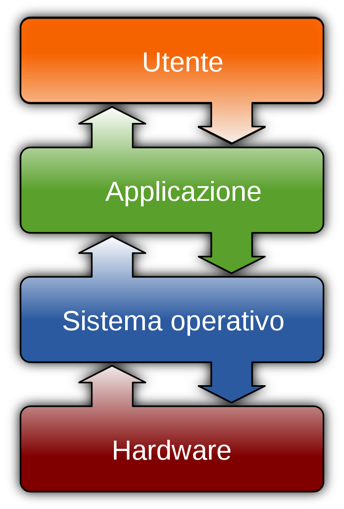
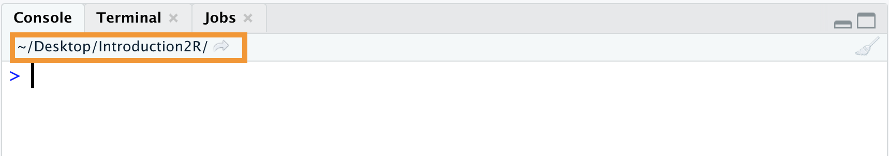
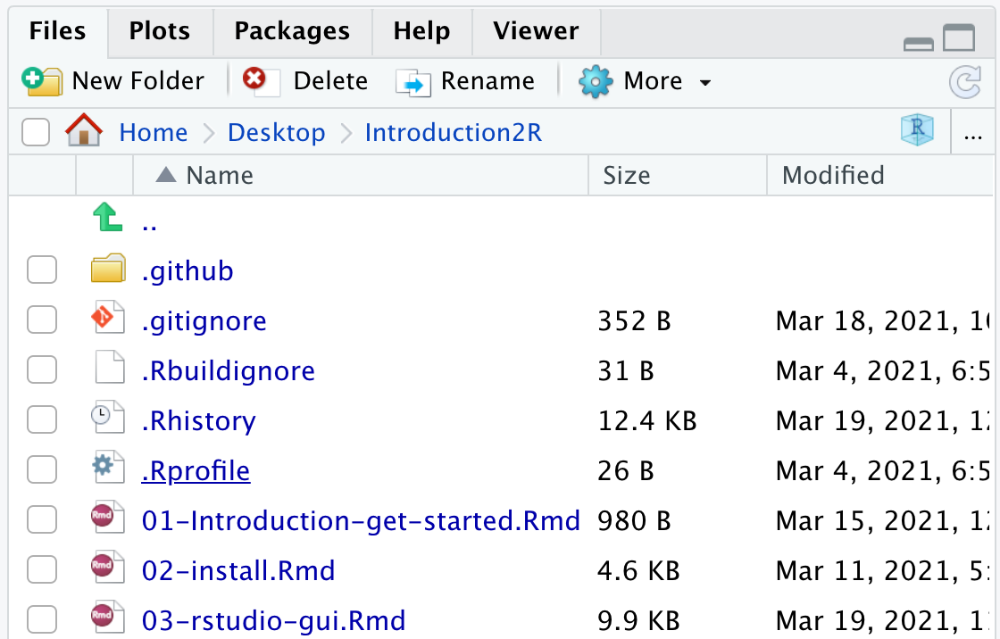
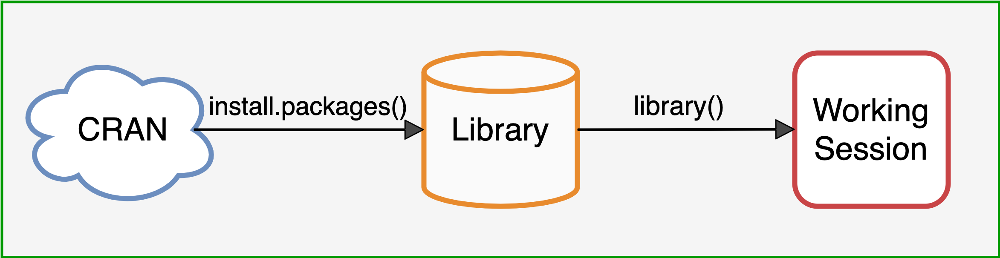
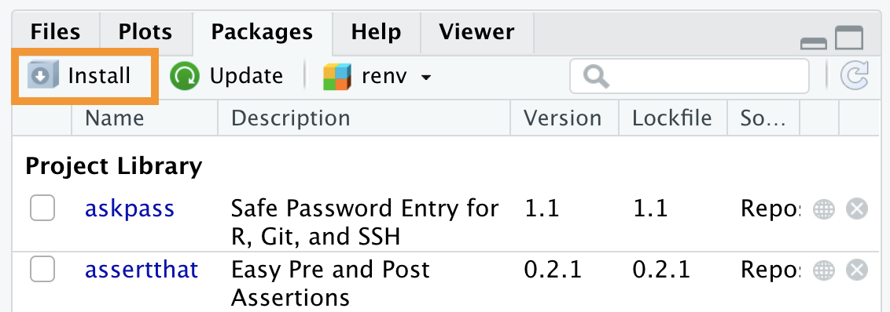
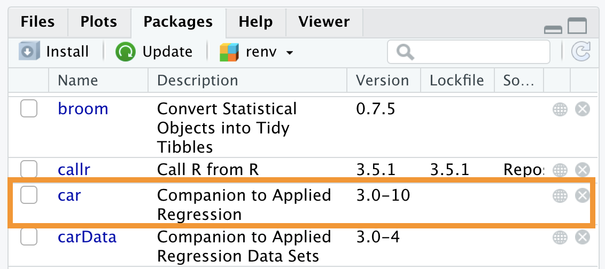
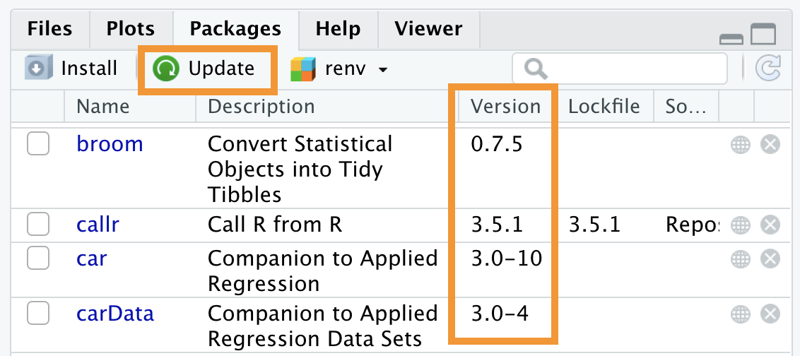
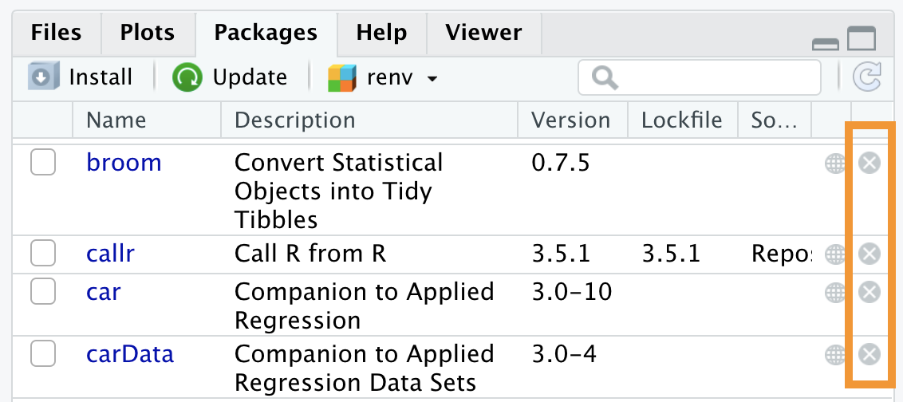

# Ambiente di Lavoro {#working-environment}

```{r settings, echo = FALSE}
knitr::opts_chunk$set(
  echo = FALSE,
  collapse=TRUE,
  fig.align="center"
)
```

In queso capitolo introdurremo alcuni concetti molto importanti che riguardano l'ambiente di lavoro in R o RStudio. In particolare parleremo dell'*environment*, della *working directory* e dell'utilizzo dei pacchetti.

## Environment

Nel Capitolo \@ref(objects-section), abbiamo visto come sia possibile assegnare dei valori a degli oggetti. Questi oggetti vengono creati nel nostro ambiente di lavoro (o meglio *Environment*) e potranno essere utilizzati in seguito.

Il nostro Enviroment raccoglie quindi tutti gli oggetti che vengono creati durante la nostra sessione di lavoro. E' possibile valutare gli oggetti attualmente presenti osservando il pannello *Environment* in alto a destra (vedi Figura \@ref(fig:environment2)) oppure utilizzadno il comando `ls()`, ovvero *list objects*.

```{r environment2, fig.cap="*Environment* - Elenco degli oggetti e variabili presenti nel'ambiente di lavoro", out.width="60%"}
knitr::include_graphics("images/environment.png")
```

All'inizio della sessione di lavoro il nostro Environment sarà vuoto (vedi Figura \@ref(environment-empty)). Il comando `ls()` non restituirà alcun oggeto ma per indicare l'assenza di oggerri userà la risposta `character(0)`, ovvero un vettore di tipo caratteri di lunghezza zero (vedi Capitolo TODO).

```{r environment-empty, fig.cap="*Environment* vuoto ad inizio sessione di lavoro", out.width="60%"}
knitr::include_graphics("images/environment-empty.png")
```

```{r, echo = TRUE}
# Environment vuoto
ls()
```

### Aggiungere Oggetti all'Environment

Una volta creati degli oggetti, questi saranno presenti nel nostro Environment e il comando `ls()` restituirà un vettore di caretteri in cui vengono elencati tutti i loro nomi.

```{r, echo = TRUE}
# Creo oggetti
x <-  c(2,4,6,8)
y <-  27
word <- "Hello Word!"

# Lista nomi oggetti nell'Environment
ls()
```

Nel pannello in alto a destra (vedi Figura \@ref(fig:environment-object)), possiamo trovare un elenco degli oggetti attualmente presenti nel nostro Environment. Insieme al nome vengono riportate anche alcune utili inforamzioni a seconda del tipo di oggetto. Vediamo come nel nostro esempio, nel caso di variabili con un singolo valore (e.g., `word` e `y`) venganno presentati direttamente gli stessi valori. Mentre, nel caso di vettori  (e.g., `x`) vengano fornite anche informazioni riguardanti la tipologia di vettore e la sua dimensione (vedi Capitolo TODO), nell'esempio abbiimao un vettore numerico (`num`) di 4 elementi (`[1:4]`).

```{r environment-object, fig.cap="*Environment* contenente gli oggetti creati", out.width="60%"}
knitr::include_graphics("images/environment-objects.png")
```

### Rimuovere Oggetti dall'Environment

Per rimuovere un oggetto dal proprio environment è possibile utilizzare il comando `remove()` oppure la sua abbreviazione `rm()`, indicando tra parentesi il nome dell'oggetto che si intende rimuovere. E' possibile indicare più di un oggetto separando i loro nomi con la virgola.

```{r, echo = TRUE}
# Rimuovo un oggetto
rm(word)
ls()

# Rimuovo più oggetti contemporaneamente
rm(x,y)
ls()
```

:::{.trick title="rm(list=ls())" data-latex="[rm(list=ls())]"}
Qualora fosse necessario eliminare tutti gli oggetti attualmete presenti nel nosto ambiente di lavoro è possibile ricorrere alla formula `rm(list=ls())`. In questo modo si avrà la certezza di pulire l'ambiente da ogni oggetto e di ripristinarlo alle condizioni iniziali della sessione.
:::

:::{.design title="Mantenere Ordinato l'Environment" data-latex="[Mantenere Ordinato l'Environment]"}
Avere cura di mantenre il proprio Environment ordinato ed essere consapevoli degli oggetti attualmente presenti è importante. Questo ci permette di evitare di compiere due errori comuni.

- **Utilizzare oggetti non ancora creati**. In questo caso l'errore è facilemente individuabile dat che sarà lo stesso R ad avvisarci che  *"object '<nome-oggetto>' not found"*. In questo caso dovremmo semplicemente eseguire il comando per creare l'oggetto richieto.
```{r, echo = TRUE, error=TRUE}
oggetto_non_esistente
```

- **Utilizzare oggetti con "*vecchi*" valori**. Se non si ha cura di mantenere ordinato il proprio ambiente di lavoro potrebbe accadere che diversi oggetti vengano creati durante successive sessioni di lavoro. A questo punto si corre il rischio di perdere il controllo rispetto al vero contenuto degli oggetti e potremmo quindi utilizzare degli oggetti pensando che contengano un certo valore, quando invece si riferisono a tutt'altro. Questo comporta che qualsiasi nostro risultato perda di significato. Bisogna prestare molta attenzione perchè R non potrà avvisarci di questo errore (per lui sono solo numeri), siamo noi che dobbiamo essere consapevoli del fatto che i comandi eseguiti abbiano senso oppure no.

Per mantere un Environmet ordinato vi consigliamo innanzitutto di non salvare automaticamente il vostro *workspace* quando terminate una sessione di lavoro. E' possibile settare tale opzione nelle impostazioni generali di R selezionando *"Never"* alla voce *"save workspace to .RData on exit"* come riportato nella Figura seguente.

<center>
{ width=75%}
</center>

Questo vi permetterà di iniziare ogni nuova sessione di lavoro in un Environment vuoto, evitando che vecchi oggetti si accumulino nel corso delle diverse sesssioni di lavoro. Durante le vostre sessioni, inoltre, sarà utile eseguire il comando `rm(list=ls())` quando inizierete un nuovo compito in modo da eliminare tutti i vecchi oggetti.

#### Environment una  Memoria a Breve Termine {-}

Notiamo quindi come l'Environment sia qualcosa di transitorio. Gli oggetti vengono salvati nella memoria primaria del computer (RAM, possiamo pensarla in modo analogo alla  memoria a breve termine dei modelli cognitivi) e verranno cancellati al comando `rm(list=ls())` o al termine di ogni sessione di lavoro.

Il fatto di partire ogni volta da un Environment vuoto, vi costringerà a raccogliere tutti i passi delle vostre analisi all'interno di uno script in modo ordinato evitando di fare affidamento su vecchi oggetti. Tutti gli oggetti necessari durante le analisi, infattii, dovranno essere ricreati ad ogni sessione, garantendo la riproducibilità e correttezza del lavro (almeno dal punto di vista di programmazione). Idealmente dovrebbe essere posibile, in una sessione di lavoro, partire da un Environment vuoto ed eseguire in ordine tutti i comandi contenuti in uno script fino ad ottenere i risultati desiderati.

E' facile intuire come in certe situazioni questa non sia la soluzione più efficiente. Alcuni comandi, infatti, potrebbero richiedere molti minuti (o anche giorni) per essere eseguiti. In questi casi sarebbe conveniente, pertanto, salvare i risultati ottenuti per poterli utilizzare anche in sessioni successive, senza la necessità di dover eseguire nuovamente tutti i comadi. Vedremo nel Capitolo TODO come sarà possibile salvare permanentemente gli oggetti creati nella memoria secondaria del computer (hard-disk, nella nostra analogia la memoria a lungo termine) e come caricarli in una successiva sessione di lavoro.

:::

## Working Directory

Il concetto di *working directory* è molto importante ma spesso poco conosciuto. La *working directory* è la posizione all'interno del computer in cui ci troviamo durante la nostra sessione di lavoro e da cui eseguiamo i nostri comandi.

### Organizzazione Computer

L'idea intuitiva che abbiamo comunemente del funzionamento del computer è fuorviante. Spesso si pensa che il Desktop rispecchi l'organizzazione del nostro intero computer e che tutte le azioni siano gestite attraverso l'interfaccia punta-e-clicca a cui ormai siamo abituati dai moderni sistemi operativi. 

Senza entrare nel dettaglio, è più corretto pensare all'organizzazione del cumputer come ad un insieme di cartelle e sottocartelle che contengono tutti i nostri file e al funzionamento del computer come ad un insieme di processi (o comandi) che vengono eseguiti. Gli stessi programmi che installiamo non sono altro che delle cartelle in cui sono contenuti tutti gli script che determinano il loro funzionamento. Anche il Desktop non è altro che una semplice cartella mentre quello che vediamo noi è un programma definito dal sistema operativo che visualizza il contenuto di quella cartella sul nostro schermo e ci permette di interfacciarci con il mouse.

Tutto quello che è presente nel nostro computer, compresi i nostri file, i  programmi e lo stesso sistema operativo in uso, tutto è organizzato in un articolato sistema di cartelle e sottocartelle. Approsimativamente possiamo pensare all'organizzazione del nostro computer in modo simile alla Figura \@ref(fig:file-system).

```{r, file-system, fig.cap="Organizzazione Computer (from: https://en.wikipedia.org/wiki/Operating_system)", out.width="35%"}

```

Ai livelli più bassi troviamo tutti i file di sistema ai quali gli utenti possono accedere solo con speciali autorizzazioni. Al livello superiore troviamo tutte i file riguardanti i programmi e applicazioni installati che in genere sono utilizzabili da più utenti sullo stesso computer. Infine troviamo tutte le cartelle e file che riguardano lo specifico utente.

###  Absolute Path e Relative Path 

Questo ampio preambolo riguardante l'organizzazione in cartelle e sottocartelle, ci serve perchè è la struttura che il computer utilizza per orientarsi tra tutti file quando esegue dei comandi attraverso un'interfaccia a riga di comando (e.g., R). Se vogliamo ad esempio caricare dei dati da uno specifico file in R devo fornire il *path* (o indirizzo) corretto che mi indichi esattamente la posizione del file all'interno della struttura di cartelle del computer. Ad esempio, immaginiamo di avere dei dati `My-data.Rda` salvato nella cartella `Introduction2R` nel proprio Desktop.

```
Desktop
 |
 |-  Introduction2R
 |    |
 |    |- Dati
 |    |   |- My-data.Rda
```

Per indicare la posizione del File potrei utilizzare un:

- **absolute path** - la posizione *"assoluta"* del file rispetto alla *root directory* del sistema ovvero la cartella principale dell'intero computer.
```{r, echo=TRUE, eval=FALSE}
# Mac
"/Users/<username>/Desktop/Introduction2R/Dati/My-data.Rda"

# Windows Vista
"c:\Users\<username>\Desktop\Introduction2R\Dati\My-data.Rda"

```

- **relative path** - la posizione del file rispetto alla nostra attuale posizione nel computer da cui stiamo eseguendo il comando, ovvero rispetto alla **working directory** della nostra sessione di lavoro. In questo riprendendo il precedente esempio se la nostra working directory fosse la cartella `Desktop/Introduction2R` avremmo i seguenti relative path:
```{r, echo=TRUE, eval=FALSE}
# Mac
"Dati/My-data.Rda"

# Windows Vista
"Dati\My-data.Rda"

```

Nota come sia preferibile l'utilizzo dei relative path poichè gli absolute path sono unici per il singolo computer di riferimento e non possono essere quindi utilizzati su altri computer.

:::{.warning title='"Error: No such file or directory"' data-latex='["Error: No such file or directory"]'}
Qualora si utilizzasse un relative path per indicare la posizione di un file, è importante che la working directory attualment in uso sia effettivamente quella prevista. Se ci trovassimo in una divesa cartella, ovviamente il "relative path" indicato non sarebbe più valido e R ci mostrerebbe un messaggio di errore.

Riprendendo l'esempio precedente, supponiamo che la nostra attuale working directory sia `Desktop` invece di `Desktop/Introduction2R`. Eseguendo il comadno `load()` per caricare i dati utilizzando il  relative path ora non più valido ottengo:

```{r, echo = TRUE, error = TRUE}
load("Dati/My-data.Rda")
```

Il messaggio di errore mi indica che R non è stato in grado di trovare il file seguendo le mie indicazioni. E' come se chiedessi al computer di aprire il frigo ma attualmente si trovasse in camera, devo prima dargli le indicazioni per raggiungere la cucina altrimenti mi risponderebbe *"frigo non trovato"*. Risulta pertanto fondamentale essere sempre consapevoli di quale sia l'attuale working directory in cui si sta svolgendo la sessione di lavoro. 

Ovviamente otterrei lo stesso errore anche usando un absolute path se questo contenesse degli errori.
:::

:::{.design title="The Garden of Forking Paths" data-latex="[The Garden of Forking Paths]"}
Come avrai notato dagli esempi precedenti, sia la struttura in cui vengono organizzati i file nel computer sia la sintassi utilizzata per indicare i path è differente in base al sistema operativo utilizzato.

#### Mac OS e Linux{-}

- Il carattere utilizzato per separare la cartelle nella definizione del path è `"/"`:
```{r, echo=TRUE, eval=FALSE}
"Introduction2R/Dati/My-data.Rda"
```
- Iniziando il path con il carattere `"/"` si indica la root-directory:
```{r, echo=TRUE, eval=FALSE}
"/Users/<username>/Desktop/Introduction2R/Dati/My-data.Rda"
```
- Iniziando il path con il carattere `"~"` si indica la cartella *home* dell'utente ovvero `/Users/<username>/`:
```{r, echo=TRUE, eval=FALSE}
"~/Desktop/Introduction2R/Dati/My-data.Rda"
```

#### Windows {-}
- Il carattere utilizzato per separare la cartelle nella definizione del path è `"\"`:
```{r, echo=TRUE, eval=FALSE}
"Introduction2R\Dati\My-data.Rda"
```
:::

### Working Directory in R 

Vediamo ora i comandi utilizzati in R per valutare e cambiare la working directory nella propria sessione di lavoro.

#### Attuale Working Directory {-}

In R è possibile valutare l'attuale working directory utilizzando il comando `getwd()` che restituirà l'absolute path dell'attuale posizione.

```{r, echo=TRUE, eval=FALSE}
getwd()
## [1] "/Users/<username>/Desktop/Introduction2R"
```

In alternativa, l'attuale working directory è anche riportata in alto a sinistra della Console come mostrato in Figura \@ref(fig:current-wd).

```{r, current-wd, fig.cap="Workig directory dell'attuale sessione di lavoro", out.width="95%"}

```

Premendo la freccia al suo fianco il pannello *Files* in basso a destra sarà reindirizzato direttamento alla workig directory dell'attuale sessione di lavoro. In questo modo sarà facile navigare tra i file e cartelle presenti al suo interno (vedi Figura \@ref(fig:current-folder)). 

```{r, current-folder, fig.cap="Workig directory dell'attuale sessione di lavoro", out.width="65%"}

```

#### Cambiare Working Directory {-}

Per cambiare la working directory è possibile utilizzare il comando `setwd()` indicando il path (absolute o relative) della nuova working directory. Nota come, nel caso in cui venga indicato un relative path, questo dovrà indicare la posizione della nuova working directory rispetto alla vecchia working directory.

```{r, echo=TRUE, eval=FALSE}
getwd()
## [1] "/Users/<username>/Desktop/Introduction2R"

setwd("Dati/")

getwd()
## [1] "/Users/<username>/Desktop/Introduction2R/Dati"
```

In alternativa è possibile selezionare l'opzione *"Choose Directory"* dal menù *"Session"* > *"Set Working Directory"* come mostrato in Figura \@ref(fig:set-wd). Verrà quindi richiesto di selezionare la working directory desiderata e preme "*Open*".

```{r, set-wd, fig.cap="Definire la working directory", out.width="95%"}
knitr::include_graphics("images/set-wd.png")
```

:::{.trick title="Show me the Path" data-latex="[Show me the Path]"}
Nota come sia possibile nel digitare il path sfruttare l'autocompletamento. All'interno delle virgolette `""` premi il tasto `Tab` per visualizzare i suggerimenti dei path relativi alla attuale working directory.

<center>
{ width=75% }
</center>
<br>

E' possibile inoltre utilizzare i caratteri speciali `"./"` e `"../"` per indicare rispettivamente l'attuale working directory e la cartella del livello superiore (i.e., *parent folder*) che include l'attuale working directory. `"../"` ci permette quindi di navigare a ritroso dalla nostra attuale posizione tra le cartelle del computer.

```{r, echo=TRUE, eval=FALSE}
getwd()
## [1] "/Users/<username>/Desktop/Introduction2R"

setwd("../")

getwd()
## [1] "/Users/<username>/Desktop/"
```

:::

## R-packages

Uno dei grandi punti di forza di R è quella di poter estendere le proprie funzioni di base in modo semplice ed intuitivo utilizzando nuovi pacchetti. Al momento esistono oltre **17'000** pachetti disponibili gratuitamente sul CRAN (la repository ufficiale di R). Questi pacchetti sono stati sviluppati dall'immensa comunity di R per svolgere ogni sorta di compito. Si potrebbe dire quindi che in R ogni cosa sia possibile, basta trovare il giusto pacchetto (oppure crearlo!).

Quando abbiamo installato R in automatico sono stati installati una serie di pacchetti che costituiscono la **system library**, ovvero tutti quei pacchetti di base che permettono il fuzionamento di R. Tuttavia, gli altri pacchetti non sono disponibili da subito. Per utilizzare le funzioni di altri pacchetti, è necessario seguire una procedura in due step come rappresentato in Figura \@ref(fig:packages-process):

1. **Scaricare ed installare i pacchetti sul nostro computer**. I pacchetti sono disponibili gratuitamente online nella reopsitory del CRAN, una sorta di archivio. Vengono quindi scaricati ed installati nella nostra *library*, ovvero la raccolta di tutti i pacchetti di R disponibili sul nostro computer.

2. **Caricare il paccheto nella sessione di lavoro**. Anche se il paccheto è installato nella nostra library non siamo ancora pronti per utilizzare le sue funzioni. Sarà necessario prima caricare il pacchetto nella nostra sessione di lavoro. Solo ora le funzionni del pacchetto saranno effetivamente disponibili per essere usate.

```{r, packages-process, fig.cap="Utilizzare i paccheti in R", out.width="95%"}

```

Questo procedimento in due step potrebbe sembrare poco intuitivo. *"Perchè dover caricare qualcosa che è già installato?"* La risposta è molto semplice ci serve per mantenere efficiente e sotto controllo la nostra sessione di lavoro. Infatti non avremo mai bisogno di tutti i pacchetti installati ma a seconda dei compiti da eseguire utilizzeremo di volta in volta solo alcuni pacchetti specifici. Se tutti i pacchetti fossero caricati automaticamente ogni volta sarebbe un inutile spreco di memoria e si creerebbero facilmente dei conflitti. Ovvero, alcune funzioni di diversi pacchetti potrebbero avere lo stesso nome ma scopi diversi. Sarebbe quindi molto facile ottenere errori o comunque risultati non validi.

Vediamo ora come eseguire queste operazioni in R.

### install.packages()

Per installare dei pacchetti dal CRAN nella nostra library è possibile eseguire il comando `install.packages()` indicando tra parentesi il nome del pacchetto desiderato.

```{r, echo = TRUE, eval=FALSE}
# Un ottimo pacchetto per le analisi statistiche di John Fox
# un grandissimo statistico...per gli amici Jonny la volpe ;)
install.packages("car")
```

In alternativa è possibile utilizzare il pulsante *"Install"* nella barra in alto a sinistra del pannello Packages ( vedi Figura \@ref(fig:packages-install)), indicando successivamente il nome del pacchetto desiderato.

```{r, packages-install, fig.cap="Installare paccektti tramite interfacci RStudio", out.width="65%"}

```

Nota come installare un pacchetto potrebbe comportare l'installazione di più pacchetti. Questo perchè verranno automaticamente installate anche le *dependencies* del pacchetto, ovverro, tutti i pacchetti usati internamente dal pacchetto di interesse che quindi necessari per il suo corretto funzionaemnto (come in un gioco di matrioske).

Una volta installato il pacchetto, questo comarirà nella library ovvero la lista dei pacchetti disponibili mostrata nel pannello Packages (vedi Figura \@ref(fig:library-car)).

```{r, library-car, fig.cap="Il pacchetto car è ora disponibile nella library", out.width="65%"}

```

### library()

Per utilizzare le funzioni di un pacchetto già presente nella notra library, dobbiamo ora caricarlo nella nostra sessione di lavoro. Per fare ciò, posssiamo utilizzare il comando `library()` indicando tra parentesi il nome del pacchetto richiesto.

```{r, echo = TRUE, eval=FALSE}
library(car)
```

In alternativa è possibile spuntare il riquadro alla sinistra del nome del pacchetto dal pannello Packages come mostrato in Figura \@ref(fig:load-package). Nota tuttavia come questa procedura sia sconsigliata. Infatti, ogni azione punta-e-clicca dovrebbe essere eseguita ad ogni sessione mentre l'utilizzo di comandi inclusi nello script garantisce la loro esecuzione automatica.

```{r, load-package, fig.cap="Caricare un pacchetto nella sessione di lavoro", out.width="65%"}
knitr::include_graphics("images/load-package.png")
```

Ora siamo finalmente pronti per utilizzare le funzioni del pacchetto nella nostra sessione di lavro.

:::{.trick title="package::function()" data-latex="[package::function()]"}
Esiste un piccolo trucco per utilizzare la funzione di uno specifico pacchetto senza dover caricare il pacchetto nella propria sessione. Per fare questo è possibile usare la sintassi:

```{r, echo = TRUE, eval=FALSE}
<nome-pacchetto>::<nome-funzione>()

# Esempio con la funzione Anova del pacchetto car
car::Anova()
```

L'utilizzo dei `::` ci permette di richiamare direttamente la funzione desiderata. La differennza tra l'uso di `library()` e l'uso di `::` riguarda aspetti abbastanza avanzati di R (per un approfondimento vedi <https://r-pkgs.org/namespace.html>). In estrema sintesi, possiamo dire che in alcuni casi è preferibile non caricare un'intero pacchetto se di questo abbiamo bisogno di un'unica funzione.
:::

### Aggiornare e Rimuovere Pacchetti

Anche i pacchettti come ogni altro software vengono aggiornati nel corso del tempo fornendo nuove funzionalità e risolvendo eventuli problemi. Per aggiornare i pacchetti alla versione più recente è possibile eseguire il comando `update.packages()` senza inidare nulla tra le parentesi.

In alternativa è possibile premere il pulsante *"Update"* nella barra in alto a sinistra del pannello Packages ( vedi Figura \@ref(fig:library-version)), indicando successivamente i pachetti che si desidera aggiornare. Nota come nella lista dei pacchetti venga riportata l'attuale versione alla voce *"Version"*. 

```{r, library-version, fig.cap="Aggiornare i pacchetti", out.width="65%"}

```

Nel caso in cui si vogli invece rimuover uno specifico pacchetto, è possibile eseguire il comando `remove.packages()` indicando tra le parentesi il nome del pacchetto.

In alternativa è possibile premere il pulsante `x` alla destra del paccehettto nel pannello Packages come mostrao in Figura \@ref(fig:library-remove).

```{r, library-remove, fig.cap="Rimuovere un pacchetto", out.width="65%"}

```


### Documantazione Pacchetti

Ogni pacchetto include la documentazione delle proprie funzioni e delle *vignette* ovvero dei brevi tutorial che mostrano degli esempi di applicazione e utilizzo del pacchetto.

- **Documentazione funzione** - Per accedere alla documentazione di una funzione è sufficiente utilizzare il comando `?<nome-funzione>` oppure `help(<nome-funzione>)`. Ricorda è necessario avere prima caricato il pacchetto altrimenti la funzione non risulta ancora disponibile. In alternativa si potrebbe estendere la ricerca utilizzando il comando `??`.

- **Vignette** - Per ottenere la lista di tutte le vignette di un determinato pacchetto è possibile utilizzare il comando `browseVignettes(package = <nome-pacchetto>)'`. Mentre, per accedere ad una specifica vignetta, si utilizza il comando `vignette("<name-vignetta>")`.

- **Documentazione intero pacchetto** - Premendo il nome del pacchetto dal pannello Packages in basso a destra, è possibile accedere alla lista di tutte le informazioni relative al pacchetto come riportato in Figura \@ref(fig:package-documentation). Vengono prima forniti i link per le vignette ed altri file relativi alle caratteristiche del pacchetto. Successivamente sono presentate in ordine alfabetico tutte le funzioni. 

```{r, package-documentation, fig.cap="Documetazione del pacchetto car", out.width="65%"}
knitr::include_graphics("images/package-documentation.png")
```

Ricordate tuttavia che in ogni caso la più grande risorsa di informazioni è come sempre google. Spesso i pacchetti più importanti hanno addirittura un proprio sito in cui raccolgono molto materiale utile. Ma comunque in ogni caso in internet sono sempre disponibili moltissimi tutorial  ed esempi.

:::{.design title="Github" data-latex="[Github]"}
Il CRAN non è l'unica risorsa da cui è possibile installare dei pacchetti di R tuttavia è quella ufficiale e garantisce un certo standard e stabilità dei pacchetti presenti. In internet esistono molte altre repository che raccolgono paccetti di R (e software in generale) tra cui una delle più popolari è certamente GitHub (<https://github.com/>).

Github viene utilizzato come piattaforma di sviluppo per molti pacchetti di R ed è quindi  possibile trovarve le ultime versioni di sviluppo dei pacchetti con gli aggirnamenti più recenti o anche nuovi pacchetti non ancora disponibili sul CRAN. Va sottolineato tuttavia, come quete siano appunto delle versioni di sviluppo e quindi potrebbero presentare maggiori problemi. Inoltre per installare i pacchetti in questo modo, è richiesta l'installzione di **R tools** (vedi *"Approfondimento: R Tools"* nel Capitolo \@ref(install-r)).

Per installare un pacchetto direttamente da Github è posibile utilizzare il comando `install_github()` del pacchetto `devtools`, indicanto tra parentesi la l'url della repository desiderata.

```{r, echo = TRUE, eval=FALSE}
install.packages("devtools")

# ggplot2 il miglior pacchetto per grafici
devtools::install_github("https://github.com/tidyverse/ggplot2")
```
:::

