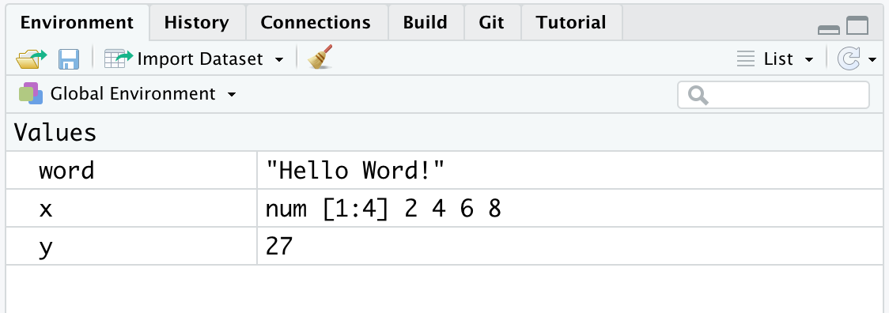
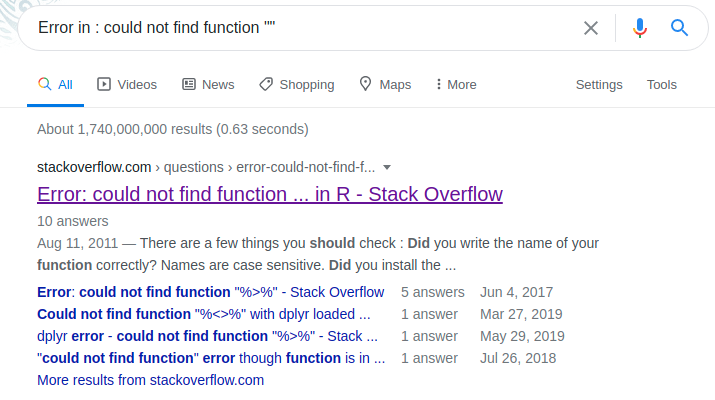

# Sessione di Lavoro {#working-session}

```{r settings, echo = FALSE}
knitr::opts_chunk$set(
  echo = FALSE,
  collapse=TRUE,
  fig.align="center"
)

```

In queso capitolo introdurremo alcuni concetti molto importanti che riguardano le sessioni di lavoro in R o RStudio. In particolare parleremo dell'*environment*, della *working directory* e dell'utilizzo di pacchetti.

Infine, disuteremo di alcuni aspetti generali della programmazione quali la gestione dei messaggi di errore o *warnings* e  vedremo alcune buone norme riguardanti l'organizzazione degli scripts e l'uso degli *RStudio Projects* per essere ordinati ed efficaci nelle proprie sessioni di lavoro.

## Environment

Nel Capitolo \@ref(objects-section), abbiamo visto come sia possibile assegnare dei valori a degli oggetti. Questi oggetti vengono creati nel nostro ambiente di lavoro (o meglio *Environment*) e potranno essere utilizzati in seguito.

Il nostro Enviroment raccoglie quindi tutti gli oggetti che vengono creati durante la nostra sessione di lavoro. E' possibile valutare gli oggetti attualmente presenti osservando il pannello *Envrionmen* in alto a destra (vedi Figura \@ref(fig:environment2)) oppure utilizzadno il comando `ls()`, ovvero *list objects*.

```{r environment2, fig.cap="*Environment* - Elenco degli oggetti e variabili presenti nel'ambiente di lavoro", out.width="60%"}
knitr::include_graphics("images/environment.png")
```

All'inizio della sessione di lavoro il nostro Environment sarà vuoto ().


```{r environment-empty, fig.cap="*Environment* vuoto ad inizio sessione di lavoro", out.width="60%"}
knitr::include_graphics("images/environment-empty.png")
```

```{r, echo = TRUE}
# Environment vuoto
ls()
```

```{r, echo = TRUE}
# Creo oggetti
x <-  c(2,4,6,8)
y <-  27
word <- "Hello Word!"

# Lista nomi oggetti nell'Environment
ls()
```

```{r environment-object, fig.cap="*Environment* contenente gli oggetti creati", out.width="60%"}

```

- concetto di ambiente di lavoro
- ls()
- rm()

- tip box aspetto transirorio (vedremo successivamente come salvare caricare dati)

## Working Directory

- che cosa è un path
- home directory ~ (non mi ricordo se per windows lavora)
- getwd(); 
- setwd(); altri modi per settare al working directory

- abodolute/relative path (?)

## R-packages

- scaricare
- library
- uso funzioni
- aggiornare i pacchetti

- box tip per l'uso di ::

## Errors and warnings

## Sessione di lavoro

- pulizia script
- commenti 
- sezioni script
- settings
- sintassi (gli spazi e gli indent corretti alineamenti)
- idea di organizzare in vairi script, cartelle

### R projects


## Problema + Google = Soluzione

Quando si approccia la scrittura di codice, anche molto semplice la cosa che sicuramente capiterà più spesso sarà riscontrare **errori** e quindi trovare il modo per risolverli.

> Qualche programmatore esperto direbbe che l'essenza stessa di programmare è in realtà risolvere gli errori che il codice produce.

L'**errore non è quindi un difetto o un imprevisto**, ma parte integrante della scrittura del codice. L'importante è capire come gestirlo.

Abbiamo tutti le immagini in testa di programmatori da film che scrivono codice alla velocità della luce, quando nella realtà dobbiamo spesso affrontare **bug**, **errori di output** o altri problemi vari. Una serie di skills utili da imparare sono:

  * Comprendere a fondo gli **errori** (non banale)
  * Sapere **come e dove cercare una soluzione** (ancora meno banale) 
  * In caso non si trovi una soluzione direttamente, chiedere aiuto in modo efficace

#### Comprendere gli errori{-}
  
Rispetto agli errori, R è solitamente abbastanza esplicito nel farci capire il problema. Ad esempio usare una funzione di un pacchetto che non è stato caricato di solito fornisce un messaggio del tipo `Error in funzione : could not find function "funzione"`. 

#### Ricercare soluzioni{-}

Altre situazioni o messaggi potrebbero non essere altrettanto immediati, in quel caso Google è il nostro miglior amico.

Cercando infatti il messaggio di errore/warning su Google, al 99% avremo altre persone che hanno avuto lo stesso problema e probabilmente anche una soluzione.

:::{.trick title="Ricerca su Google" data-latex="[Ricerca su Google]"}
Il modo migliore per cercare è copiare e incollare su Google direttamente l'output di errore di R come ad esempio `Error in funzione : could not find function "funzione"` piuttosto che descrivere a parole il problema. I messaggi di errore sono standard per tutti, la tua descrizione invece no.
:::

Cercando in questo modo vedrete che molti dei risultati saranno esattamente riferiti al vostro errore:

<center>


</center>

#### Chiedere una soluzione

Se invece il vostro probelma non è un messaggio di errore ma un utilizzo specifico di R allora il consiglio è di usare una ricerca del tipo: `argomento + breve descrizione problema + R`. Nelle sezioni successive vedrete nel dettaglio altri aspetti della programmazione ma se volete ad esempio calcolare la **media** in R potrete scrivere `compute mean in R`. 
Mi raccomando, fate tutte le ricerche in **inglese** perchè le possibilità di trovare una soluzione sono molto più alte.

Dopo qualche ricerca, vi renderete conto che il sito che vedrete più spesso si chiama [**Stack Overflow**](https://stackoverflow.com/). Questo è una manna dal cielo per tutti i programmatori, a qualsiasi livello di expertise. E' una community dove tramite domande e risposte, si impara a risolvere i vari problemi ed anche a trovare nuovi modi di fare la stessa cosa. E' veramente utile oltre che un ottimo modo per imparare.

L'ultimo punto di questa piccola guida alla ricerca di soluzioni, riguarda il fatto di dover non solo cercare ma anche chiedere. Dopo aver cercato vari post di persone che richiedevano aiuto per un problema noterete che le domande e le risposte hanno sempre una struttura simile. Questo non è solo un fatto stilistico ma anzi è molto utile per uniformare e rendere chiara la domanda ma sopratutto la risposta, in uno spirito di condivisione. C'è anche una [guida dedicata](https://stackoverflow.com/help/how-to-ask) per scrivere la domanda perfetta.

In generale[^stack]:

- Titolo: un super riassunto del problema
- Contesto: linguaggio (es. R), quale sistema operativo (es. Windows)
- Descrizione del problema/richiesta: in modo chiaro e semplice ma non troppo generico
- Codice ed eventuali dati per capire il problema

L'ultimo punto di questa lista è forse il più importante e si chiama in gergo tecnico [**REPREX**](https://community.rstudio.com/t/faq-whats-a-reproducible-example-reprex-and-how-do-i-create-one/5219) (**Rep**roducible **Ex**ample). E' un tema leggermente più avanzato ma l'idea di fondo è quella di fornire tutte le informazioni possibili per poter riprodurre (e quindi eventualmente trovare una soluzione) il codice di qualcuno nel proprio computer.

Se vi dico "R non mi fa creare un nuovo oggetto, quale è l'errore?" è diverso da dire "il comando `oggetto -> 10` mi da questo errore `Error in 10 <- oggetto : invalid (do_set) left-hand side to assignment`, come posso risolvere?"

:::{.tip title="My title" data-latex="[My title]"}
Ci sono anche diversi pacchetti in R che rendono automatico creare questi esempi di codice da poter condividere, come il pacchetto [`reprex`](https://www.tidyverse.org/help/).
:::

[^stack]: Fonte: [Writing the perfect question - Jon Skeet](https://codeblog.jonskeet.uk/2010/08/29/writing-the-perfect-question/)


