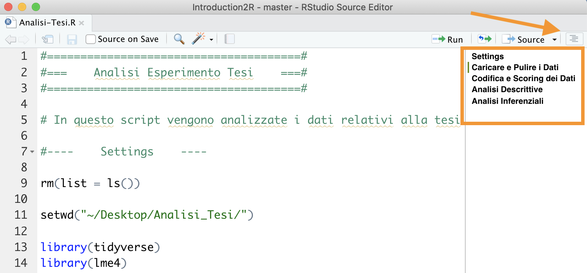
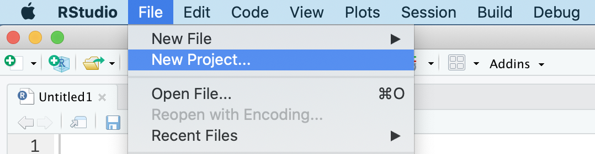
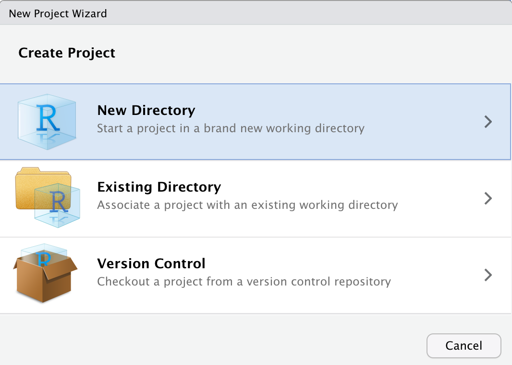
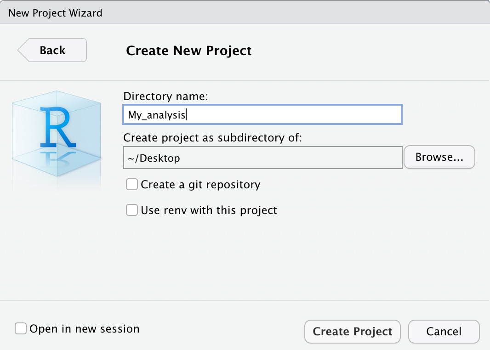

# Sessione di Lavoro {#working-session}

```{r settings, echo = FALSE}
knitr::opts_chunk$set(
  echo = FALSE,
  collapse=TRUE,
  fig.align="center"
)

if (knitr::is_html_output()) {
  out_extra <- 'style="background-color: #999999; padding:2px"'
}
if (knitr::is_latex_output()) {
  out_extra <- NULL
}
```

In questo capitolo, discuteremo di alcuni aspetti generali delle sessioni di lavoro in R. Descriveremo delle buone abitudini riguardanti l'organizzazione degli scripts per essere ordinati ed efficaci nel proprio lavoro. Inoltre descriveremo come organizzare i propri progetti in cartelle ed in particolare introdurremo l'uso degli *RStudio Projects*. Infine approfondiremo l'uso dei messaggi di R ed in particolare come comportarsi in caso di errori.

## Organizzazione Script

Abbiamo visto che idealmente tutti i passaggi delle nostre analisi devono essere raccolti in modo ordinato all'interno di uno script. Eseguendo in ordine linea per linea i comandi, dovrebbe essere possibile svolgere tutte le analisi fino ad ottenere i risultati desiderati.

Vediamo ora una serie di buone regole per organizzare in modo ordinato il codice all'interno di uno script e facilitare la sua lettura.

### Creare delle Sezioni

Per mantenere chiara l'oreganizzazione degli script e facilitare la sua comprensione, è utile suddividere il codice in sezioni dove vengono eseguiti i diversi step delle analisi. In RStudio è possibile creare una sezione aggiungendo al termine di una linea di commento i caratteri `####` o `----`. Il testo del commento verrà considerao il titolo della sezione e comparirà una piccola freccia a lato del numero di riga. È possibile utilizzare a piacere i caratteri `#` o `-` per creare lo stile desiderato, l'importante è che la linea si concluda con almeno quattro caratteri identici.


```{r, echo = TRUE}
# Sezione 1 ####

# Sezione 2 ----

#----    Sezione 3    ----

####   Sezione non valida   --##

```

A titolo del tutto esemplificativo prendiamo in esempio la divisione in sezioni utilizzata nello script in Figura \@ref(fig:script-template).

```{r, script-template, fig.cap="Esempio di suddivisione in sezioni di uno script", out.width="85%", out.extra=out_extra}
knitr::include_graphics("images/script-template.png")
```

- **Titolo** - Un titolo esplicativo del contenuto dello script. È possibile utilizzare altri caratteri all'interno dei commenti per creare l'effetto desiderato.
- **Intorduzione** - Descrizione e utili informazioni che riguardano sia l'obbiettivo del lavoro che l'esecuzione del codice (ad es. dove sono disponibili i dati, eventuali specifiche tecniche). Potrebbe essere utile anche indicare l'autore e la data del lavoro.
- **Setting** -  Sezione fondamentale in cui si predispone l'abiente di lavoro. Le operazioni da svolgere sono:
  1. `rm(list = ls())` per pulire l'Environment da eventuali oggetti in modo da eseguire lo script partendo da un ambiente vuoto (vedi Capitolo \@ref(environment)).
  2. `setwd()` per settare la working directory per assicuraci che i comandi siano eseguiti dalla  correttta posizione nel nostro computer (vedi Capitolo \@ref(working-directory)).
  3. `library()` per caricare i pacchetti utilizzati nel corso delle analisi (vedi Capitolo \@ref(packages)).
- **Caricare e Pulire i Dati** - Generica sezione in cui eseguire l'importazione e pulizia dei dati.
- **Codifica e Scoring dei Dati** - Generica sezione in cui eseguire la codifica ed eventuale scoring dei dati.
- **Analisi Descrittive** - Generica sezione in cui eseguire le analisi descrittive.
- **Analisi Inferenziali** - Generica sezione in cui eseguire le analisi inferenziali

Oltre che a mantenere ordinato e chiaro il codice, suddividere il proprio script in sezioni ci permette anche di navigare facilmente tra le diverse parti del codice. Possiamo infatti sfruttare l'indice che automaticamente viene creato. L'indice è consultabile premendo il tasto in alto a destra dello script da cui successivamente selezionare la sezione desiderata (vedi Figura \@ref(fig:toc-side)).

```{r, toc-side, fig.cap="Indice in alto per navigazione sezioni", out.width="85%", out.extra=out_extra}

```

In alternativa, è possibile utilizzare il menù in basso a sinistra dello script (vedi Figura \@ref(fig:toc-bottom)).

```{r, toc-bottom, fig.cap="Menù in basso per navigazione sezioni", out.width="85%", out.extra=out_extra}
knitr::include_graphics("images/toc-bottom.png")
```

Infine, un altro vantaggio è quello di poter compattare o espandere le sezioni di codice all'interno dell'editor, utilizzando le frecce a lato del numero di riga (vedi Figura \@ref(fig:section-closed)).

```{r, section-closed, fig.cap="Compattare ed espandere le sezioni di codice", out.width="85%", out.extra=out_extra}
knitr::include_graphics("images/section-closed.png")
```

### Sintassi {#syntax}

Elenchiamo qui altre buone norme nella scrittura del codice che ne facilitano la comprensione.

#### Commenti {-}

L'uso dei commenti è molto importante, ci permette di documentare le varie parti del codice e chiarire eventuli comandi difficili da capire. Tuttavia, non è necessario commentare ogni singola riga di codice ed anzi è meglio evitare di commentare laddove i comandi sono facilemtne interpetabili semplicemnte leggendo il codice.

La capacità di scrivere commenti utili ed eviare quelli rindondanti si impara con l'esperienza. In generale un commento non dovrebbe indicare *"che cosa"* ma piuttosto il *"perché"* di quella parte di codice. Infatti il cosa è facilmente interpretabile dal codice stesso mentre il perché potrebbe essere meno ovvio e soprattutto più utile per la comprensione dell'intero script. Ad esempio:
```{r, echo = TRUE, eval=FALSE}
x <- 10 # assegno a x il valore 10
x <- 10 # definisco massimo numero risposte
```
Il primo commento è inutile poiché è facilmente comprensibile dal codice stesso, mentre il secondo commento è motlo utile perché chiarisce il significato della variabile e mi faciliterà nella comprensione del codice. 

#### Nomi Oggetti {-}

Abbiamo visto nel Capitolo \@ref(objects-names) le regole che discriminano nomi validi da nomi non validi e le convenzioni da seguire nella definizione di un nome. Ricordiamo qui le caratterisiche che un nome deve avere per facilitare la comprensione del codice. Il nome di un oggetto deve essere:

- **auto-descrittivo** - Dal solo nome dovrebbe essere possibile intuire il contenuto dell'oggetto. È meglio quindi evitare nomi generici (quali `x` o `y`) ed utilizzare invece nomi che chiaramente descrivano il contenuto dell'oggetto.
- **della giusta lunghezza** - Non deve essere ne troppo breve (evitare sigle incomprensibili) ma neppure troppo lunghi. In genere sono sufficienti 2 o 3 parole per descrivere chiaramente un oggetto.

È inoltre importante essere **consistenti** nella scelta dello stile con cui si nominano le variabili. In genere è preferibile usare lo **snake_case** rispetto al **CamelCase**, ma la scelta è comunque libera. Tuttavia, una volta presa una decisione, è bene mantenerla per facilitare la comprensione del codice.

#### Esplicitare Argomenti {-}

Abbiamo visto nel Capitolo \@ref(function-arguments) l'importanza di esplicitare il nome degli argomenti quando vengono utilizzati nelle funzioni. Specificando a che cosa si riferiscono i vari valori facilitiamo la lettura e la comprensione del codice. Ad esempio:

```{r, echo = TRUE, eval = FALSE}
seq(0, 10, 2)
```

Potrebbe non essere chiaro se intendiamo una sequennza tra 0 e 10 di lunghezza 2 o a intervalli di 2. Specificando gli argomenti evitiamo incomprensioni e possibili errori.

```{r, echo = TRUE, eval = FALSE}
seq(from = 0, to = 10, by = 2)
seq(from = 0, to = 10, length.out = 2)
```

#### Spazi, Indentazione ed allineamento {-}

Al contrario di molti altri software, R non impone regole severe nell'utilizzo di spazi, indentazioni ed allineamenti ed in genere è molto permissivo per quanto riguarda la sintassi del codice. Tuttavia è importante ricordare che:

> Good coding style is like using correct punctuation. You can manage without it, but it sure makes things easier to read. Hadley Wickham

Prendiamo ad esempio le seguenti linee di codice, che includono delle funzioni avanzate di R:

```{r, echo=TRUE}
# Stile 1
k=10;if(k<5){x<-5:15}else{x<-seq(0,16,4)};y=7*2-12;mean(x/y)

# Stile 2
k <-  10

if (k < 5){
  x <- 5:15
} else {
  x<-seq(from = 0, to = 16, by = 4)
}

y <- 7 * 2 - 12

mean(x / y)
```

Come puoi notare otteniamo in entrambi i casi gli stessi risultati, per R non c'è alcuna differenza. Tuttavia, l'uso di spazi, una corretta indentazione ed un appropriato allineamento facilita la lettura e comprensione del codice.

In genere sono valide le seguenti regole:

- Aggiungi degli **spazi** intorno agli operatori (`+`, `-`, `<-`, etc.) per separargli dagli argomenti ad eccezione di `:`.
```{r, echo=TRUE, eval = FALSE}
# Good
35 / 5 + 7
x <- 0:10

# Bad
35/5+7
x<-0 : 10
```

- Nelle funzioni aggiungi degli **spazi** intorno al simbolo `=` che separa il nome degli argomenti e il loro valore. Aggiungi uno spazio dopo ogni virogola ma non separare il nome della funzione dalla parentesi sinistra.
```{r, echo=TRUE, eval = FALSE}
# Good
seq(from = 0, to = 10, by = 2)

# Bad
seq (from=0,to=10,by=2)
```

- Usa la corretta **indentazione** per i blocchi di codice posti all'interno delle parentesi graffe. Il livello  di indentazione deve rispecchiare la struttura di  annidamento del codice.
```{r, echo=TRUE, eval = FALSE}
# Good
for (...) {       # loop più esterno
  ...
  for (...) {     # loop interno
    ...
    if (...) {    # isruzione condizionale
      ...
    }
  }
}

# Bad
for (...) {       # loop più esterno
...
for (...) {     # loop interno
...
if (...) {    # isruzione condizionale
...
}
}
}
```
- **Allinea** gli argomenti di una funzione se questi spaziano più righe.
```{r, echo=TRUE, eval = FALSE}
# Good
data.frame(id = ...,
           name = ...,
           age = ...,
           sex = ...)

# Bad
data.frame(id = ..., name = ...,
age = ..., sex = ...)
```


:::{.design title="Tutta una Questione di Stile" data-latex="[Tutta una Questione di Stile]"}
Potete trovare  ulteriori regole e consigli riguardanti lo stile nella scrittura di codici al seguente link <https://irudnyts.github.io/r-coding-style-guide/>.
:::

## Organizzazione Progetti

All'aumentare della complessità di un'analisi vi troverete presto a dover gestire molti file di deversa tipologia (ad es. dati, report, grafici) e a dover suddividere le varie parti del lavoro in differenti script. A questo punto sarà opportuno organizzare in modo ordinato tutto il materiale necessario per l'analisi e i relativi risultati in un'unica cartella.

Idealmente, infatti, ogni analisi verrà salvata in una differente cartella e possiamo ad esempio organizzare i file utilizzando la seguente struttura di sottocartelle:

```
My_analysis/
 |-  Data/
 |-  Documents/
 |-  Outputs/
 |-  R/
```

- `Data/` - tutti i file relativi ai dati usati nell'analisi. Sarà importante mantenere sia una copia dei dati *raw*, ovvero i dati grezzi senza alcuan manipolazione, sia i dati effetivamente usati nelle analisi che in genere sono stati già puliti e codificati.
- `Documents/` - tutti i file di testo (ad es. Word o simili) e report utilizzati per descrivere le analisi (vedi in particolare [R-markdown](https://rmarkdown.rstudio.com/)).
- `Outputs/` - eventuali outputs creati durante le analisi come ad esempio grafici e tabelle.
- `R/` - tutti gli script utilizzati per le analisi. È possibile numerare gli script per suggerire il corretto ordine in cui debbano essere eseguiti, ad esempio `01-import-data.R`, `02-munge-data.R`, `03-descriptive-analysis.R` etc.

Questa struttura è puramente esemplificativa ma può essere un utile base di partenza che è possibile adattare a seconda delle particolari esigenze di ogni lavoro.

### RStudio Projects

RStudio permette inoltre di creare degli **R Projects**, ovvero degli spazi di lavoro che permettono di gestire indipendentemente diversi progetti. Ogni progetto avrà la propria working directory, workspace, history e settaggi personalizzati. Questo consente di passare velocemente da un progetto ad un altro riprendento immediatamente il lavoro da dove si era arrivati senza altre preoccupazioni.

Vediamo quindi come creare un **R Projects**.

1. Selezionare *File* > *New Project...*
<center>
{ width=75% }
</center>
<br>
2. Selezionare *New Directory* per creare un R Project in una nuova cartella (in alternativa selezionare *Existing Directory* per creare un R Project in una cartella già esistente) 
<center>
{ width=75% }
</center>
<br>
3. Selezionare *New Project* (in utilizzi avanzati è possibile scegliere particolari template da usare)
<center>
{ width=75% }
</center>
<br>
4. Indicare il nome della cartella (utilizzato anche come nome dell'R Project) e la posizione in cui creare la cartella
<center>
{ width=75% }
</center>
<br>
5. Una volta creato il progetto RStudio aprirà direttamente il progetto. Notate come nell'icona di RStudio comparirà ora anche il nome del progetto attualmente aperto
<center>
{ width=15% }
</center>
<br>
6. Per chiudere un progetto è sufficiente selezionare *File* > *Close Project* o in alterantiva utilizzare il menù in alto a destra
<center>
{ width=75% }
</center>
<br>
6. Per aprire un progetto precedente, è sufficiente selezionare *File* > *Open Project* o in alterantiva fare doppio click sul file `.Rproj` presente nella cartella del progetto
<center>
{ width=75% }
</center>
<br>

Elenchiamo ora alcuni dei principali vantaggi dell'utilizzare gli R Project:

- La **working directory** viene autoamticamente settata nella cartella del progetto. Questo ci permette di non doverci più preoccupare della sua definizione e possiamo definire ogni *path* in relazione alla cartella del progetto.
- Quando apriamo un progetto in una successiva **sessione di lavoro** gli script e i documenti di lavoro verranno automaticamente aperti come li avevamo lasciati nella sessione precedente. È come avere una scrivania per ogni progetto dove lasciare tutti i documenti utili e riprendere il lavoro immediatamete.
- Utilizzando i progetti è possibile **personnalizzare e automatizzare** molte funzioni come ad esempio caricare i paccheti o eseguire determinati codici. Tuttavia richiedono una buona conoscenza di R.
- Esistono molti **template** per i progetti che implementano utili funzionalità, in particolare la struttura degli R Projects usata per lo sviluppo dei pacchetti è molto utile anche nel caso di analisi statistiche. Tuttavia richiedono una buona conoscenza di R.

## Messages, Warnings e Errors

R utilizza la console per comunicare con noi durante le nostre sessioni di lavoro. Oltre a fornirci i risultati dei nostri comandi, R ci segnala anche altre utili informazioni attraverso diverse tipologie di messaggi. In particolare abbiamo:

- **Messages**: dei semplici messaggi che ci possono aggiornare ad esempio sullo stato di avanzamento di un dato compito oppure fornire suggerimenti sull'uso di una determinata funzione o pacchetto (spesso vengono mostrati quando viene caricato un pacchetto).
- **Warnings**: questi messaggi sono utlizzati da R per dirci che c'è stato qualche cosa di strano che ha messo in allerta R. R ci avvisa che, sebbene il comando sia stato eseguito ed abbiamo ottenuto un risultato, ci sono stati dei comportamenti inusuali o magari eventuali correzioni apportate in automatico. Nel caso di warnings non ci dobbiamo allramre, è importante controllare che i comandi siano corretti e che abbiamo effetivamente ottenuto il risultato desiderato. Una volta sicuri dei risultati possiamo procedere tranquillamente.
- **Errors**: R ci avvisa di eventuali errori e problemi che non permettono di eseguire il comando. in questo caso non otterremo nnessun risultato ma sarà necessario capire e risolvere il problema per poi rieseguire nuovamente il comando e procedere.

Notiamo quindi come non tutti i messaggi che R ci manda sono dei messaggi di errore. È quindi importante non spaventarsi ma leggere con attenzione  i messaggi, molte volte si tratta semplicemente di avvertimenti o suggerimenti.


Tuttavia gli errori rappresentano sempre il maggiore dei problemi perché non è possibile procedere nel lavoro senza averli prima risolti. È importante ricordare che i messaggi di errore non sono delle critiche che R ci rivolge perché sbagliamo. Al contrario, sono delle richieste di aiuto fatte da R perché non sa come comportarsi. Per quanto super potente, R è un seplice programma che non può interpretare le nostre richieste ma si basa sull'uso dei comandi che seguono una rigida sintassi. A volte è sufficiente una virgola mancante o un charattere al posto di un numero per mandare in confusione R e richiedere il nostro intervento risolutore. 

### Risolvere gli Errori

Quando si approccia la scrittura di codice, anche molto semplice, la cosa che sicuramente capiterà più spesso sarà riscontrare  messaggi di **errore** e quindi trovare il modo per risolverli.

> Qualche programmatore esperto direbbe che l'essenza stessa di programmare è in realtà risolvere gli errori che il codice produce.

L'**errore non è quindi un difetto o un imprevisto**, ma parte integrante della scrittura del codice. L'importante è capire come gestirlo.

Abbiamo tutti le immagini in testa di programmatori da film che scrivono codice alla velocità della luce, quando nella realtà dobbiamo spesso affrontare **bug**, **errori di output** o altri problemi vari. Una serie di skills utili da imparare sono:

  * Comprendere a fondo gli **errori** (non banale)
  * Sapere **come e dove cercare una soluzione** (ancora meno banale) 
  * In caso non si trovi una soluzione direttamente, chiedere aiuto in modo efficace

#### Comprendere gli errori{-}
  
Leggere con attenzione i messaggi di errore è molto importante. R è solitamente abbastanza esplicito nel farci capire il problema. Ad esempio usare una funzione di un pacchetto che non è stato caricato di solito fornisce un messaggio del tipo `Error in funzione : could not find function "funzione"`.

Tuttavia, in altre situazioni i messaggi potrebbero non essere altrettanto chiari. Seppur esplicito R è anche molto sintetico e quindi l'utilzzo di un linguaggio molto specifico (e almeno inizialmente poco familiare), potrebbe rendere difficile capire il loro significato o addirittura renderli del tutto incomprensibili. Man mano che diventerete più esperti in R, diventerà sempre più semplice ed immmediato capire quale sia il problema e anche come risolverlo. Ma nel caso non si conosca la soluzione è necessario cercarla in altro modo.

#### Problema + Google = Soluzione {-}

In qualsiasi situazione Google è il nostro miglior amico.

Cercando infatti il messaggio di errore/warning su Google, al 99% avremo altre persone che hanno avuto lo stesso problema e probabilmente anche una soluzione.

:::{.tip title="Ricerca su Google" data-latex="[Ricerca su Google]"}
Il modo migliore per cercare è copiare e incollare su Google direttamente l'output di errore di R come ad esempio `Error in funzione : could not find function "funzione"` piuttosto che descrivere a parole il problema. I messaggi di errore sono standard per tutti, la tua descrizione invece no.
:::

Cercando in questo modo vedrete che molti dei risultati saranno esattamente riferiti al vostro errore:

<center>


</center>

#### Chiedere una soluzione {-}

Se invece il vostro probelma non è un messaggio di errore ma un utilizzo specifico di R allora il consiglio è di usare una ricerca del tipo: `argomento + breve descrizione problema + R`. Nelle sezioni successive vedrete nel dettaglio altri aspetti della programmazione ma se volete ad esempio calcolare la **media** in R potrete scrivere `compute mean in R`. 
Mi raccomando, fate tutte le ricerche in **inglese** perché le possibilità di trovare una soluzione sono molto più alte.

Dopo qualche ricerca, vi renderete conto che il sito che vedrete più spesso si chiama [**Stack Overflow**](https://stackoverflow.com/). Questo è una manna dal cielo per tutti i programmatori, a qualsiasi livello di expertise. È una community dove tramite domande e risposte, si impara a risolvere i vari problemi ed anche a trovare nuovi modi di fare la stessa cosa. È veramente utile oltre che un ottimo modo per imparare.

L'ultimo punto di questa piccola guida alla ricerca di soluzioni, riguarda il fatto di dover non solo cercare ma anche chiedere. Dopo aver cercato vari post di persone che richiedevano aiuto per un problema noterete che le domande e le risposte hanno sempre una struttura simile. Questo non è solo un fatto stilistico ma anzi è molto utile per uniformare e rendere chiara la domanda ma sopratutto la risposta, in uno spirito di condivisione. C'è anche una [guida dedicata](https://stackoverflow.com/help/how-to-ask) per scrivere la domanda perfetta.

In generale[^stack]:

- Titolo: un super riassunto del problema
- Contesto: linguaggio (es. R), quale sistema operativo (es. Windows)
- Descrizione del problema/richiesta: in modo chiaro e semplice ma non troppo generico
- Codice ed eventuali dati per capire il problema

L'ultimo punto di questa lista è forse il più importante e si chiama in gergo tecnico [**REPREX**](https://community.rstudio.com/t/faq-whats-a-reproducible-example-reprex-and-how-do-i-create-one/5219) (**Rep**roducible **Ex**ample). È un tema leggermente più avanzato ma l'idea di fondo è quella di fornire tutte le informazioni possibili per poter riprodurre (e quindi eventualmente trovare una soluzione) il codice di qualcuno nel proprio computer.

Se vi dico "R non mi fa creare un nuovo oggetto, quale è l'errore?" è diverso da dire "il comando `oggetto -> 10` mi da questo errore `Error in 10 <- oggetto : invalid (do_set) left-hand side to assignment`, come posso risolvere?"

:::{.trick title="reprex" data-latex="[reprex]"}
Ci sono anche diversi pacchetti in R che rendono automatico creare questi esempi di codice da poter condividere, come il pacchetto [`reprex`](https://www.tidyverse.org/help/).
:::

[^stack]: Fonte: [Writing the perfect question - Jon Skeet](https://codeblog.jonskeet.uk/2010/08/29/writing-the-perfect-question/)

