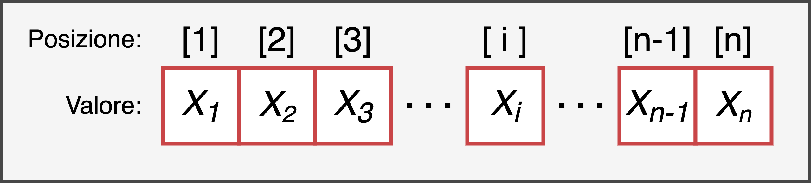

# Vettori {#vector}


```{r settings, echo = FALSE}
knitr::opts_chunk$set(
  echo = FALSE,
  collapse=TRUE,
  fig.align="center"
)

library(kableExtra)
```

I vettori sono la struttura dati più semplice tra quelle presenti in R. Un vettore non è altro che un insieme di elementi disposti in uno specifico ordine e possiamo quindi immaginarlo in modo simile a quanto rappresentato in Figura \@ref(fig:vector). 

```{r, vector, fig.cap="Rappresentazione della struttura di un vettore di lunghezza *n*", out.width="65%"}

```

Due caratteristiche importanti di un vettore sono:

- la **lunghezza** - il numero di elementi da cui è formato il vettore
- la **tipologia** - la tipologia di dati da cui è formato il vettore. Un vettore infatti deve essere formato da **elementi tutti dello stesso tipo** e pertanto esistono diversi vettori a seconda della tipologia di dati da cui è formato (valori numerici, valori interi, valori logici, valori carattere).  


È fondamentale inoltre sottolineare come ogni **elemento** di un vettore sia caratterizzato da:

- un **valore** - ovvero il valore dell'elemento che può essere di qualsiasi tipo ad esempio un numero o una serie di caratteri.
- un **indice di posizione** - ovvero un numero intero positivo che identifica la sua posizione all'interno del vettore.

Notiamo quindi come i vettori $x$ e $y$ così definiti:
$$
x = [1, 3, 5];\ \ \ y = [3, 1, 5],
$$
sebbene includano gli stessi elementi, non sono identici poiché differiscono per la loro disposizione. Tutto questo ci serve solo per ribadire come l'ordine degli elementi sia fondamentale per la valutazione di un vettore.


Vediamo ora come creare dei vettori in R e come compiere le comuni operazioni di selezione e manipolazione di vettori. Successivamente approfondiremo le caratteristiche dei vettori valutandone le diverse tipologie.

## Creazione

In realtà abbiamo già incontrato dei vettori nei precedenti capitoli poiché anche le variabili con un singolo valore altro non sono che un vettore di lunghezza 1. Tuttavia, per creare dei vettori di più elementi dobbiamo utilizzare il comando `c()`, ovvero *"combine"*, indicando tra le parentesi i valori degli elementi nella successione desiderata e separati da una virgola. Avremo quindi la seguente sintassi:

```{r echo = TRUE, eval = FALSE}
nome_vettore <- c(x_1, x_2, x_3, ..., x_n)
```

Nota come gli elementi di un vettore debbano essere tutti della stessa tipologia ad esempio valori numerici o valori carattere.

:::{.design title="Sequenze - \\texttt{:}, \\texttt{seq()} e \\texttt{rep()}" data-latex="[Sequenze - \\texttt{:}, \\texttt{seq()} e \\texttt{rep()}]"}
In alternativa è possibile utilizzare qualsiasi funzione che restituisca come output una sequenza di valori sotto forma di vettore. Tra le funzioni più usate per creare delle sequenze abbiamo:

- `<from>:<to>` - Genera una sequenza di valori numerici crescenti (o decrescenti) dal primo valore indicato (`<from>`) al secondo valore indicato (`<to>`) a step di 1 (o -1 ).
```{r echo = TRUE}
# sequenza crescente
1:5

# sequenza decrescente
2:-2

# sequenza con valori decimali
5.3:10
```

- `seq(from = , to = , by = , length.out = )` - Genera una sequenza regolare di valori numerici compresi tra `from` e `to` con incrementi indicati da `by`, oppure di lunghezza complessiva indicata da `length.out` (vedi `?seq()` per maggiori dettagli).
```{r echo = TRUE}
# sequenza a incrementi di 2
seq(from = 0, to = 10, by = 2)

# sequenza di 5 elementi
seq(from = 0, to = 1, length.out = 5)
```

- `rep(x, times = , each = )` - Genera una sequenza di valori ripetendo i valori contenuti in `x`. I valori di `x` possono essere ripetuti nello stesso ordine più volte specificando `times` oppure ripetuti ciascuno più volte specificando `each` (vedi `?rep()` per maggiori dettagli).
```{r echo = TRUE}
# sequenza a incrementi di 2
rep(c("foo", "bar"), times = 3)

# sequenza di 5 elementi
rep(1:3, each = 2)
```
:::

### Esercizi {-}

familiarizza con la creazione di vettori ([soluzioni](https://github.com/psicostat/Introduction2R/blob/master/exercises/chapter-07-vectors.R)):

1. Crea il vettore `x` contenente i numeri 4, 6, 12, 34, 8
2. Crea il vettore `y` contenente tutti i numeri pari compresi tra 1 e 25 (`?seq()`)
3. Crea il vettore `z` contenente tutti i primi 10 multipli di 7 partendo da 13 (`?seq()`)
4. Crea il vettore `s` in cui le lettere `"A"`,`"B"` e `"C"` vengono ripetute nel medesimo ordine 4 volte (`?rep()`)
5. Crea il vettore `t` in cui le letter `"A"`,`"B"` e `"C"` vengono ripetute ognuna 4 volte (`?rep()`)
6. Genera il seguente output in modo pigro, ovvero scrivendo meno codice possibile ;)

```{r}
rep(rep(c("foo", "bar"), each = 2),times = 2)
```


## Selezione elementi {#vector-selection}

Una volta creato un vettore potrebbe essere necessario selezionare uno o più dei suoi elementi. In R per selezionare gli elementi di un vettore si utilizzano le **parentesi quadre** `[]` dopo il nome del vettore, indicando al loro interno **l'indice di posizione** degli elementi desiderati:

```{r, echo = TRUE, eval = FALSE}
nome_vettore[<indice-posizione>]
```

Attenzione, non devo quindi indicare il valore dell'elemento desiderato ma il suo indice di posizione. Ad esempio: 

```{r echo = TRUE}
# dato il vettore
my_numbers <- c(2,4,6,8)

# per selezionare il valore 4 utilizzo il suo indice di posizione ovvero 2
my_numbers[2]

# Se utilizzassi il suo valore (ovvero 4) 
# otterrei l'elemento che occupa la 4° posizione
my_numbers[4]
```

Per selezionare più elementi è necessario indicare tra le parentesi quadre tutti gli indici di posizione degli elementi desiderati. Nota come non sia possibile fornire semplicemente i singoli indici numerici ma questi devono essere raccolti in un vettore, ad esempio usando la funzione `c()`. Praticamente usiamo un vettore di indici per selezionare gli elementi desiderati dal nostro vettore iniziale.

```{r echo = TRUE, error = TRUE}
# ERRATA selezione più valori 
my_numbers[1,2,3]

# CORRETTA selezione più valori
my_numbers[c(1,2,3)]
my_numbers[1:3]
```

:::{.tip title="Selezionare non è modificare" data-latex="[Selezionare non è modificare]"}
Nota come l'operazione di selezione non modifichi l'oggetto iniziale. Pertanto è necessario salvare il risultato della selezione se si desidera mantenere le modifiche.

```{r, echo = TRUE}
my_words <- c("foo", "bar", "baz", "qux")

# Seleziono i primi 2 elementi
my_words[1:2]

# Ho ancora tutti gli elementi nell'oggetto my_words
my_words

# Salvo i risultati
my_words <- my_words[1:2]
my_words
```

:::

:::{.warning title="Casi estremi nella selezione" data-latex="[Casi estremi nella selezione]"}
Cosa accade se utilizziamo un indice di posizione maggiore del numero di elementi del nostro vettore?
```{r echo = TRUE}
# Il mio vettore
my_numbers <- c(2,4,6,8)

my_numbers[10]
```
R non restituisce un errore ma il valore `NA` ovvero *Not Available*, per indicare che nessun valore è disponibile.

Osserviamo infine anche altri comportamenti particolari o possibili errori nella selezione di elementi. 

- L'indice di posizione deve essere un valore numerico e non un carattere.
```{r echo = TRUE, error = TRUE}
# ERRATA selezione più valori 
my_numbers["3"]

# CORRETTA selezione più valori
my_numbers[3]
```
- I numeri decimali vengono ignorati e non "arrotondati"
```{r echo = TRUE,}
my_numbers[2.2]
my_numbers[2.8]
```
- Utilizzando il valore 0 ottengo un vettore vuoto
```{r echo = TRUE,}
my_numbers[0]
```
:::

### Utilizzi avanzati selezione {#vector-selection-advanced}

Vediamo ora alcuni utilizzi avanzati della selezione di elementi di un vettore. In particolare impareremo a:

- utilizzare gli operatori relazionali e logici per selezionare gli elementi di un vettore
- modificare l'ordine degli elementi
- creare nuove combinazioni
- sostituire degli elementi
- eliminare degli elementi

#### Operatori relazionali e logici {-}

Un'utile funzione è quella di selezionare tra gli elementi di un vettore quelli che rispettano una certa condizione. Per fare questo dobbiamo specificare all'interno delle parentesi quadre la proposizione di interesse utilizzando gli operatori relazionali e logici (vedi Capitolo \@ref(operators-rel-log)). 

Possiamo ad esempio selezionare da un vettore numerico tutti gli elementi maggiori di un certo valore, oppure selezionare da un vettore di caratteri tutti gli elementi uguali ad una data stringa.
```{r, echo = TRUE}
# Vettore numerico - seleziono elementi maggiori di 0
my_numbers <- -5:5
my_numbers[my_numbers >= 0]

# Vettore caratteri - seleziono elementi uguali a "bar"
my_words <- rep(c("foo", "bar"), times = 4)
my_words[my_words == "bar"]
```

Per capire meglio questa operazione è importante notare come nello stesso comando ci siano in realtà due passaggi distinti:

- **Vettore logico** (vedi Capitolo \@ref(logical-vector)) - quando un vettore è valutato in una proposizione, R restituisce un nuovo vettore che contiene per ogni elemento del vettore iniziale la risposta (`TRUE` o `FALSE`) alla nostra proposizione.
- **Selezione** - utilizziamo il vettore logico ottenuto per selezionare gli elementi dal vettore iniziale. Gli elementi associati al valore `TRUE` sono selezionati mentre quelli associati al valore `FALSE` sono scartati.

Rendiamo espliciti questi due passaggi nel seguente codice: 
```{r, echo = TRUE}
# Vettore logico
condition <- my_words == "bar"
condition

# Selezione
my_words[condition]
```

#### Ordinare gli elementi {-}

Gli indici di posizione possono essere utilizzati per ordinare gli elementi di un vettore a seconda delle necessità.

```{r, echo = TRUE}
messy_vector <- c(5,1,7,3)

# Altero l'ordine degli elementi
messy_vector[c(4,2,3,1)]

# Ordino gli elementi per valori crescenti
messy_vector[c(2,4,1,3)]
```

:::{.trick title="\\texttt{sort()} vs \\texttt{order()}" data-latex="[\\texttt{sort()} vs \\texttt{order()}]"}
Per ordinare gli elementi di un vettore in ordine crescente o decrescente (sia alfabetico che numerico), è possibile utilizzare la funzione `sort()` specificando l'argomento `decreasing`. Vedi l'help page della funzione per ulteriori informazioni (`?sort()`).

```{r, echo = TRUE}
# Ordine alfabetico
my_letters <- c("cb", "bc", "ab", "ba", "cb", "ab")
sort(my_letters)

# ordine decrescente
sort(messy_vector, decreasing = TRUE)
```

Nota come esista anche la funzione `order()` ma questa sia un false-friend perché non ci fornisce direttamente un vettore con gli elementi ordinati ma bensì gli indici di posizione per riordinare gli elementi (`?order()`). Vediamo nel seguente esempio come utilizzare questa funzione:
```{r, echo = TRUE}
# Indici di posizione per riordinare gli elementi
order(messy_vector)
# Riordino il vettore usando gli indici di posizione
messy_vector[order(messy_vector)]
```
:::

#### Combinazioni di elementi {-}

Gli stessi indici di posizione possono essere richiamati più volte per ripetere gli elementi nelle combinazioni desiderate formando un nuovo vettore.
```{r, echo = TRUE}
my_numbers <- c(5,6,7,8)
# Ottengo un nuovo vettore con la combinazione desiderata
my_numbers[c(1,2,2,3,3,3,4)]
```

#### Modificare gli elementi {-}

Un importante utilizzo degli indici riguarda la modifica di un elemento di un vettore. Per sostituire un vecchio valore con un nuovo valore, posso utilizzare la funzione *assign* (`<-` o `=`) come nell'esempio:

```{r, echo = TRUE}
my_names <- c("Andrea", "Bianca", "Carlo")

# Modifico il nome "Bianca" in "Beatrice"
my_names[2] <- "Beatrice"
my_names
```

Per sostituire il valore viene indicato alla sinistra dell'operatore *assign* il valore che si vuole modificare e alla destra il nuovo valore. Nota come questa operazione possa essere usata per aggiungere anche nuovi elementi al vettore.

```{r, echo = TRUE}
my_names[4]

# Aggiungo il nome "Daniela"
my_names[4] <- "Daniela"
my_names
```


#### Eliminare gli elementi {-}

Per **eliminare degli elementi** da un vettore, si indicano all'interno delle parentesi quadre gli indici di posizione degli elementi da eliminare preceduti dall'operatore `-` (*meno*). Nel caso di più elementi è anche possibile indicare il meno solo prima del comando `c()`, ad esempio il comando `x[c(-2,-4)]` diviene `x[-c(2,4)]`.

```{r, echo = TRUE}
my_words <- c("foo", "bar", "baz", "qux")

# Elimino "bar"
my_words[-2]

# Elimino "foo" e "baz"
my_words[-c(1,3)]    # oppure my_words[c(-1, -3)]
```

Nota come l'operazione di eliminazione sia comunque un'operazione di selezione. Pertanto è necessario salvare il risultato ottenuto se si desidera mantenere le modifiche.

```{r, echo = TRUE}
# Elimino "foo" e "baz"
my_words[-c(1,3)]

# Ho ancora tutti gli elementi nell'oggetto my_words
my_words

# Salvo i risultati
my_words <- my_words[-c(1,3)]
my_words
```

#### `which()`

La funzione `which()` è molto utile per ottenere la **posizione** all'interno di un vettore associata ad una certa condizione logica. In altri termini se vogliamo sapere in quale posizione sono i valori `> 5` in un certo vettore numerico possiamo usare la funzione `which(x > 5)` dove `x` è chiaramente il nostro vettore numerico.

```{r}
x <- rnorm(10, 5, 3)
x > 5
which(x > 5)
```

Come vedete, la funzione `which()` essenzialmente restituisce la **posizione** (e non il valore) dove la condizione testata è `TRUE`. È importante notare che queste due scritture sono equivalenti:

```{r}
x[x > 5]
x[which(x > 5)]
```

Infatti, come abbiamo visto possiamo indicizzare un vettore sia con un'altro vettore che ci indica la posizione degli elementi da estrarre che un vettore **logico** di lunghezza uguale al vettore originale.

### Esercizi {-}

Esegui i seguenti esercizi ([soluzioni](https://github.com/psicostat/Introduction2R/blob/master/exercises/chapter-07-vectors.R)):

1. Del vettore `x` seleziona il 2°, 3° e 5° elemento
2. Del vettore `x` seleziona i valori 34 e 4
3. Dato il vettore `my_vector = c(2,4,6,8)` commenta il risultato del comando `my_vector[my_vector]`
4. Del vettore `y` seleziona tutti i valori minori di 13 o maggiori di 19
5. Del vettore `z` seleziona tutti i valori compresi tra 24 e 50
6. Del vettore `s` seleziona tutti gli elementi uguali ad `"A"`
7. Del vettore `t` seleziona tutti gli elementi diversi da `"B"`
8. Crea un nuovo vettore `u` identico a `s` ma dove le `"A"` sono sostituite con la lettera `"U"`
9. Elimina dal vettore `z` i valori 28 e 42


## Funzioni e operazioni {#vector-functions}

Vediamo ora alcune utili funzioni e comuni operazioni che è possibile svolgere con i vettori (vedi Tabella \@ref(tab:table-vector-operators)).

```{r table-vector-operators}

names_function <- c("Unire più vettori in un unico vettore ", "Valutare il numero di elementi contenuti in un vettore", "Somma di due vettori", "Differenza tra due vettori",
                    "Prodotto tra due vettori", "Rapporto tra due vettori")
formula <- sprintf("vettore1 %s vettore2", c("+", "-", "*", "/"))

if (knitr::is_html_output()) {
  vector_operators <- data.frame(formula = c("nuovo_vettore <- c(vettore1, vettore2)",
                                             "length(nome_vettore)",formula),
                                 name = names_function)
  escape = TRUE
}
if (knitr::is_latex_output()) {
  vector_operators <- data.frame(formula = sprintf("\\texttt{%s}",
                                  c("nuovo\\_vettore <- c(vettore1, vettore2)",
                                    "length(nome\\_vettore)",formula)),
                                 name = names_function)
  escape = FALSE
}

kableExtra::kable(vector_operators, col.names = c("Funzione", "Descrizione"),
                  escape = escape, caption = "Funzioni e operazioni con vettori") %>%
  kable_styling(bootstrap_options = c("striped", "hover", "condensed", "responsive"),
                full_width = F,
                latex_options = c("hold_position"))
```

Nota che l'esecuzione di operazioni matematiche (ad es. `+`, `-`, `*`, `/` etc.) è possibile sia rispetto ad un singolo valore sia rispetto ad un altro vettore:

- **Singolo valore** - l'operazione sarà svolta per ogni elemento del vettore rispetto al singolo valore fornito. 
- **Altro vettore** - l'operazione sarà svolta per ogni coppia di elementi dei due vettori. È quindi necessario che i due vettori abbiano la **stessa lunghezza**, ovvero lo stesso numero di elementi.

```{r, echo = TRUE}
x <- 1:5
y <- 1:5

# Sommo un valore singolo
x + 10

# Somma di vettori (elemento per elemento)
x + y
```

:::{.warning title="Vettori di diversa lunghezza" data-latex="[Vettori di diversa lunghezza]"}
Qualora i vettori differiscano per la loro lunghezza, R ci presenterà un warning avvisandoci del problema ma eseguirà comunque l'operazione utilizzando più volte il vettore più corto.
```{r, echo = TRUE, error = TRUE}
x + c(1, 2)
```

Tuttavia, compiere operazioni tra vettori di diversa lunghezza (anche se multipli) dovrebbe essere evitato poiché è facile causa di errori ed incomprensioni. 
:::

:::{.design title="Vectorized Operations" data-latex="[Vectorized Operations]"}
In R la maggior parte degli operatori sono *vettorizzati*, ovvero calcolano direttamente il risultato per ogni elemento di un vettore. Questo è un grandissimo vantaggio poiché ci permette di essere molto efficienti e coincisi nel codice.

Senza vettorizzazione, ogni operazione tra due vettori richiederebbe di specificare l'operazione per ogni elemento del vettore. Nel precedente esempio della somma tra `x` e `y` avremmo dovuto usare il seguente codice:
```{r, echo = TRUE}
z <- numeric(length(x))
for(i in seq_along(x)) {
      z[i] <- x[i] + y[i]
}
z
```

Nota come questo sia valido anche per gli **operatori relazionali e logici**. Infatti valutando una proposizione rispetto ad un vettore, otterremmo una risposta per ogni elemento del vettore

```{r, echo = TRUE}
my_values <- 1:8

# Valori compresi tra 4 e 7
my_values >= 4 & my_values <= 7
```
:::

### Esercizi {-}

Esegui i seguenti esercizi ([soluzioni](https://github.com/psicostat/Introduction2R/blob/master/exercises/chapter-07-vectors.R)):

1. Crea il vettore `j` unendo i vettori `x` ed `z`.
2. Elimina gli ultimi tre elementi del vettore `j` e controlla che i vettori `j` e `y` abbiano la stessa lunghezza.
3. Calcola la somma tra i vettori `j` e `y`.
4. Moltiplica il vettore z per una costante `k=3`.
5. Calcola il prodotto tra i primi 10 elementi del vettore `y` ed il vettore `z`.

## Data Type {#data-type}

Abbiamo visto come sia necessario che in un vettore tutti gli elementi siano della stessa tipologia. Avremo quindi diversi tipi di vettori a seconda della tipologia di dati che contengono.

In R abbiamo 4 principali tipologie di dati, ovvero tipologie di valori che possono essere utilizzati:

- `character` - *Stringhe di caratteri* i cui valori alfanumerici vengono delimitati dalle doppie virgolette `"Hello world!"` o virgolette singole `'Hello world!'`.
- `double` - *Valori reali* con o senza cifre decimali ad esempio `27` o `93.46`.
- `integer` - *Valori interi* definiti apponendo la lettera `L` al numero desiderato, ad esempio `58L`.
- `logical` - *Valori logici* `TRUE` e `FALSE` usati nelle operazioni logiche.

Possiamo verificare la tipologia di un valore utilizzando la funzione `typeof()`.
```{r, echo = TRUE}
typeof("foo") 

typeof(2021)

typeof(2021L) # nota la lettera L

typeof(TRUE)
```

Esistono molte altre tipologie di dati tra cui `complex` (per rappresentare i numeri complessi del tipo $x + yi$) e `Raw` (usati per rappresentare i valori come bytes) che però riguardano usi poco comuni o comunque molto avanzati di R e pertanto non verranno trattati.

:::{.design title="Tutta una questione di bit" data-latex="[Tutta una questione di bit]"}
Questa distinzione tra le varie tipologie di dati deriva dalla modalità con cui il computer rappresenta internamente i diversi valori. Sappiamo infatti che il computer non possiede caratteri ma solamente bits, ovvero successioni di 0 e 1 ad esempio 01000011. 

Senza scendere nel dettaglio, per ottimizzare l'uso della memoria i diversi valori vengono *"mappati"* utilizzando i bits in modo differente a seconda delle tipologie di dati. Pertanto in R il valore `24` sarà rappresentato diversamente a seconda che sia definito come una stringa di caratteri (`"24"`), un numero intero (`24L`) o un numero double (`24`).

#### Integer vs double {-}

In particolare un aspetto poco intuitivo riguarda la differenza tra valori `double` e `integer`. Mentre i valori interi possono essere rappresentati con precisione dal computer, non tutti i valori reali possono essere rappresentati esattamente utilizzando il numero massimo di 64 bit. In questi casi i loro valori vengono quindi approssimati e, sebbene questo venga fatto con molta precisione, a volte potrebbe portare a dei risultati inaspettati. Nota infatti come nell'esempio seguente non otteniamo zero, ma osserviamo un piccolo errore dovuto all'approssimazione dei valori `double`.
```{r, echo = TRUE}
my_value <- sqrt(2)^2 # dovrei ottenere 2
my_value - 2          # dovrei ottenere 0
```

È importante tenere a mente questo problema nei test di uguaglianza dove l'utilizzo dell'operatore `==` potrebbe generare delle risposte inaspettate. In genere viene quindi preferita la funzione `all.equal()` che prevede un certo margine di tolleranza (vedi `?all.equal()` per ulteriori dettagli).
```{r, echo = TRUE}
my_value == 2          # Problema di approssimazione 
all.equal(my_value, 2) # Test con tolleranza
```

Ricorda infine che i computer hanno un limite rispetto al massimo valore e minimo valore che possono rappresentare sia per quanto riguarda i valori interi che i valori reali. Per approfondire vedi <https://stat.ethz.ch/pipermail/r-help/2012-January/300250.html>.
:::

Vediamo ora i diversi tipi di vettori a seconda della tipologia di dati utilizzati.

### Character

I vettori formati da stringhe di caratteri sono definiti vettori di caratteri. Per valutare la tipologia di un oggetto possiamo utilizzare la funzione `class()`, mentre ricordiamo che la funzione `typeof()` valuta la tipologia di dati. In questo caso otteniamo per entrambi il valore `character`. 

```{r, echo = TRUE}
my_words<-c("Foo","Bar","foo","bar")

class(my_words) # tipologia oggetto

typeof(my_words) # tipologia dati
```

Non è possibile eseguire operazioni aritmetiche con vettori di caratteri ma solo valutare relazioni di uguaglianza o disuguaglianza rispetto ad un'altra stringa.

```{r, echo = TRUE, error = TRUE}
my_words + "foo"

my_words == "foo"
```

### Numeric

In R, se non altrimenti specificato, ogni valore numerico viene rappresentato come un `double` indipendentemente che abbia o meno valori decimali. I vettori formati da valori double sono definiti vettori numerici. In R la tipologia del vettore è indicata con `numeric` mentre i dati sono `double`. 

```{r, echo = TRUE}
my_values <- c(1,2,3,4,5)
class(my_values)  # tipologia oggetto

typeof(my_values) # tipologia dati
```

I vettori numerici sono utilizzati per compiere qualsiasi tipo di operazioni matematiche o logico-relazionali. 

```{r, echo = TRUE}
my_values + 10

my_values <= 3
```

### Integer

In R per specificare che un valore è un numero intero viene aggiunta la lettera `L` immediatamente dopo il numero. I vettori formati da valori interi sono definiti vettori di valori interi. In R la tipologia del vettore è indicata con `integer` allo stesso modo dei dati. 

```{r, echo = TRUE}
my_integers <- c(1L,2L,3L,4L,5L)
class(my_integers)  # tipologia oggetto

typeof(my_integers) # tipologia dati
```

Come per i vettori numerici, i vettori di valori interi possono essere utilizzati per compiere qualsiasi tipo di operazioni matematiche o logico-relazionali. Nota tuttavia che operazioni tra integer e doubles restituiranno dei doubles ed anche nel caso di operazioni tra integers il risultato potrebbe non essere un integer.

```{r, echo = TRUE}
is.integer(5L * 5)   # integer e double

is.integer(5L * 5L)  # integer e integer

is.integer(5L / 5L)  # integer e integer
```

### Logical {#logical-vector}

I vettori formati da valori logici (`TRUE` e `FALSE`) sono definiti vettori logici. In R la tipologia del vettore è indicata con `logical` allo stesso modo dei dati. 

```{r, echo = TRUE}
my_logical <- c(TRUE, FALSE, TRUE)
class(my_logical)  # tipologia oggetto

typeof(my_logical) # tipologia dati
```

I vettori di valori logici possono essere utilizzati con gli operatori logici.

```{r, echo = TRUE}
my_logical & c(FALSE, TRUE, TRUE)

my_logical & c(0, 1, 3)
```

Tuttavia ricordiamo che ai valori `TRUE` e `FALSE` sono associati rispettivamente i valori numerici 1 e 0 (o più precisamente i valori interi `1L` e `0L`). Pertanto è possibile eseguire anche operazioni matematiche dove verranno automaticamente considerati i rispettivi valori numerici. Ovviamente il risultato ottenuto sarà un valore numerico e non logico.

```{r, echo = TRUE}
TRUE * 10

FALSE * 10
```


:::{.trick title="\\texttt{sum()} e \\texttt{mean()}" data-latex="[\\texttt{sum()} e \\texttt{mean()}]"}
Utilizzando le funzioni `sum()` e `mean()` con un vettore logico, possiamo valutare rispettivamente il numero totale e la percentuale di elementi che hanno soddisfatto una certa condizione logica.

```{r, echo = TRUE}
my_values <- rnorm(50)  # genero dei numeri casuali 

sum(my_values > 0)      # totale numeri positivi

mean(my_values > 0)      # percentuale numeri positivi
```
:::


:::{.design title="is.* adn as.* Function Families" data-latex="[is.* adn as.* Function Families]"}
Esistono due famiglie di funzioni che permettono rispettivamente di testare e di modificare la tipologia dei dati.

#### is.* Family {-}

Per testare se un certo valore (o un vettore di valori) appartiene ad una specifica tipologia di dati, possiamo utilizzare una tra le seguenti funzioni:

- `is.vector()` - valuta se un oggetto è un generico vettore di qualsiasi tipo
```{r, echo = TRUE, eval=FALSE}
is.vector("2021")   # TRUE
is.vector(2021)     # TRUE
is.vector(2021L)    # TRUE
is.vector(TRUE)     # TRUE
```

- `is.character()` - valuta se l'oggetto è una stringa
```{r, echo = TRUE, eval=FALSE}
is.character("2021") # TRUE
is.character(2021)   # FALSE
is.character(2021L)  # FALSE
is.character(TRUE)   # FALSE
```
- `is.numeric()` - valuta se l'oggetto è un valore numerico indipendentemente che sia un double o un integer
```{r, echo = TRUE, eval=FALSE}
is.numeric("2021")   # FALSE
is.numeric(2021)     # TRUE
is.numeric(2021L)    # TRUE
is.numeric(TRUE)     # FALSE
```
- `is.double()` - valuta se l'oggetto è un valore `double`
```{r, echo = TRUE, eval=FALSE}
is.double("2021")    # FALSE
is.double(2021)      # TRUE
is.double(2021L)     # FALSE
is.double(TRUE)      # FALSE
```
- `is.integer()` - valuta se l'oggetto è un valore intero
```{r, echo = TRUE, eval=FALSE}
is.integer("2021")   # FALSE
is.integer(2021)     # FALSE
is.integer(2021L)    # TRUE
is.integer(TRUE)     # FALSE
```
- `is.logical()` - valuta se l'oggetto è un valore logico
```{r, echo = TRUE, eval=FALSE}
is.logical("2021")   # FALSE
is.logical(2021)     # FALSE
is.logical(2021L)    # FALSE
is.logical(TRUE)     # TRUE
```

#### as.* Family {-}

Per modificare la tipologia di un certo valore (o un vettore di valori), possiamo utilizzare una tra le seguenti funzioni:

- `as.character()` - trasforma l'oggetto in una stringa
```{r, echo = TRUE}
as.character(2021)
as.character(2021L)
as.character(TRUE)
```
- `as.numeric()` - trasforma l'oggetto in un `double`
```{r, echo = TRUE}
as.numeric("foo")  # Non valido con stringhe di caratteri
as.numeric("2021") # Valido per stringhe di cifre
as.numeric(2021L)
as.numeric(TRUE)
```
- `as.double()` - trasforma l'oggetto in un `double`
```{r, echo = TRUE}
as.double("2021") # Valido per stringhe di cifre
as.double(2021L)
as.double(TRUE)
```
- `as.integer()` - trasforma l'oggetto in un `integer`
```{r, echo = TRUE}
as.integer("2021") # Valido per stringhe di cifre
as.integer(2021.6) # Tronca la parte decimale
as.integer(TRUE)
```
- `as.logical()` - trasforma un oggetto numerico in un valore logico qualsiasi valore diverso da 0 viene considerato `TRUE`
```{r, echo = TRUE}
as.logical("2021") # Non valido per le stringhe
as.logical(0)
as.logical(0.5)
as.logical(2021L)
```
:::

### Valori speciali

Vediamo infine alcuni valori speciali utilizzati in R con dei particolari significati e che richiedono specifici accorgimenti quando vengono manipolati:

- `NULL`- rappresenta l'oggetto nullo, ovvero l'assenza di un oggetto. Spesso viene restituito dalle funzioni quando il loro output è indefinito.
- `NA` - rappresenta un dato mancate (*Not Available*). È un valore costante di lunghezza 1 che può essere utilizzato per qualsiasi tipologia di dati.
- `NaN` - indica un risultato matematico che non può essere rappresentato come un valore numerico (*Not A Number*). È un valore costante di lunghezza 1 che può essere utilizzato come valore numerico (non intero).
```{r, echo = TRUE}
0/0
sqrt(-1)
```
- `Inf` (o `-Inf`) - indica un risultato matematico infinito (o infinito negativo). È anche utilizzato per rappresentare numeri estremamente grandi.
```{r, echo = TRUE}
pi^650

-pi/0
```

È importante essere consapevoli delle caratteristiche di questi valori poiché presentano dei comportamenti peculiari che, se non correttamente gestiti, possono generare conseguenti errori nei codici. Descriviamo ora alcune delle caratteristiche più importanti. 

#### Lunghezza elementi {-}

Notiamo innanzitutto come mentre `NULL` sia effettivamente un oggetto nullo, ovvero privo di dimensione, `NA` sia uno speciale valore che rappresenta la presenza di un dato mancate. Pertanto `NA`, a differenza di `NULL`, è effettivamente un valore di lunghezza 1. 

```{r, echo = TRUE}
# Il valore NULL è un oggetto nullo
values_NULL <- c(1:5, NULL)
length(values_NULL)
values_NULL # NULL non è presente

# Il valore NA è un oggetto che testimonia un'assenza
values_NA <- c(1:5, NA)
length(values_NA)
values_NA   # NA è presente
```

Allo stesso modo, anche i valori `NaN` e `Inf` sono effettivamente dei valori di lunghezza 1 usati per testimoniare speciali risultati numerici. 
```{r, echo = TRUE}
length(c(1:5, NaN))
length(c(1:5, Inf))
```

#### Propagazione valori {-}

Altra importante caratteristica è quella che viene definita *propagazione* dei valori ovvero le operazioni che includono questi speciali valori restituiscono a loro volta lo stesso speciale. Ciò significa che questi valori si propagheranno di risultato in risultato all'interno del nostro codice se non opportunamente gestiti.

- `NULL`- osserviamo come se il valore `NULL` viene utilizzato in una qualsiasi operazione matematica il risultato sarà un vettore numerico vuoto di dimensione 0, il quale può essere interpretato in modo simile (seppur non identico) al valore `NULL`
```{r, echo = TRUE}
res_NULL <- NULL * 3
length(res_NULL)
res_NULL
```
- `NA` - quando `NA` viene utilizzato in una qualsiasi operazione matematica il risultato sarà nuovamente un `NA`.
```{r, echo = TRUE}
NA * 3
```
- `NaN` - quando `NaN` viene utilizzato in una qualsiasi operazione matematica il risultato sarà nuovamente un `NaN`.
```{r, echo = TRUE}
NaN * 3
```
- `Inf` (o `-Inf`) - qualora `Inf` (o `-Inf`) siano utilizzati in un'operazione matematica il risultato seguirà le comuni regole delle operazioni tra infiniti.
```{r, echo = TRUE, eval = FALSE}
Inf - 3     # Inf

Inf * -3    # - Inf

Inf + Inf   # Inf

Inf + -Inf  # NaN

Inf * -Inf  # -Inf

Inf / Inf   # NaN
```

#### Testare valori {-}

È importante ricordare come per testare la presenza di uno di questi valori speciali siano presenti delle funzioni specifiche della famiglia `is.*`. Non deve mai essere utilizzato il comune operatore di uguaglianza `==` poiché non fornisce i risultai corretti.

- `is.null`
```{r, echo = TRUE, eval = FALSE}
NULL == NULL     # logical(0)
is.null(NULL)    # TRUE
```
- `is.na` 
```{r, echo = TRUE, eval = FALSE}
NA == NA    # NA
is.na(NA)   # TRUE
```
- `is.nan` 
```{r, echo = TRUE, eval = FALSE}
NaN == NaN  # NA
is.nan(NaN) # TRUE
```
- `Inf`  
```{r, echo = TRUE, eval = FALSE}
Inf == Inf       # TRUE considero anche il segno
is.infinite(Inf) # TRUE sia per Inf che -Inf
```

#### Operatori logici {-}

Un particolare comportamento riguarda i risultati ottenute con gli operatori logici dove la *propagazione* del valore non segue sempre le attese. Osserviamo i diversi casi:

- `NULL`-  otteniamo come da attese un vettore logico vuoto di dimensione 0
```{r, echo = TRUE, eval = FALSE}
TRUE & NULL  # logical(0)
TRUE | NULL  # logical(0)

FALSE & NULL # logical(0)
FALSE | NULL # logical(0)
```
- `NA` - non otteniamo come da attese sempre il valore `NA` ma in alcune condizioni la proposizione sara `TRUE` o `FALSE`
```{r, echo = TRUE, eval = FALSE}
TRUE & NA  # NA
TRUE | NA  # TRUE

FALSE & NA # FALSE
FALSE | NA # NA
```
- `NaN` - otteniamo gli stessi risultati del caso precedente utilizzando il valore `NA`
```{r, echo = TRUE, eval = FALSE}
TRUE & NaN  # NA
TRUE | NaN  # TRUE

FALSE & NaN # FALSE
FALSE | NaN # NA
```
- `Inf`  - essendo un valore numerico diverso da zero otteniamo i risultati secondo le attese
```{r, echo = TRUE, eval = FALSE}
TRUE & Inf  # TRUE
TRUE | Inf  # TRUE

FALSE & Inf # FALSE
FALSE | Inf # TRUE
```

:::{.tip title="A Logical Solution" data-latex="[A Logical Solution]"}
Un comportamento tanto strano per quanto riguarda l'utilizzo del valore `NA` con gli operatori logici può essere spiegato dal fatto che il valore `NA` in realtà sia un valore logico che indica la mancanza di una risposta.
```{r, echo = TRUE}
is.logical(NA)
```

Pertanto le proposizioni vengono correttamente seguendo le comuni regole. Nel caso di `TRUE | NA` la proposizione è giudicata `TRUE` perché con l'operatore di disgiunzione è sufficiente che una delle due parti sia vera affinché la proposizione sia vera. Nel caso di `FALSE & NA`, invece, la proposizione è giudicata `FALSE` perché con l'operatore di congiunzione è sufficiente che una delle due parti sia falsa affinché la proposizione sia falsa. LA non risposta indicata da `NA` i questi casi è ininfluente, mentre determina il risultato nei restanti casi quando la seconda parte della proposizione deve essere necessariamente valutata. A questo punto gli operatori restituiscono `NA` poiché incapaci di determinare la risposta.

Per quanto riguarda il caso del valore `NaN` è sufficiente ricordare che tale valore sia comunque un valore numerico di cui però non è possibile identificare il valore.
```{r, echo = TRUE}
is.numeric(NaN)
```
Tutti i valori numerici sono considerati validi nelle operazioni logiche, dove qualsiasi numero diverso da zero è valutato `TRUE`. Pertanto viene seguito lo stesso ragionamento precedente, quando non è necessario valutare entrambe le parti della proposizione viene fornita una risposta, mentre si ottiene `NA` negli altri casi quando R è obbligato a valutare entrambe la parti ma è incapace di fornire una risposta poiché non può determinare il valore di `NaN`.
:::

:::{.design title="L'importanza dei dati mancanti" data-latex="[L'importanza dei dati mancanti]"}
Lavorare in presenza di dati mancanti accadrà nella maggior parte dei casi. Molte delle funzioni presenti in R hanno già delle opzioni per rimuovere automaticamente eventuali dati mancanti così da poter ottenere correttamente i risultati.
```{r, echo = TRUE}
my_sample <- c(2,4,6,8, NA)
mean(my_sample)
mean(my_sample, na.rm = TRUE)
```
Tuttavia, è importante non avvalersi in modo automatico di tali opzioni ma avere cura di valutare attentamente la presenza di dati mancanti. Questo ci permetterà di indagare possibili pattern riguardanti i dati mancanti e valutare la loro possibile influenza sui nostri risultati e la validità elle conclusioni.

Inoltre sarà fondamentale controllare sempre l'effettiva dimensione del campione utilizzato nelle vari analisi. Ad esempio se non valutato attentamente potremmo non ottenere il numero effettivo di valori su cui è stata calcolata precedentemente la media.
```{r echo = TRUE}
length(my_sample)    # NA incluso
length(my_sample[!is.na(my_sample)]) # NA escluso
```

:::
