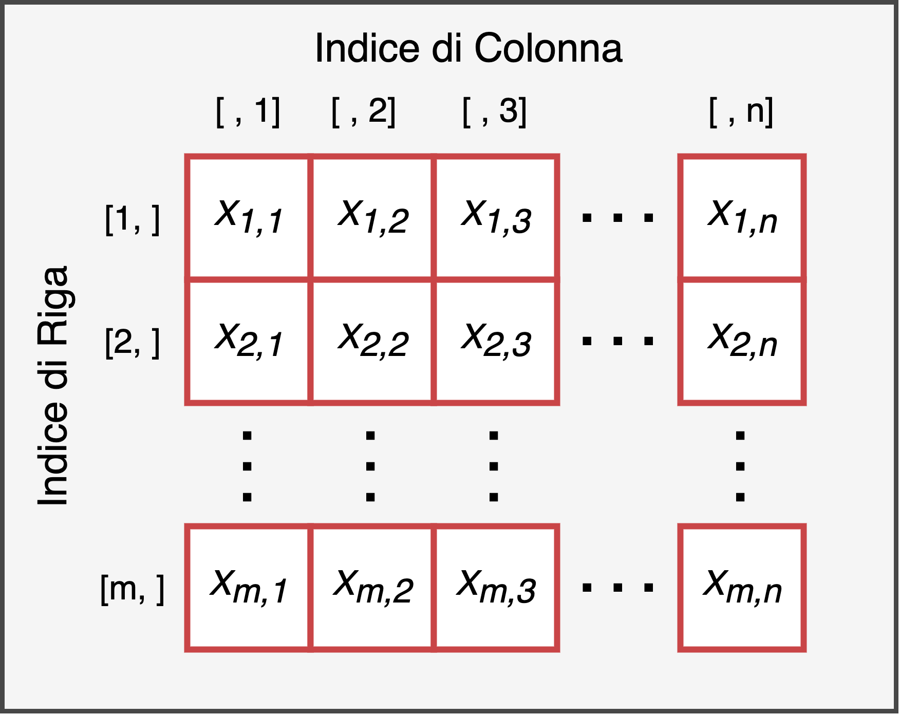

# Matrici {#matrix}

```{r settings, echo = FALSE}
knitr::opts_chunk$set(
  echo = FALSE,
  collapse=TRUE,
  fig.align="center"
)

library(kableExtra)
library(magrittr)
```

Le matrici sono una struttura di dati **bidimensionale**, dove gli elementi sono disposti secondo righe e colonne. Possiamo quindi immaginare una matrice generica di *m* righe e *n* colonne in modo simile a quanto rappresentato in Figura \@ref(fig:matrix).  

```{r, matrix, fig.cap="Rappresentazione della struttura di una matrice di *m* colonne e *n* righe", out.width="75%"}

```

Due caratteristiche importanti di una matrice sono:

- la **dimensione** - il numero di **righe** e di **colonne** da cui è formata la matrice
- la **tipologia** - la tipologia di dati che sono contenuti nella matrice. Infatti, in modo analogo a quanto visto con i vettori, una matrice deve esssere formata da **elementi tutti dello stesso tipo**. Pertanto esistono diverse tipologie di matrici a seconda del tipo di dati da cui è formata, in particolare abbiamo matrici numeriche, di valori logici e di caratteri (vedi Capitolo TODO). 

E' fondamentale inoltre sottolineare come ogni **elemento** di una matrice sia caratterizzato da:

- un **valore** - ovvero il valore dell'elemento che può essere di qualsiasi tipo ad esempio un numero o una serie di caratteri.
- un **indice di posizione** - ovvero una **coppia di valori (*i*, *j*)**  interi positivi che indicando rispettivamente **l'indice di riga** e **l'indice di colonna** e che permettono di identificare univocamente l'elemento all'interno della matrice.

Ad esempio, data una matrice $X$ di dimensione $3\times4$ (i.e., 3 righe e 4 colonne) così definita:
$$
 X = 
\begin{bmatrix}
3 & 12 & 7 & 20\\
16 & 5 & 9 & 13\\
10 & 1 & 14 & 19
\end{bmatrix},
$$
abbiamo che $x_{2, 3} = 9$ mentre $x_{3, 2} = 1$. Questo ci serve solo per ribadire il corretto uso degli indici, dove per un generico elemento $x_{i, j}$, il valore *i* è l'indice di riga mentre il valore *j* è l'indice di colonna. **Prima si indicano le righe poi le colonne**. 

Vediamo ora come creare delle matrici in R e come compiere le comuni operazini di selezione. Successivamente vedremo diverse manipolazioni e operazioni con le matrici. Infine estenderemo brevemente il concetto di matrici a dimensioni maggiori di due atttraverso l'uso degli **array**.

## Creazione

Il comando usato per creare una matrice in R è `matrix()` e contiene diversi argomenti:

```{r, eval=FALSE, echo=TRUE}
nome_matrice <- matrix(data, nrow = , ncol = , byrow = FALSE)
```

*  `data` - un **vettore di valori** utilizzati per popolare la matrice
*  `nrow` e `ncol` -  sono rispettivamente il numero di righe e il numero di colonne della matrice
* `byrow` - indica se la matrice deve essere popolata per riga oppure per colonna. Il valore di default è `FALSE` quindi i valori della matrice vengono aggiunti colonna dopo colonna. Indicare `TRUE` per aggiungere gli elementi riga dopo riga

Creiamo come esempio una matrice di 3 righe e 4 colonne con i valori che vanno da 1 a 12. 
```{r, echo = T}
# Dati per popolare la matrice
my_values <- 1:12
my_values

# Matrice popolata per colonne
mat_bycol <- matrix(my_values, nrow = 3, ncol = 4)
mat_bycol
```

La funzione `matrix()` ha di default l'argomento `byrow = FALSE`,  quindi di base R popola le matrici colonna dopo colonna. Per popolare le matrici riga dopo riga invece, è necessario richiederlo esplicitamente specificando `byrow = TRUE`.

```{r, echo = T}
# Matrice popolata per righe
mat_byrow <- matrix(my_values, nrow = 3, ncol = 4, byrow = TRUE)
mat_byrow
```

E' importante notare come mentre sia possibile specificare qualsiasi combinazione di righe e colonne, il numero di valori forniti per popolare la matrice deve essere compatibile con la dimensione della matrice. In altre parole, **non posso fornire più o meno dati di quelli che la matrice può contenere**.

Pertanto, la launghezza del vettore passato all'argomento `data` deve essere compatibile con gli argomenti `nrow` e `ncol`. E' possibile tuttavia, fornire un unico valore se si desidera ottenre una matrice in cui tutti i valori siano identici. Creiamo ad esempio una matrice vuota con soli valori `NA` con 3 righe e 3 colonne.
```{r, echo = TRUE}
mat_NA <- matrix(NA, nrow = 3, ncol = 3)
mat_NA
```

:::{.tip title="Ciclare Valori" data-latex="[Ciclare Valori]"}
In realtà è possibile fornire più o meno dati di quelli che la matrice può contenere. Nel caso vengano forniti più valori, R semplicemente utilizza i primi valori disponibili ignorando quelli successivi.
```{r, echo = TRUE}
matrix(1:20, nrow = 2, ncol = 2)
```
Nel caso vengano forniti meno valori, invece, R riutilizza gli stessi valori nello stesso ordinere per completare la matrice avvertendoci del problema.
```{r, echo = TRUE}
matrix(1:4, nrow = 3, ncol = 4)
```
Tuttavia, è meglio evitare questa pratica di *ciclare* i valori poichè i risultati potrebbero essere poco chiari ed è facile commettere errori.
:::


### Tipologie di Matrici

Abbiamo viso che, in modo analogo ai vettori, anche per le matrici è necessario che tutti i dati siano della stessa tipologia. Avremo pertanto matrici che includono solo valori `character`, `double`, `integer` oppure `logical` e le operazioni che si potranno eseguire (uso di operatori matematiche o operatori logici-relazionali) dipenderanno dalla tipologia di dati. Tuttavia, a differenza dei vettori, la tipologia di oggetto rimarrà sempre `matrix` indipendentemente dai dati contenuti. Le matrici sono sempre matrici, è la tipologia di dati che varia.

#### Character {-}

E' possibile definire una matrice di soli caratteri, tuttavia sono usate raramente visto che chiaramente tutte le operazioni matematiche non sono possibili.
```{r, echo = TRUE}
mat_char <- matrix(letters[1:12], nrow = 3, ncol = 4, byrow = TRUE)
mat_char

class(mat_char)
typeof(mat_char)
```

:::{.trick title="Letters" data-latex="[Letters]"}
In R esistono due speciali oggetti `letters` e `LETTERS` che includono rispettivamente le lettere minuscole e maiuscole dell'alfabeto inglese.
```{r, echo = TRUE}
letters[1:5]
LETTERS[6:10]
```
:::

#### Numeric {-}

Le matrici di valori numerici, sia `double` che `integer`, sono senza dubbio le più comuni ed utilizzate. Vengono spesso sfruttate per eseguire calcoli algebrici computazionalemnte molto efficienti.
```{r, echo = TRUE}
# doubles
mat_num <- matrix(5, nrow = 3, ncol = 4)
class(mat_num)
typeof(mat_num)

# integers
mat_int <- matrix(5L, nrow = 3, ncol = 4)
class(mat_int)
typeof(mat_int)
```

#### Logical {-}

Infine le matrici possono essere formate anche da valori logici `TRUE` e `FALSE`. Vedremo un loro importante utilizzo per quanto riguarda la selezione degli elementi di una matrice nel Capitolo TODO.

```{r, echo = TRUE}
mat_logic <- matrix(c(TRUE, FALSE), nrow = 3, ncol = 4)
mat_logic
class(mat_logic)
typeof(mat_logic)
```

Ricordiamo che è comunque possibile eseguire operazioni matematiche con i valori logici poichè verranno automaticamente rasformatti nei rispettivi valori numerici 1 e 0.

### Esercizi {-}

1. Crea la matrice `A` così definita: 

$$
\begin{matrix}
2 & 34 & 12 & 7\\
46 & 93 & 27 & 99\\
23  & 38 & 7 & 04
\end{matrix}
$$

2. Crea la matrice `B` contenente tutti i primi 12 numeri dispari disposti su 4 righe e 3 colonne.
3. Crea la matrice `C` contenente i primi 12 multipli di 9 disposti su 3 righe e 4 colonne.
4. Crea la matrice `D`  formata da 3 colonne in cui le lettere `"A"`,`"B"` e `"C"` vengano ripetute 4 volte ciascuna rispettivamente nella prima, seconda e terza colonna.
5. Crea la matrice `E`  formata da 3 righe in cui le lettere `"A"`,`"B"` e `"C"` vengano ripetute 4 volte ciascuna rispettivamente nella prima, seconda e terza riga.


## Selezione Elementi {#sel-matrix}

L'aspetto sicuramente più importante (e divertente) riguardo le matrici è accedere ai vari elementi. Ricordiamo che una matrice non è altro che una griglia di righe e colonne dove vengono disposti i vari valori. Indipendentemente da cosa la matrice contenga, è possibile utilizzare gli indici di riga e di colonna per identificare univocamente un dato elemento nella matrice. Pertanto ad ogni elemento è associata una coppia di valori (*i*, *j*) dove *i* è l'indice di riga e *j* è l'indice di colonna.

Per visualizzare questo concetto, riportiamo nel seguente esempio gli indici per ogni elemnto di una matrice $3\times4$:

```{r}
mat <- matrix(NA, 3, 4)

for(i in 1:nrow(mat)){
  for(j in 1:ncol(mat)){
    mat[i,j] <- paste0(i,",",j)
  }
}

mat
```

In R è possibile selezionare un elemento di una matrice utilizzando il suo indice di riga e di colonna. In modo analogo ai vettori è necessario quindi indicare all'inerno delle **parentesi quadre** `[]` poste dopo il nome del vettore, **l'indice di riga** e **l'indice di colonna** **separati da virgola**. 

```{r, echo = TRUE, eval = FALSE}
nome_matrice[<indice-riga>, <indice-colonna>]
```

L'**ordine** `[<indice-riga>, <indice-colonna>]` è prestabilito e deve essere rispettato affinché la selezione avvenga correttamente. Vediamo un semplice esempio di come sia possibile accedere ad un qualsiasi elemento:

```{r, echo = TRUE, error=TRUE}
my_matrix <- matrix(1:12, nrow = 3, ncol = 4)
my_matrix

# Selezioniamo l'elemento alla riga 2 e colonna 3
my_matrix[2,3]

# Selezioniamo il valore 6
my_matrix[3,2]
```

:::{.warning title="Subscript out of Bounds" data-latex="[Subscript out of Bounds]"}
Notiamo come indicando degli indici al di fuori della dimensione della matrice otteniamo un messaggio di errore.
```{r, echo = TRUE, error = TRUE}
my_matrix[20,30]
```
:::

Oltre alla selezione di un singolo elemento è possibile eseguire altri tipi di selezione:

#### Selezione per Riga o Colonna {-}

E' possibile selezionare **tutti** gli elementi di una riga o di una colonna utilizzando la seguente sintassi:
```{r, echo = TRUE, eval = FALSE}
# Selzione intera riga
nome_matrice[<indice-riga>, ]

# Selzione intera colonna
nome_matrice[ , <indice-colonna>]
```
Nota come sia comunque necessario l'utilizzo della **virgola** lasciando vuoto il posto prima o dopo la virgola per indicare ad R di selezionare rispettivamente tutte le righe o tutte le colonne. 
```{r, echo = TRUE}
# Selezioniamo la 2 riga e tutte le colonne
my_matrix[2, ]

# Selezioniamo  tutte le righe e la 3 colonna
my_matrix[ ,3]
```
Qualora fosse necessario selezionare più righe o più colonne è sufficiente indicare tutti gli indici di interesse. Ricorda che questi devono essere specificati in un unico vettore. All'interno delle parentesi quadre, R si aspetta una sola virgola che separa gli indici di riga da quelli di colonna. E' quindi necessario combinare gli indici che vogliamo selezionare in un unico vettore sia nel caso delle righe che delle colonne. Per selezionare righe o colonne in successione, ad esempio  le prime 3 colonne, posso utilizzare la scrittura compatta `1:3` che è equivalente a `c(1,2,3)`.

```{r, echo = TRUE}
# Selezioniamo la 1 e 3 riga
my_matrix[c(1,3), ]

# Selezioniamo dalla 2° alla 4° colonna
my_matrix[ , 2:4]
```

#### Selezionare Regione Matrice {-}

Combinando indici di righe e di colonne è anche possibile selezionare specifiche regioni di una matrice o selezionare alcuni suoi valori per creare una nuova matrice. 

```{r, echo = TRUE}
# Selezioniamo un blocco
my_matrix[1:2, 3:4]

# Selezioniamo valori sparsi
my_matrix[c(1,3), c(2,4)]
```

:::{.tip title="Selezionare non è Modificare" data-latex="[Selezionare non è Modificare]"}
Ricordiamo che, come per i vettori, l'operazione di selezione non modifichi l'oggetto iniziale. Pertanto è necessario salvare il risultato della selezione se si desidera mantenere le modifiche.
:::

:::{.design title="Matrici e Vettori" data-latex="[Matrici e Vettori]"}

I più attenti avranno notato che che i comandi di selezione non restituiscono sempre lo stesso oggetto, a volte otteniamo come risultato un vettore e delle altre una matrice.

E' importante chiarire che una **un vettore non è un matrice** e tanto più vale l'opposto. In R questi sono due tipologie di oggetti diversi e sarà importante tenere a mente questa distinzione.

```{r, echo=TRUE, eval = FALSE}
# Un vettore non è una matrice
my_vector <- 1:5
is.vector(my_vector) # TRUE
is.matrix(my_vector) # FALSE

# Una matrice non è un vettore
my_matrix <- matrix(1, nrow = 3, ncol = 3)
is.vector(my_matrix) # FALSE
is.matrix(my_matrix) # TRUE
```

Il risultato che otteniamo da una selezione potrebbe essere un vettore oppure una matrice a seconda del tipo di selezione. Vediamo in particolare come selezionando un'unica colonna (o riga) otteniamo un vettore mentre selezionando più colonne (o righe) otteniamo una matrice.

```{r, echo=TRUE, eval = FALSE}
# Seleziono una colonna
is.vector(my_matrix[, 1]) # TRUE
is.matrix(my_matrix[, 1]) # FALSE

# Seleziono più colonne
is.vector(my_matrix[, c(1,2)]) # FALSE
is.matrix(my_matrix[, c(1,2)]) # TRUE
```

Questa distinzione influirà sul successivo utilizzo dell'oggetto ottenuto dalla selezione.

#### Vettore Riga e Vettore Colonna {-}

Una particolare fonte di incomprensioni e successivi errori riguarda proprio l'utilizzo di un vettore ottenuto dalla selezione di una singola riga (o una singola colonna) di una matrice  come fosse un *vettore riga* (o un *vettore colonna*).

In algebra lineare, i *vettori riga* ed i *vettori colonna* non sono altro che delle matrici rispettivamente di dimensione $1\times n$ e $m \times 1$. La dimensione ($righe \times colonne$) di una matrice, e quindi anche di un vettore, rivestono un ruolo importante nelle operazioni con le matrici ed in particolare nel prodotto matriciale.

In R i vettori hanno una sola dimensione ovvero la *lunghezza* e quindi nel loro utilizzo con operazioni tra matrici vengono convertiti automaticamente in vettori riga o vettori colonna a seconda delle necessità. Tuttavia, questa trasformazione potrebbe non sempre rispettare le attuali intenzioni ed è quindi meglio utlizzare sempre le matrici e non i vettori.

```{r, echo = TRUE}
# Vettore
my_vector <- 1:4
dim(my_vector) # dimensione righe, colonne
length(my_vector)

# Matrice 1x4 (vettore riga)
my_row_vector <- matrix(1:4, nrow = 1, ncol = 4)
dim(my_row_vector) 
my_row_vector

# Matrice 4x1 (vettore colonna)
my_col_vector <- matrix(1:4, nrow = 4, ncol = 1)
dim(my_col_vector) 
my_col_vector
```

#### Srotolare una Matrice {-}

Abbiamo visto che possiamo facilmente popolare una matrice con un vettore. Allo stesso modo possiamo vettorizzare una matrice (in altri termini "srotolare" la matrice) per ritornare al vettore originale. Con il comando `c(matrice)` oppure forzando la tipologia di oggetto a vettore con `vector(matrice)` o `as.vector(matrice)`.

```{r, echo = T}
# Da matrice a vettore
my_matrix <- matrix(1:12, nrow = 3, ncol = 4)
c(my_matrix)
as.vector(my_matrix)
```

:::

### Utilizzi Avanzati Selezione

Vediamo ora alcuni utilizzi avanzati della selezione di elementi di una matrice. In particolare impareremo a:

- utilizzare gli operatori relazionali e logici per selezionare gli elementi di una martrice
- modificare l'ordine di righe e colonne
- sostituire degli elementi
- eliminare delle righe o colonne

Nota che queste operazioni siano analoghe a quelle viste per i vettori e quindi seguiranno le stesse regole e principi.

#### Operatori Relazionali e Logici {-}

Un'utile funzione è quella di selezionare tra gli elementi di una matrice quelli che rispetano una certa condizione. Possiamo ad esempio valutare *"quali elementi della matrice sono maggiori di x?"*. Per fare questo dobbiamo specificare all'interno delle parentesi quadre la proposizione di interesse utilizzando gli operatori relazionali e logici (vedi Capitolo \@ref(operators-rel-log)). 

Quando una matrice è valutata all'interno di una proposizione, R valuta la veridicità di tale proposizione rispetto ad ogni suo elemento. Come risultato otteniamo una matrice di valori logici con le rispettive risposte per ogni elemento (`TRUE` o `FALSE`).
```{r, echo = TRUE}
my_matrix <- matrix(1:23, nrow = 3, ncol = 4)
my_matrix

# Elemeni maggiori di 4 e minori di 10
test <- my_matrix >= 4 & my_matrix <=10
test
```

Questa matrice può essere utilizzata all'interno delle parentesi quadre per selezionare gli elementi della matrice originale che soddisfano la proposizione. Gli elementi associati al valore `TRUE` sono selezionati mentre quelli associati al valore `FALSE` sono scartati.

```{r, echo = TRUE}
# Seleziono gli elementi
my_matrix[test]
```

Nota come in questo caso non sia necessaria alcuna virgola all'interno delle parentesi quadre e come il risultato ottenuto sia un vettore.

#### Modificare l'Ordine Righe e Colonne {-}

Gli indici di riga e di colonna possono essere utilizzati per riordinare le righe e le colonne di una matrice a seconda delle necessità.

```{r, echo = TRUE}
my_matrix <- matrix(1:6, nrow = 3, ncol = 4)
my_matrix

# Altero l'ordinen delle righe
my_matrix[c(3,2,1), ]

# Altero l'ordine delle colonnne
my_matrix[ ,c(1,3,2, 4)]
```


#### Modificare gli Elementi {-}

Un importante utilizzo degli indici riguarda la modifica di un elemento di una matrice. Per sostituire un vecchio valore con un nuovo valore, seleziono il vecchio valore della matrice e utilizzo la funzione `<-` (o `=`) per assegnare il nuovo valore.

```{r, echo = TRUE}
my_matrix <- matrix(1:12, nrow = 3, ncol = 4)
my_matrix

# Modifico il l'elemento con il valore 5
my_matrix[2,2] <- 555
my_matrix
```

E' possibile anche sostituire tutti i valori di un'intera riga o colonnna opportunamente selezionata. In questo caso sarà necessario fornire un corretto numero di nuovi valori da utilizzare.
```{r, echo = TRUE}
# Modifico la 2 colonna
my_matrix[ ,2] <- c(444, 555, 666)
my_matrix

# Modifico la 3 riga
my_matrix[3, ] <- c(111, 666, 999, 122)
my_matrix
```

Nota come a differenza dei vettori non possa aggiungere una nuova riga o colonna attraverso questa operazione ma sarà necesssario utilizzare una diversa procedura (vedi Capitolo TODO).

```{r, echo = TRUE, error =  TRUE}
# Aggiungo una nuova colona [errore selezione indici]
my_matrix[, 5] <- c(27, 27, 27)
```

#### Eliminare Righe o Colonne {-}

Per **eliminare** delle righe (o delle colonne) da una matrice, è necessario indicare all'interno delle parentesi quadre gli indici di riga (o di colonna) che si intende eliminare, preceduti dall'operatore `-` (*meno*). Nel caso di più righe (o colone) è possibile indicare il meno solo prima del comando `c()` analogamente con quanto fatto con i vettori.

```{r, echo = TRUE}
my_matrix <- matrix(1:12, nrow = 3, ncol = 4)

# Elimino la 2° riga
my_matrix[-2, ]

# Elimino la 2° riga  e la 2° e 3° colonna
my_matrix[-2, -c(2,3)]
```

Nota come l'operazione di eliminazione sia comunque un'operazione di selezione. Pertanto è necessario salvare il risultato ottenuto se si desidera mantenere le modifiche.

## Funzioni ed Operazioni

Vediamo ora alcune funzioni frequentemente usate e le comuni operazioni eseguite con le matrici (vedi Tabella \@ref(tab:table-matrix-operators)).

```{r table-matrix-operators}

names_function <- c("Unire due matrici creando nuove colonne (le matrici devono avere lo stesso numero di righe)",
                    "Unire due matrici creando nuove righe (le matrici devono avere lo stesso numero di colonne)", 
                    "Numero di righe della matrice",
                    "Numero di colonne della matrice",
                    "Dimensione della matrice (righe e colonne)",
                    "Nomi delle colonne della matrice",
                    "Nomi delle righe della matrice",
                    "Nomi delle righe e delle colonne",
                    "Trasposta della matrice",
                    "Vettore con gli elementi della diagonale della matrice",
                    "Determinante della matrice (la matrice deve essere quadrata)",
                    "Inversa della matrice",
                    "Somma elemento per elemento di due matrici",
                    "Differenza elemento per elemento tra due matrici",
                    "Prodotto elemento per elemento tra due matrici",
                    "Rapporto elemento per elemento tra due matrici",
                    "Prodotto matriciale")
formula <- sprintf("matrice1 %s matrice2", c("+", "-", "*", "/"))

if (knitr::is_html_output()) {
  vector_operators <- data.frame(formula = c(
    sprintf("nuova_matrice <- %s(matrice1, matrice2)", c("cbind", "rbind")),
    sprintf("%s(nome_matrice)", c("nrow", "ncol", "dim", "colnames", "rownames", "dimnames",
                                  "t", "diag", "det", "solve")),
    formula, "matrice1 %*% matrice2"),
    name = names_function)
  escape = TRUE
}
if (knitr::is_latex_output()) {
  vector_operators <- data.frame(formula = sprintf("\\texttt{%s}", c(
    sprintf("nuova\\_matrice <- %s(matrice1, matrice2)", c("cbind", "rbind")),
    sprintf("%s(nome\\_matrice)", c("nrow", "ncol", "dim", "colnames", "rownames", "dimnames",
                                    "t", "diag", "det", "solve")),
    formula, "matrice1 \\%*\\% matrice2")),
    name = names_function)
  escape = FALSE
}

kableExtra::kable(vector_operators, col.names = c("Funzione", "Descrizione"),
                  escape = escape, caption = "Funzioni e operazioni con matrici") %>%
  kable_styling(bootstrap_options = c("striped", "hover", "condensed", "responsive"),
                full_width = F,
                latex_options = c("hold_position"))
```

Descriviamo ora nel dettaglio alcuni particolari utilizzi.

### Attributi di una Matrice {#mat-prop}

Abbiamo visto nel Capitolo TODO che gli oggetti in R possiedono quelli che sono definiti *attibuti* ovvero delle utili informazioni riguardanti l'oggetto stesso, una sorta di *metadata*. Vediamo ora alcuni attributi particolarmente rilevanti nel caso delle matrici ovvero la dimensione (`dim`) e i nomi delle righe e colonne (`names`). 

#### Dimensione {-}

Ricordiamo che la matrice è un oggetto **bidimensionale** formato da righe e colonne. Queste formano pertanto le dimensioni di una matrice. Per ottenere il numero di righe e di colonne di una matrice, possiamo usare rispettivamente i comandi `nrow()` e `ncol()`.

```{r, echo = T}
my_matrix <- matrix(1:12, ncol = 3, nrow = 4)

# Numero di righe
nrow(my_matrix)

# Numero di colonne
ncol(my_matrix)
```

In alternativa per conoscere le dimensioni di una matrice è possibile utilizzare la funzione `dim()`. Questa ci restituirà un vettore con due valori dove il primo rappresenta il numero di righe e il secondo il numero di colonne. 

```{r, echo = TRUE}
dim(my_matrix)
```

#### Nomi Righe e Colonne {-}

Come avrete notato, di base le dimensioni di una matrice (ovvero le righe e le colonne) vengono identificate attraverso i loro indici numerici. In R tuttavia, è anche possibile assegnare dei nomi alle righe e alle colonne di una matrice.

Con i comandi `rownames()` e `colnames()` possiamo accedere rispettivamente ai nomi delle righe e delle colonne.

```{r, echo = T}
my_matrix <- matrix(1:12, nrow = 3, ncol = 4)

# Nome di righe
rownames(mat)

# Nome di colonne
colnames(mat)
```

Non essendo impostati, ottieniamo inizialmente come output il valore `NULL`. Per impostare i nomi di righe e/o colonne, sarà quindi necessario assegnare a `rownames(nome_matrice)` e `colnames(nome_matrice)` un vettore di caratteri della stessa lunghezza della dimensione che stiamo rinominando. Se impostiamo un unico carattere, tutte le righe/colonne avranno lo stesso valore. Questo ci fa capire che, se vogliamo impostare dei nomi, R richiede che questo venga fatto per tutte le righe/colonne.

```{r, echo=TRUE}
# Assegnamo i nomi alle righe
rownames(my_matrix) <- LETTERS[1:3]
my_matrix

# Assegno i nomi alle colonne
colnames(my_matrix) <- LETTERS[4:7]
my_matrix
```

In alternativa posson utilizzare il `dimnames()`  per accedere contemporaneamente sia ai nomi di riga che a quelli di colonna. Come output ottengo una lista (vedi Capitolo TODO) dove vengono prima indicati i nomi di riga e poi quelli di colonna

```{r, echo = TRUE}
dimnames(my_matrix)
```

:::{.design title="Selezione per Nomi" data-latex="[Selezione per Nomi]"}
Quando nel Capitolo \@ref(sel-matrix) abbiamo visto i diversi modi di selezionare gli elementi di una matrice, abbiamo sempre usato gli indici numerici di riga e di colonna. Tuttavia, quando i nomi delle delle dimensioni sono disponibili, è possibile indicizzare una matrice in base ai nomi delle righe e/o colone.

Possiamo quindi selezionare la prima colonna sia con il suo indice numerico `nome_matrice[ , 1]` ma anche con il nome assegnato `nome_matrice[ ,"nome_colonna"]`. Queste sono operazioni poco utili con le matrici ma che saranno fondamentali nel caso dei **dataframe** (vedi Capitolo TODO).

```{r, echo=TRUE}
# Seleziono la colona "F"
my_matrix[ , "F"]

# Selezioniamo la riga "A" e "C"
my_matrix[c("A", "C"), ]
```
:::

### Combinare Matrici

Abbiamo visto nel Capitolo \@ref(vector) come si possano fare diverse operazioni tra vettori, in particolare combinare ovvero unire vettori diversi. Anche per le matrici è possibile combinare matrici diverse, rispettando alcune regole:

* Posso unire matrici per riga ovvero aggiungo una o più righe ad una matrice, in questo caso le matrici devono avere lo stesso numero di colonne
* Posso unire matrici per colonna ovvero aggiungo una o più colonne ad una matrice, in questo caso le matrici devono avere lo stesso numero di righe
* Le matrici che unisco devono essere della stessa tipologia (numeri o caratteri)

Se partiamo da una matrice `mat` per unire a `mat` un'altra matrice `new_mat` possiamo usare il comando `cbind(mat, new_mat)` se vogliamo unire le due matrici per colonna invece `rbind(mat, new_mat)` se vogliamo unire per riga. E' utile pensare all'unione come un collage tra matrici, in figura\@ref(fig:mat-comb) è presente uno schema utile per capire visivamente questo concetto.

```{r mat-comb, fig.cap="Schema per la combinazione di matrici", out.width="50%"}
knitr::include_graphics("images/matrix_comb.png")
```

Vediamo in R:

```{r, error=TRUE, echo = T}
vec <- 1:25
mat <- matrix(vec, ncol = 5, nrow = 5, byrow = FALSE)

# Nuova matrice da aggiungere
new_vec <- 11:20
new_mat <- matrix(new_vec, ncol = 2, nrow = 5, byrow = FALSE)

mat
new_mat

# Combiniamo per colonna

cbind(mat, new_mat)

# Combiniamo per riga

rbind(mat, new_mat)

# Scambiamo il numero di colonne e righe, per far combaciare le due matrici

new_vec <- 11:20
new_mat <- matrix(new_vec, ncol = 5, nrow = 2, byrow = FALSE)
mat
new_mat

rbind(mat, new_mat)
```

Possiamo combinare quindi per riga/colonna solo se le righe/colonne delle due matrici sono equivalenti. Otteniamo un errore quando cerchiamo di combinare matrici di dimensioni diverse.

Un ultimo aspetto utile è l'estensione dei comandi `cbind()` ed `rbind()`. Fino ad ora li abbiamo utilizzati con due elementi: matrice di partenza e matrice da aggiungere ma possono essere utilizzati con elementi multipli. Se vogliamo combinare $n$ matrici possiamo usare il comando `cbind(mat1, mat2, mat3, ...)` o `rbind(mat1, mat2, mat3, ...)`. In questo caso il risultato finale dipende dall'ordine degli argomenti quindi prima la `mat1`, poi la `mat2` e così via.

### Operatori Matematici

- condizioni sulle dimensioni

#### Diagonale {-}

Riguardo la **diagonale** di una matrice essa può essere vista, dal punto di vista prettamente pratico, come l'insieme di elementi associati allo stesso indice di riga e colonna. Il comando `diag(matrice)` permette di estrarre la diagonale di una matrice e trattarla come un semplice vettore:

```{r, echo = T}

# Matrice quadrata
vec <- 1:25
mat <- matrix(vec, ncol = 5, nrow = 5, byrow = FALSE)

mat

diag(mat)

# Matrice non quadrata

vec <- 1:16
mat <- matrix(vec, ncol = 2, nrow = 8, byrow = FALSE)
mat

diag(mat)
```


### Esercizi {-}

Utilizzando le matrici `A` e `B` create nei precedenti esercizi:

1. Utilizzando gli indici di riga e di colonna selziona il numero 27 della matrice `A`
2. Selziona gli elementi compresi tra la seconda e quarta riga, seconda e terza colonna della matrice `B`
3. Seleziona solo gli elementi pari della matrice `A` (Nota: utilizza l'operazione resto `%%`)
4. Elimina dalla matrice `C` la terza riga e la terza colonna
5. Seleziona tutti gli elementi della seconda e terza riga della matrice `B`
6. Seleziona tutti gli elementi diversi da  “B” appartenenti alla matrice `D`
7. Crea la matrice `G` unendo alla matrice `A` le prime due colonne della matrice `C`
8. Crea la matrice `H` unendo alla matrice `C` le prime due righe della matrice trasposta di `B`
9. Ridefinisci la matrice `A` eliminando la seconda colonna. Ridefinisci la matrice `B` eliminando la prima riga. Verifica che le  matrici così ottenute abbiano la stessa dimensione.
10. Commenta i differenti risultati che otteniamo nelle operazioni `A*B`, `B*A`, `A%*%B` e `B%*%A`.
11. Assegna i seguenti nomi alle colonne e alle righe della matrice `C`: `"col_1", "col_2", "col_3", "col_4", "row_1", "row_2", "row_3"`.


## estensione array
<!--

### Esercizi {-}

1. Crea la matrice `A` così definita: 

$$
\begin{matrix}
2 & 34 & 12 & 7\\
46 & 93 & 27 & 99\\
23  & 38 & 7 & 04
\end{matrix}
$$

2. Crea la matrice `B` contenente tutti i primi 12 numeri dispari disposti su 4 righe e 3 colonne.
3. Crea la matrice `C` contenente i primi 12 multipli di 9 disposti su 3 righe e 4 colonne.
4. Crea la matrice `D`  formata da 3 colonne in cui le lettere `"A"`,`"B"` e `"C"` vengano ripetute 4 volte ciascuna rispettivamente nella prima, seconda e terza colonna.
5. Crea la matrice `E`  formata da 3 righe in cui le lettere `"A"`,`"B"` e `"C"` vengano ripetute 4 volte ciascuna rispettivamente nella prima, seconda e terza riga.

## Selezione di Elementi di una Matrice

In R per selezioneare gli elementi di matrice si deve indicare all'interno delle parentesi quadre l'indice di riga e l'indice di colonna (**separati da virgola**) degli elementi da selezionare oppure la condizione logica che devono rispettare.

`<nome-matrice>[<indice-riga>, <indice-colonna>]`

**Nota:** per selezionare tutti gli elementi di una data riga o di una data colonna basta lasciare vuoto rispettivamente l'indice di riga o l'indice di colonna.

### Esercizi {-}

1. Utilizzando gli indici di riga e di colonna selziona il numero 27 della matrice `A`
2. Selziona gli elementi compresi tra la seconda e quarta riga, seconda e terza colonna della matrice `B`
3. Seleziona solo gli elementi pari della matrice `A` (Nota: utilizza l'operazione resto `%%`)
4. Elimina dalla matrice `C` la terza riga e la terza colonna
5. Seleziona tutti gli elementi della seconda e terza riga della matrice `B`
6. Seleziona tutti gli elementi diversi da  “B” appartenenti alla matrice `D`

## Funzioni ed Operazioni tra Matrici


```{r}

names_function <- c("Per unire due matrici creando nuove colonne (le matrici devono avere lo stesso numero di righe)",
                    "Per unire due matrici creando nuove righe (le matrici devono avere lo stesso numero di colonne)", 
                    "Per valutare il numero di righe della matrice",
                    "Per valutare il numero di colonne della matrice",
                    "Per valutare la dimensione della matrice (righe e colonne)",
                    "Per ottenere la trasposta della matrice",
                    "Ottenere un vettore con gli elementi della diagonale della matrice",
                    "Ottenere il determinante della matrice (la matrice deve essere quadrata)",
                    "Ottenere l'inversa della matrice",
                    "Nomi delle colonne della matrice",
                    "Nomi delle righe della matrice",
                    "Somma elemento per elemento di due matrici",
                    "Differenza elemento per elemento tra due matrici",
                    "Prodotto elemento per elemento tra due matrici",
                    "Rapporto elemento per elemento tra due matrici",
                    "Prodotto matriciale")
formula <- c(sprintf("<nuova-matrice> <- %s(<matrice1>, <matrice2>)", 
                     c("cbind", "rbind")),
             sprintf("%s(<nome-matrice>)", 
                     c("nrow", "ncol", "dim", "t", "diag", "det", "solve",
                       "colnames", "rownames")),
             sprintf("matrice1 %s matrice2", c("+", "-", "*", "/")))

if (knitr::is_html_output()) {
  vector_operators <- data.frame(formula = c(formula, "matrice1 %*% matrice2"),
                                 name = names_function)
  escape = TRUE
}
if (knitr::is_latex_output()) {
  vector_operators <- data.frame(formula = sprintf("\\texttt{%s}",
                                                   c(formula, "matrice1 \\%*\\% matrice2")),
                                 name = names_function)
  escape = FALSE
}

kableExtra::kable(vector_operators, col.names = c("Operazione", "Nome"),
                  escape = escape, caption = "Operazioni con matrici") %>%
  kable_styling(bootstrap_options = c("striped", "hover", "condensed", "responsive"),
                full_width = F,
                latex_options = c("hold_position"))
```

**Note:**

- Per il significato di determinante di una matrice considera: <https://it.wikipedia.org/wiki/Determinante>
- Per il significato di matrice inversa considera: <https://it.wikipedia.org/wiki/Matrice_invertibile>
- Per  compiere operazioni elemento per elemento tra due matrici, esse devono avere la stessa dimensione
- Per compiere il prodotto matriciale il numero di colonne della prima matrice deve essere uguale al numero di righe della seconda matrice (vedi <https://it.wikipedia.org/wiki/Moltiplicazione_di_matrici>). 
- E' possibile assegnare nomi alle colonne e righe di una matrice rispettivamente atttraverso i comandi:
```{r, eval=FALSE, echo = TRUE}
colnames(<nome-matrice>)<-c("nome-1",...,"nome-s")}

rownames(<nome-matrice>)<-c("nome-1",...,"nome-n")}
```

### Esercizi {-}

1. Crea la matrice `G` unendo alla matrice `A` le prime due colonne della matrice `C`
2. Crea la matrice `H` unendo alla matrice `C` le prime due righe della matrice trasposta di `B`
3. Ridefinisci la matrice `A` eliminando la seconda colonna. Ridefinisci la matrice `B` eliminando la prima riga. Verifica che le  matrici così ottenute abbiano la stessa dimensione.
4. Commenta i differenti risultati che otteniamo nelle operazioni `A*B`, `B*A`, `A%*%B` e `B%*%A`.
5. Assegna i seguenti nomi alle colonne e alle righe della matrice `C`: `"col\_1", "col\_2", "col\_3", "col\_4", "row\_1", "row\_2", "row\_3"`.

-->


