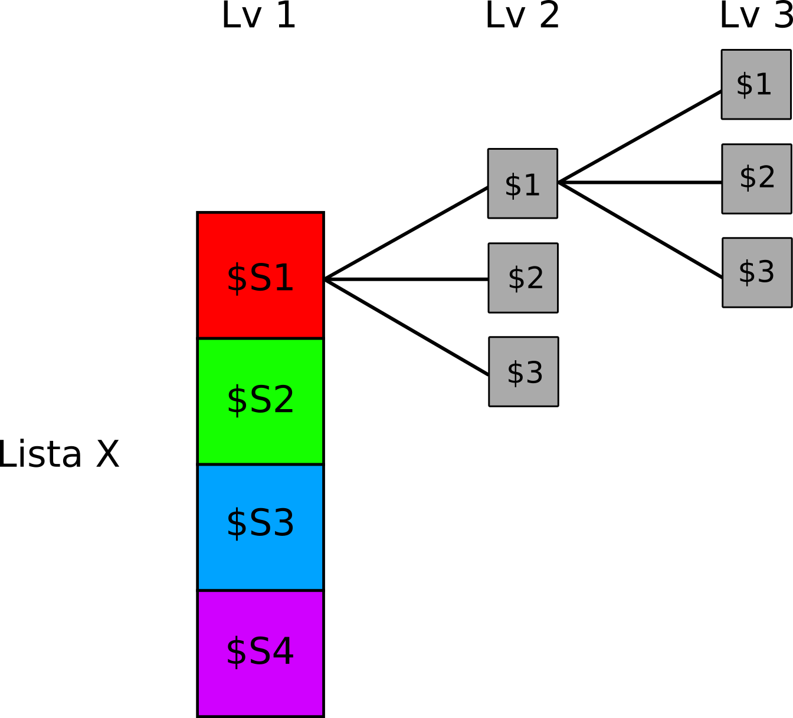

# Liste {#list}

```{r settings, echo = FALSE}
knitr::opts_chunk$set(
  echo = FALSE,
  collapse=TRUE,
  fig.align="center"
)

library(kableExtra)
```


La **lista** è uno degli oggetti più versatili e utili all'interno del linguaggio R. A parte alcune caratteristiche in comune con gli altri oggetti che abbiamo già affrontato, l'aspetto crucuale della lista è la capacità di contenere **tipologie diverse di oggetti** al suo interno come ad esempio vettori, dataframe, matrici e anche altre liste. Se da un punto di vista pratico la lista è un oggetto molto semplice (praticamente un vettore) essendo molto versatile può diventare molto complesso sopratutto per l'indicizzazione.

## Creazione di Liste

In R per definire una lista si utilizza il comando:

```r
<nome-Lista> <- list(nome_oggetto_1 = oggetto_1, ..., nome_oggetto_n = oggetto_n)
```

Nonostante il parametro `nome_oggetto_x` non sia necessario, come vedremo è assolutamente consigliato rinominare tutti gli elementi della lista per agevolare l'indicizzazione. Se non nominiamo gli elementi, questi saranno identificati con il numero progressivo $1...n$ esattamente come un vettore. Quindi, se nel nostro workspace abbiamo degli oggetti diversi come un `vettore`, un `dataframe` e una semplice `variabile` possiamo assegnare ognuno di questi elementi dentro ad una lista.

```r
<nome-Lista> <- list(oggetto_1, ..., oggetto_n)
```

:::{.tip title="Lista vs dataframe/matrice" data-latex="[Lista vs dataframe/matrice]"}
Rispetto ai `dataframe` o alle `matrici` gli elementi della lista sono completamente indipendenti tra loro. Mentre una matrice/dataframe di $i$ righe e $j$ colonne aveva necessariamente tutte le righe e colonne di lunghezza uguali, la `lista` può contendere oggetti completamente diversi tra loro sia in tipologia che in dimensioni. 
:::

Un modo utile per immaginarsi una lista (vedi \@ref(fig:list-example)) è pensare ad un corridoio di un albergo dove ogni porta conduce ad una stanza diversa per caratteristiche, numero di elementi e così via:

```{r list-example, fig.cap="Esempio concettuale di una lista", out.height="30%", out.width="30%"}
knitr::include_graphics("images/list_example.png")
```


### Esercizi {-}

1. Crea la lista `esperimento_1` contenente:
    - DataFrame `data_wide`
    - la matrice `A`
    - il vettore `x`
    - la variabile `info = "Prima raccolta dati"`
2. Crea la lista `esperimento_2` contenente:
    - DataFrame `data_long`
    - la matrice `C`
    - il vettore `y`
    - la variabile `info = "Seconda raccolta dati"`

## Indicizzazione di una lista

Come dicevamo in precedenza, la lista è molto semplice da indicizzare e segue la stessa logica di un semplice vettore, dove ogni elemento ha il suo indice numerico progressivo. Una differenza rispetto ai vettori è il tipo di oggetto contenuto nella lista. Mentre nel vettore la scrittura `vettore[i]` ci fa accedere ad un singolo carattere e/o numero alla posizione $i$ la scrittura `lista[i]` non ci fa accedere direttamente al suo elemento. Essendo che ogni elemento di una lista può essere un oggetto complesso, per accedere direttamente è necessario usare le doppie parentesi quadrate `lista[[i]]`. Vediamo la differenza:

```{r, echo = T}
a <- c(1, 3, 5, 6, 10)
b <- data.frame(
  id = 1:10,
  gender = rep(c("m", "f"), each = 5),
  y = 1:10
)

c <- "prova"

x <- list("elemento1" = a, "elemento2" = b, "elemento3" = c)

x

# Indicizzazione con una parentesi

x[1]

# Indicizzazione con 2 parentesi

x[[1]]
```

Questo aspetto è importante perchè usando `[i]` in realtà sto accedendo al primo elemento della lista ancora legato però alla lista originaria. Mentre con la scrittura `[[i]]` accedo direttamente all'oggetto contenuto. Questo diventa chiaro applicando una funzione generica allo stesso elemento indicizzato in modo diverso oppure usando la funzione `str()` per capire la tipologia. Come vedete solo accedendo direttamente all'elemento possiamo eseguire le normali operazioni. Infatti, indicizzando con 1 parentesi, l'oggetto è riconosciuto come una lista a singolo elemento.

```{r, echo = T, error=TRUE}

# Applichiamo la media al vettore `elemento1` indicizzato con 1 o 2 parentesi

mean(x[1])

mean(x[[1]])

# Vediamo la struttura

str(x[1])
str(x[[1]])

```

Fino ad ora abbiamo indicizzato la lista usando le parentesi `[[i]]` e un indice numerico $i$ che rappresenta la posizione. Allo stesso modo dei dataframe e in parte delle matrici però possiamo anche accedere agli elementi usando `$nome`:

```{r, echo = T}
x
# Selezioniamo il primo elemento

x$elemento1
```

Una volta che abbiamo avuto accesso ad uno specifico elemento, possiamo utilizzare quell'oggetto nel modo che preferiamo, chiaramente in base alle operazione specifiche che sono consentite. Possiamo assegnare l'elemento di una lista ad un nuovo oggetto, oppure eseguire direttamente delle funzioni o altre operazioni generiche.

```{r, echo = T}

# Seleziono il primo elemento dell'oggetto $elemento1

x$elemento1

x$elemento1[1]
x[[1]][1] # equivalente a alla precedente

# Seleziono la colonna $gender dell'oggetto $elemento2

x$elemento2$gender

# Altre scritture equivalenti
x[[2]]$gender
x[[2]][, 2]
x[[2]][, "gender"]
```

## Proprietà della lista

Come per gli oggetti precedenti, anche la lista ha una **dimensionalità** e delle proprietà (come i nomi degli elementi). Usando il comando `names(lista)` possiamo accedere ai nomi (se sono stati assegnati). Per assegnare dei nomi possiamo:

* Creare la lista con i nomi già assegnati: `list("nome" = oggetto)`
* Assegnare ad ogni elemento un nome, con un vettore di stringhe: `names(lista) <- c("nome")`.

Rispetto al **numero di elementi**, possiamo usar, analogalmente ai vettori, il comando `length(lista)`. Per avere invece una visione più chiara della struttura della lista, sopratutto se molto complessa il comando `str(lista)` ci fornisce una utile panoramica.

```{r, echo = T}
names(x)

names(x) <- NULL # eliminiamo i nomi (come se non gli avessimo assegnati in fase di creazione)

names(x)

# Assegnamo dei nomi

names(x) <- c("nome1", "nome2", "nome3")
names(x)

# Dimensioni Lista

length(x)

# Struttura

str(x)

```

### Esercizi {-}

1. Utilizzando gli **indici numerici** di posizione selziona i dati dei soggetti `subj_1` e `subj_4` riguardanti le variabili `age`,`sex` e `gruppo` dal DataFrame `data_wide` contenuto nella lista `esperimento_1`.
2. Compi la stessa selezione dell'esercizio precedente usando però questa volta il nome dell'oggetto per selezionare il DateFrame dalla lista.
3. Considerando la lista `esperimento_2` seleziona gli oggetti `data_long`, `y` e `info`
4. Cambia i nomi degli oggetti contenuti nella lista `esperimento_2` rispettivamente in `"dati_esperimento"`, `"matrice_VCV"`, `"codici_Id"` e `"note"`

## Creazione e indicizzazione avanzata

Al contrario dei vettori che si estendono in *lunghezza* o dei dataframe/matrici che sono caratterizzati da righe e colonne, la peculiarità della lista (oltre alla lunghezza come abbaimo visto) è il concetto di **profondità**. Infatti una lista può contenere al suo interno una o più liste di fatto creando una **struttura nidificata molto complessa**. Nonostante la struttura più complessa, il principio di indicizzazione e creazione è lo stesso. La figura \@ref(fig:list-depth) rappresenta l'idea di una lista nidificata (o nested):

```{r list-depth, out.height="50%", out.width="50%", fig.cap="Rappresentazione concettuale di una lista nested"}

```

Per fare un esempio pratico, immaginiamo che $n$ soggetti abbiamo eseguito $k$ diversi esperimenti e vogliamo organizzare questa struttura di dati in R in modo efficace e ordinato. Possiamo immaginare una lista `esperimenti` che contiene:

* Ogni soggetto come una lista, chiamata `s1, s2, ..., sn`
* Ogni elemento della lista-soggetto è un dataframe per lo specifico esperimento chiamato `exp1, exp2, ..., expn`

```{r, echo = T}

# Per comodità ripetiamo lo stesso esperimento e lo stesso soggetto

# Esperimento generico
exp_x <- data.frame(
  id = 1:10,
  gender = rep(c("m", "f"), each = 5),
  y = 1:10
)

# Soggetto generico
sx <- list(
  exp1 = exp_x,
  exp2 = exp_x,
  exp3 = exp_x
)

# Lista Completa

esperimenti <- list(
  s1 = sx,
  s2 = sx,
  s3 = sx
)

str(esperimenti)
```

Ora la struttura è molto più complessa, ma se abbiamo chiara la figura \@ref(fig:list-depth) e l'indicizzazione per le liste precedenti, accedere agli elementi della lista `esperimenti` è semplice ed intuitivo. Se vogliamo accedere al dataset del `soggetto 3` che riguarda `l'esperimento 2`:

```{r echo=TRUE}
# Con indici numerici
esperimenti[[3]][[2]] # elemento 3 (una lista) e poi l'elemento 2

# Con i nomi (molto più intuitivo)
esperimenti$s3$exp2
```

:::{.tip title="A cosa servono le liste?" data-latex="[A cosa servono le liste?]"}
Se il vantaggio di un dataframe rispetto ad una matrice è palese, quale è la vera utilità delle liste essendo "semplicemente" dei contenitori?
I vantaggi principali che rendono le liste degli oggetti estremamente potenti sono:

* **Organizzare strutture complesse di dati**: come abbiamo visto nell'esempio precedente, insiemi di oggetti nidificati possono essere organizzati in un oggetto unico senza avere decine di singoli oggetti nel workspace.
* **Effettuare operazioni complesse su più oggetti parallelamente**. Immaginate di avere una lista di dataframe strutturalmente simili ma con dati diversi all'interno. Se volete applicare una funzione ad ogni dataframe potete organizzare i dati in una lista e usare le funzioni dell'`apply` family che vedremo nei prossimi capitoli.

:::
