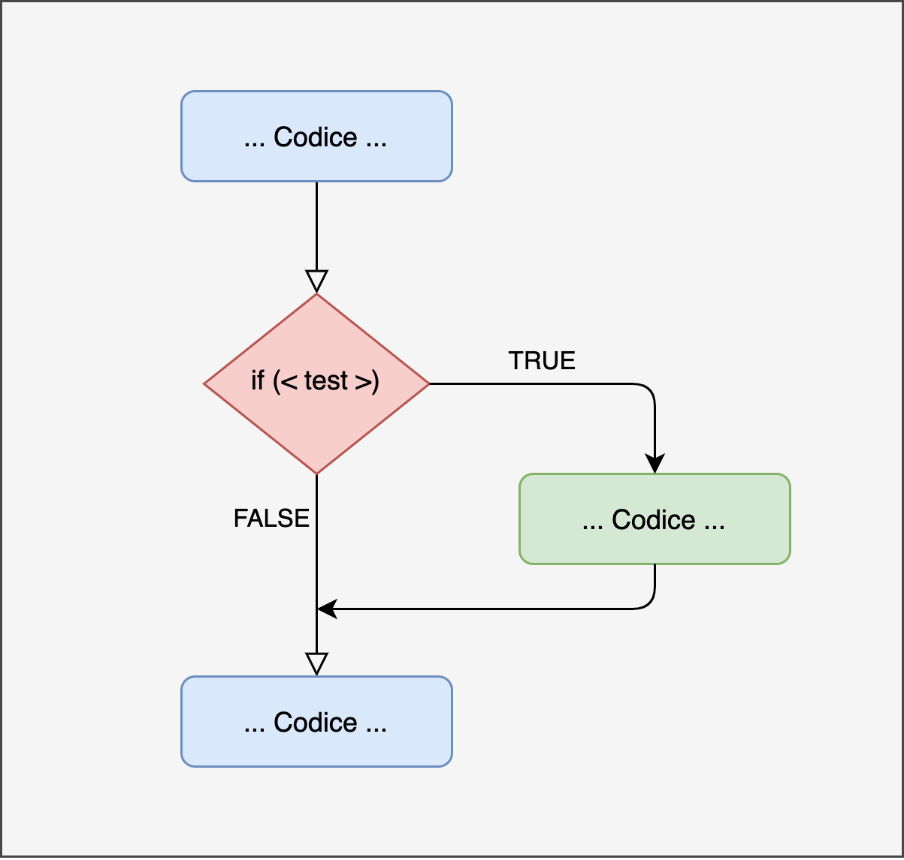
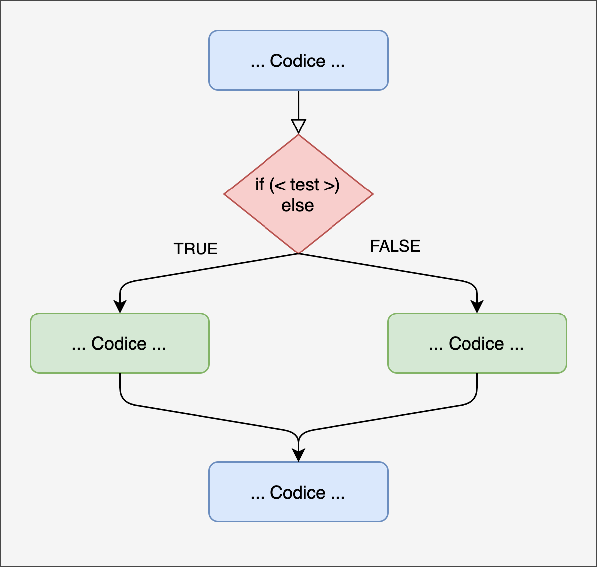
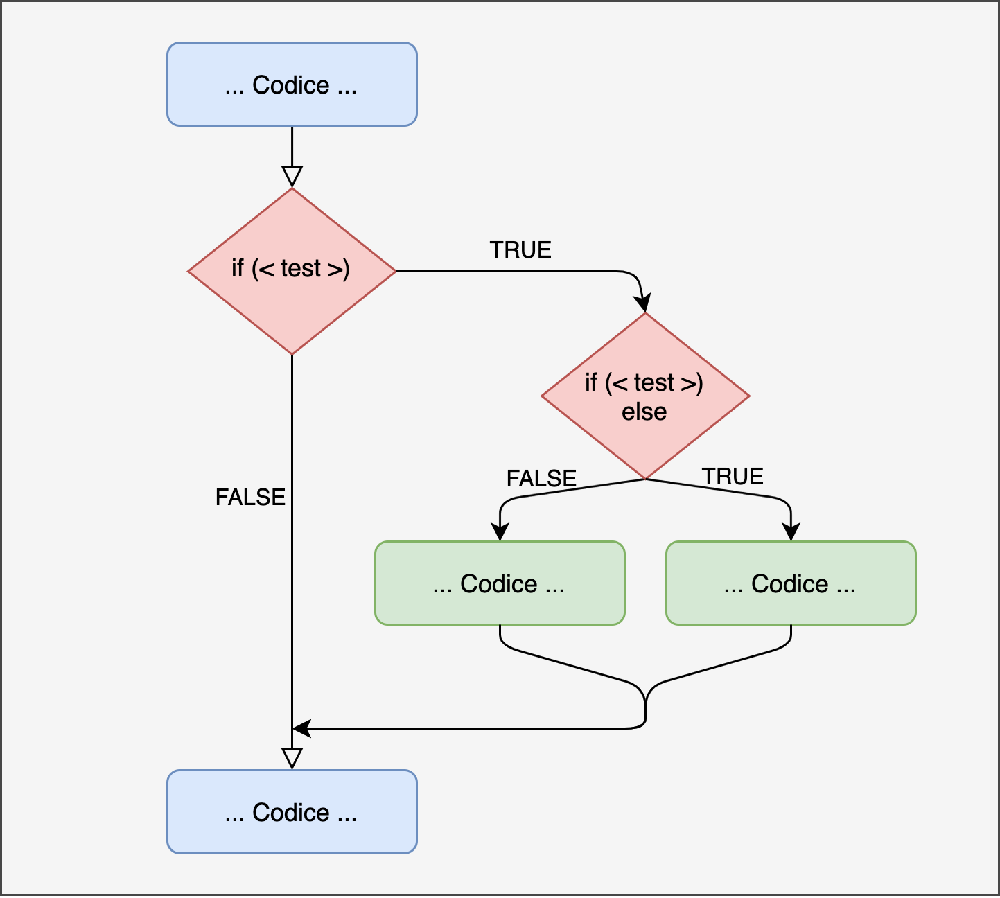

# Programmazione Condizionale {#coditionals}

```{r settings, echo = FALSE}
knitr::opts_chunk$set(
  echo = FALSE,
  collapse=TRUE,
  fig.align="center"
)
```


Working in progress.

## Strutture condizionali

### if

```{r, plot-if-chart, fig.cap="Rappresentazione if", out.width="65%"}

```

#### Struttura if {-}

```{r, echo = TRUE, eval = FALSE}
  ...
  
  if (<test>) {
    <codice-da-eseguire>
  }
  ...
```

#### Esempio {-}

- Singolo if
```{r, echo = TRUE}
my_function <- function(value){
  
  if(value > 0){
    cat("Il valore è maggiore di 0\n")
  }
  
  cat("Fine funzione\n")
}

my_function(5)

my_function(-5)
```

- Multipli if
```{r, echo = TRUE}
my_function <- function(value){
  
  if(value > 0){
    cat("Il valore è maggiore di 0\n")
  }
  
  if(value > 10){
    cat("Il valore è maggiore di 10\n")
  }
  
  cat("Fine funzione\n")
}

my_function(5)

my_function(15)

my_function(-5)
```


### if...else

```{r, plot-ifelse-chart, fig.cap="Rappresentazione if...else", out.width="65%"}

```

#### Struttura if {-}

```{r, echo = TRUE, eval = FALSE}
  ...
  
  if (<test>) {
    <codice-da-eseguire>
  } else {
    <codice-da-eseguire>
  }
  ...
```

#### Esempio {-}

- Singolo if...else
```{r, echo = TRUE}
my_function <- function(value){
  
  if(value >= 0){
    cat("Il valore è maggiore di 0\n")
  } else {
    cat("Il valore non è maggiore di 0\n")
  }
  
  cat("Fine funzione\n")
}

my_function(5)

my_function(-5)
```

- Multipli if
```{r, echo = TRUE}
my_function <- function(value){
  
  if(value > 0){
    cat("Il valore è maggiore di 0\n")
  } else if (value > 10){
    cat("Il valore è maggiore di 10\n")
  } else {
    cat("Il valore non è maggiore di 0\n")
  }
  
  cat("Fine funzione\n")
}

my_function(5)

my_function(15)

my_function(-5)
```

### Nested

```{r, plot-ifnested, fig.cap="Rappresentazione if nested", out.width="65%"}

```

#### Struttura if {-}

```{r, echo = TRUE, eval = FALSE}
  ...
  
  if (<test>) {
    
    if(<test>) {
      <codice-da-eseguire>
    } else {
      <codice-da-eseguire>
    }
  }
  ...
```

#### Esempio {-}

```{r, echo = TRUE}
my_function <- function(value){
  
  if(value > 0){
    
    if(value > 10) {
      cat("Il valore è maggiore di 10\n")
    } else {
      cat("Il valore è maggiore di 0\n")
    }
    
  } else {
    cat("Il valore non è maggiore di 0\n")
  }
  
  cat("Fine funzione\n")
}

my_function(5)

my_function(15)

my_function(-5)
```

### Esercizi {-}

Esegui i seguenti esercizi:
  
  1. Definisci una funzione per assegnare un voto in base alla percentuale di rispote corrette (*score*) segui le seguenti indicazioni: 
  
    - score < .55 insufficiente
    - .55 <= score < .65 - sufficiente
    - .65 <= score < .75 - buono
    - .75 <= score < .85 - distinto
    - .85 <= score - ottimo
    
  2. Definisci una funzione che determini se un numero è pari o dispari.
  3. Definisci una funzione che determini se un numero è un multiplo di 3, 4, o 5.
  4. Definisci una funzione che calcoli lo stipendio mensile considerando gli straordinari che sono retribuiti 1.5 della paga oraria normale. Utilizza come parametrile ore svolte nel mese, la paga oraria ed il tetto ore lavorative, oltre cui si contano gli straordinari.
  

## Altri Operatori Condizinali

### switch

#### Struttura switch {-}

```{r, echo = TRUE, eval = FALSE}

switch(my_value,
       case1 = action1,
       case2 = action2,
       ... )
```

#### Esempio {-}

```{r, echo = TRUE}
my_colors <- function(color){
  
  new_color <- switch(color,
       "rosso" = "red",
       "blu" = "blue",
       "verde" = ,
       "verde acqua" = "green",
       "Not Found")
  
  return(new_color)
}

my_colors("blu")

my_colors("verde")

my_colors("arancione")
```

### ifelse 

#### Struttura ifelse {-}

```{r, echo = TRUE, eval = FALSE}
ifelse(test = , no = , yes = )
```

#### Esempio {-}

```{r, echo = TRUE}
ifelse(test = {12 > 10}, no = "Non superore a 10", yes = "Superiore a 10")
```

