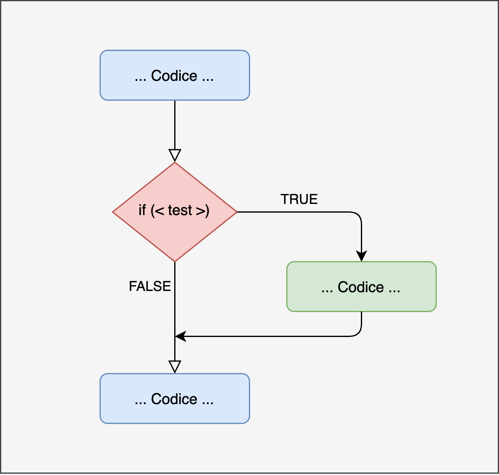
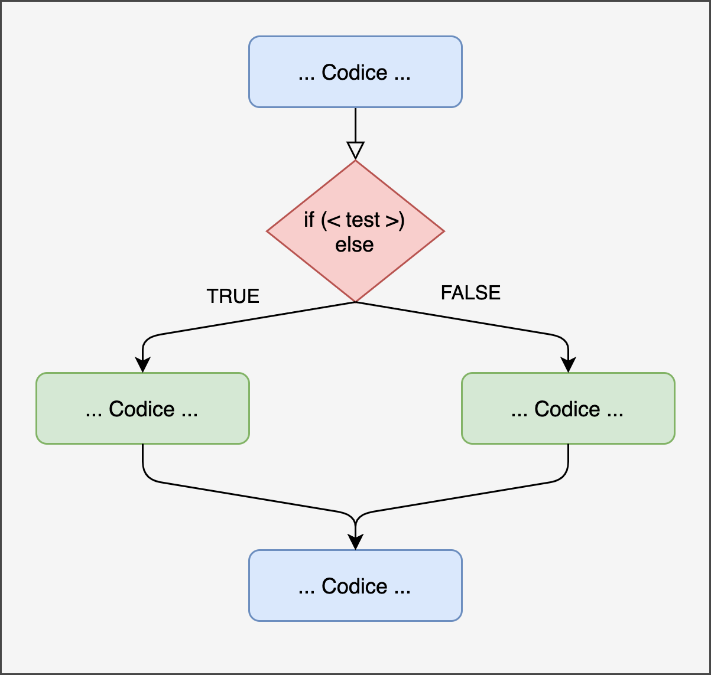
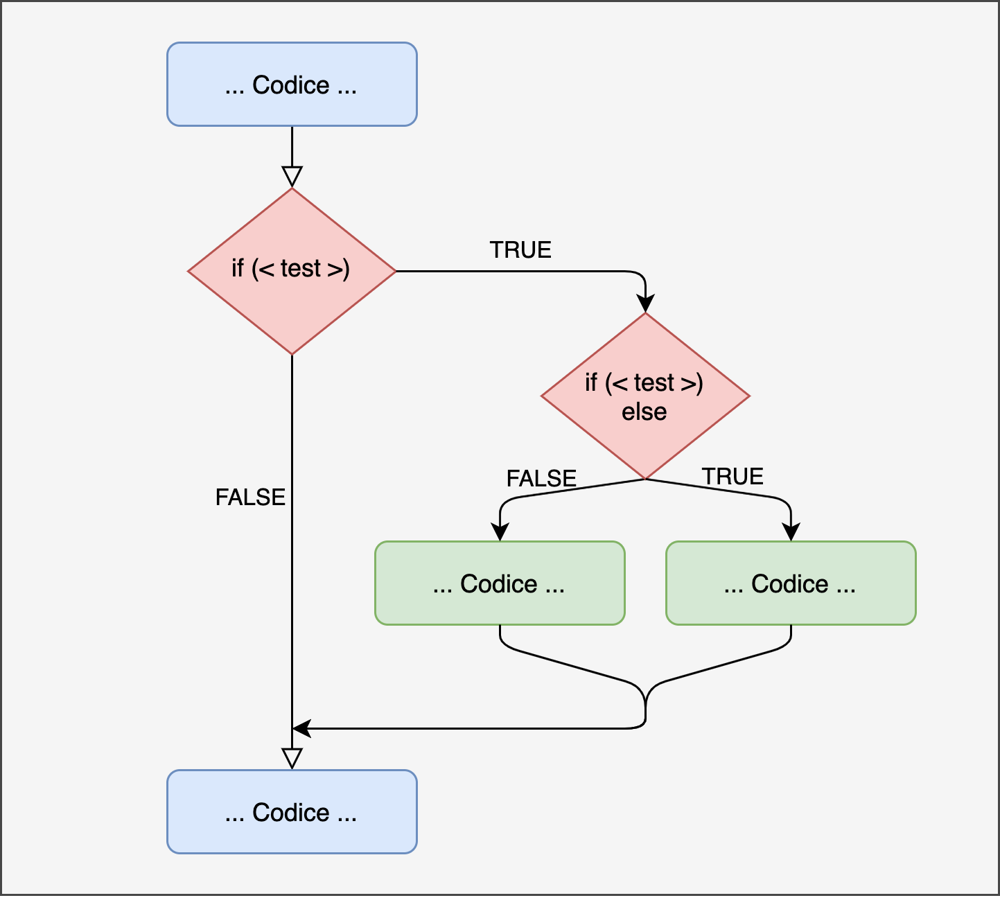

# Programmazione Condizionale {#conditionals}


Uno dei principali costrutti della programmazione sono proprio le espressioni condizionali. L'idea semplice alla base è quella di eseguire alcune operazioni o eseguire le operazioni in un certo modo in funzione di alcune *condizioni*. Le condizioni non sono altro che espressioni che resituiscono sempre un valore *booelan* ovvero `TRUE` oppure `FALSE`. 

L'esempio classico è quello dell'ombrello, immaginate di scrivere il codice per un videogioco e avete scritto una funzione per far prendere prendere e aprire l'ombrello al vostro personaggio. Chiaramente per rendere tutto credibile, dovete far eseguire questa operazione solo quando è richiesto ovvero quando piove. In termini di programmazione, dovete prima verificare una certa condizione (la pioggia) e poi eseguire (o non eseguire) una serie di operazioni di conseguenza.

## Strutture condizionali

Ci sono diverse possibilità in R, tuttavia la logica di eseguire operazioni solo quando alcune condizioni sono rispettate è sempre la stessa. La Figura \@ref(fig:plot-if-chart) rappresenta la struttura generica di un flusso di controllo condizionale.

### if


```r

```

<div class="figure" style="text-align: center">

<p class="caption">(\#fig:plot-if-chart)Rappresentazione if</p>
</div>

#### Struttura if {-}

Per scrivere la struttura condizionale della Figura \@ref(fig:plot-if-chart) si usa la seguente sintassi in R:


```r
  ...
  
  if (<test>) {
    <codice-da-eseguire>
  }
  ...
```

#### Esempio {-}

- Singolo if


```r
my_function <- function(value){
  
  if(value > 0){
    cat("Il valore è maggiore di 0\n")
  }
  
  cat("Fine funzione\n")
}

my_function(5)
## Il valore è maggiore di 0
## Fine funzione

my_function(-5)
## Fine funzione
```

- Multipli if

```r
my_function <- function(value){
  
  if(value > 0){
    cat("Il valore è maggiore di 0\n")
  }
  
  if(value > 10){
    cat("Il valore è maggiore di 10\n")
  }
  
  cat("Fine funzione\n")
}

my_function(5)
## Il valore è maggiore di 0
## Fine funzione

my_function(15)
## Il valore è maggiore di 0
## Il valore è maggiore di 10
## Fine funzione

my_function(-5)
## Fine funzione
```


### if...else

Il semplice utilizzo di un singolo `if` potrebbe non essere sufficiente in alcune situazioni. Sopratutto perchè possiamo vedere l'`if` come una deviazione temporanea dallo script principale (molto chiaro nella figura \@ref(fig:plot-if-chart)) che viene imboccata solo se è vera una condizione, altrimenti lo script continua. Se vogliamo una struttura più "simmetrica" possiamo eseguire delle operazioni se la condizone è vera `if` e altre per tutti gli altri scenari (`else`). La Figura \@ref(fig:plot-ifelse-chart) mostra chiaramente questa struttura diversa nel flusso.


```r

```

<div class="figure" style="text-align: center">

<p class="caption">(\#fig:plot-ifelse-chart)Rappresentazione if...else</p>
</div>

#### Struttura if {-}

In R questo viene implementato nel seguente modo:


```r
  ...
  
  if (<test>) {
    <codice-da-eseguire>
  } else {
    <codice-da-eseguire>
  }
  ...
```

#### Esempio {-}

- Singolo if...else

```r
my_function <- function(value){
  
  if(value >= 0){
    cat("Il valore è maggiore di 0\n")
  } else {
    cat("Il valore non è maggiore di 0\n")
  }
  
  cat("Fine funzione\n")
}

my_function(5)
## Il valore è maggiore di 0
## Fine funzione

my_function(-5)
## Il valore non è maggiore di 0
## Fine funzione
```

- Multipli if

```r
my_function <- function(value){
  
  if(value > 0){
    cat("Il valore è maggiore di 0\n")
  } else if (value > 10){
    cat("Il valore è maggiore di 10\n")
  } else {
    cat("Il valore non è maggiore di 0\n")
  }
  
  cat("Fine funzione\n")
}

my_function(5)
## Il valore è maggiore di 0
## Fine funzione

my_function(15)
## Il valore è maggiore di 0
## Fine funzione

my_function(-5)
## Il valore non è maggiore di 0
## Fine funzione
```

E' importante capire la differenza tra usare multipli `if` e `else if` rispetto a utilizzare un semplice `else`. Se noi vogliamo specificare un set **finito** di alternative, la scelta migliore e quella più chiara consiste di usere `else if` perchè al contrario di `else` richiede di specificare la condizione. Se invece siamo interessanti ad alcune condizioni mentre per tutto il resto applichiamo la stessa operazione, possiamo concludere il nostro flusso con un `else`.

### Nested

Oltre a concatenare una serie di `if` e `else if` è possibile inserire uno o più `if` all'interno di un'altro. Questo permette di controllare delle condizioni che sono dipendenti dal controllo precedente e quindi non possono essere eseguite in serie.


```r

```

<div class="figure" style="text-align: center">

<p class="caption">(\#fig:plot-ifnested)Rappresentazione if nested</p>
</div>

#### Struttura if {-}


```r
  ...
  
  if (<test>) {
    
    if(<test>) {
      <codice-da-eseguire>
    } else {
      <codice-da-eseguire>
    }
  }
  ...
```

#### Esempio {-}


```r
my_function <- function(value){
  
  if(value > 0){
    
    if(value > 10) {
      cat("Il valore è maggiore di 10\n")
    } else {
      cat("Il valore è maggiore di 0\n")
    }
    
  } else {
    cat("Il valore non è maggiore di 0\n")
  }
  
  cat("Fine funzione\n")
}

my_function(5)
## Il valore è maggiore di 0
## Fine funzione

my_function(15)
## Il valore è maggiore di 10
## Fine funzione

my_function(-5)
## Il valore non è maggiore di 0
## Fine funzione
```

### Esercizi {-}

Esegui i seguenti esercizi:
  
  1. Definisci una funzione per assegnare un voto in base alla percentuale di rispote corrette (*score*) segui le seguenti indicazioni: 
  
    - score < .55 insufficiente
    - .55 <= score < .65 - sufficiente
    - .65 <= score < .75 - buono
    - .75 <= score < .85 - distinto
    - .85 <= score - ottimo
    
  2. Definisci una funzione che determini se un numero è pari o dispari.
  3. Definisci una funzione che determini se un numero è un multiplo di 3, 4, o 5.
  4. Definisci una funzione che calcoli lo stipendio mensile considerando gli straordinari che sono retribuiti 1.5 della paga oraria normale. Utilizza come parametrile ore svolte nel mese, la paga oraria ed il tetto ore lavorative, oltre cui si contano gli straordinari.
  

## Altri Operatori Condizionali

### switch

L'operatore `switch` è un utile alternativa quando vogliamo eseguire una porzione di codice in modo condizionale all'input senza tuttavia usare una serie di `if`.

#### Struttura switch {-}


```r

switch(my_value,
       case1 = action1,
       case2 = action2,
       ... )
```

In questo caso, se il valore input (`my_value`) ha una corrispondenza tra i casi considerati (ad esempio `case1`), il codice corrispondente (`action1`) viene eseguito.

Ci sono alcune regole da considerare quando si utilizza uno `switch` statement:

- se il valore inserito è una stringa, R cercherà una corrispondenza come `input == argomento`
- se è presente più di una corrispondenza, viene utilizzata la prima
- non c'è la possibilità di inserire un valore di default
- se non viene trovata una corrispondenza viene restituito un valore `NULL`. Inserendo però un `case` senza un valore corrispondente, questo verra utilizzato al posto di `NULL`.

#### Esempio {-}


```r

my_colors <- function(color){
  
  new_color <- switch(color,
       "rosso" = "red",
       "blu" = "blue",
       "verde" = ,
       "verde acqua" = "green",
       "Not Found") # valore non trovato
  
  return(new_color)
}

my_colors("blu")
## [1] "blue"

my_colors("verde")
## [1] "green"

my_colors("arancione")
## [1] "Not Found"
```

### ifelse

Gli `if`, `else` e `else if` statements funzionano solo per un singolo valore. In altri termini non è possibile testare una stessa condizione su una serie di elementi. Nel prossimo capitolo affronteremo la programmazione iterativa che permette di ripetere una serie di operazioni. Tuttavia utilizzando la funzione `ifelse()` è possibile implementare una versione vettorizzata delle operazioni condizionali.
La struttura è la seguente:


```r
ifelse(test = , yes = , no = )
```

Dove:

- `test` è la condizione da valutare e corrisponde a quello che di solito era tra parentesi negli `if` precedenti `if(test){...}`
- `yes` è il codice che viene eseguito se la condizione è `TRUE`
- `no` è il codice che viene eseguito se la condizione è `FALSE`

#### Esempio {-}

Immaginiamo di avere un vettore di numeri che corrispondono a delle età e vogliamo eseguire qualcosa se il l'età è maggiore o minore di 18 anni, ad esempio mostrare semplicemente la scritta "maggiorenne" oppure "minorenne". Utilizzando un semplice `if` vediamo che:


```r
age <- c(18, 19, 11, 10, 23, 55, 33, 26, 10)
if(age < 18){
  print("Minorenne")
}else{
  print("Maggiorenne")
}
## Warning in if (age < 18) {: the condition has length > 1 and only the first
## element will be used
## [1] "Maggiorenne"
```

Veniamo avvertiti che `age` non è un singolo valore e che quindi solo il primo valore è utilizzato. Questo dimostra che `if` non funziona su una lista di elementi. Utilizzando `ifelse` invece:


```r
ifelse(age < 18, yes = print("Minorenne"), no = print("Maggiorenne"))
## [1] "Minorenne"
## [1] "Maggiorenne"
## [1] "Maggiorenne" "Maggiorenne" "Minorenne"   "Minorenne"   "Maggiorenne"
## [6] "Maggiorenne" "Maggiorenne" "Maggiorenne" "Minorenne"
```

In questo caso l'idea è di eseguire il codice precedente per ogni valore del nostro vettore in input. Questo è possibile perchè l'operazione `<` è vettorizzata.
