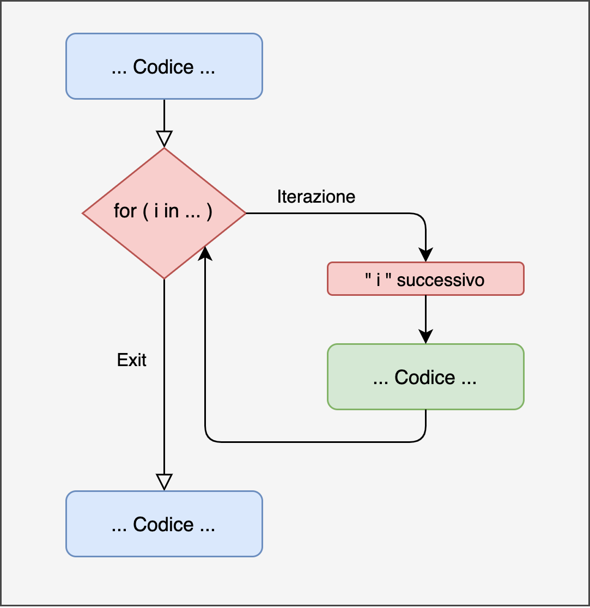
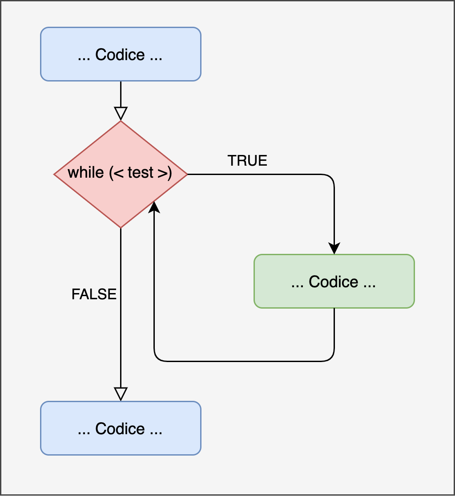

# Programmazione Iterativa {#loop}

```{r settings, echo = FALSE}
knitr::opts_chunk$set(
  echo = TRUE,
  collapse=TRUE,
  fig.align="center"
)

set.seed(2021)
```

L'essenza della maggior parte delle operazioni nei vari linguaggi di programmazione è quella del concetto di **iterazione**. Iterazione significa ripetere una porzione di codice un certo numero di volte o fino anche una condizione viene soddisfatta. 

Molte delle funzioni che abbiamo usato finora come la funzione `sum()` o la funzione `mean()` si basano su operazioni iterative. In R, purtroppo o per fortuna, userete abbastanza raramente delle iterazioni tramite loop anche se nella maggior parte delle funzioni sono presenti. Infatti molte delle funzioni implementate in R sono disponibili solo con pacchetti esterni oppure devono essere scritte manualmente implementando strutture iterative.

## Loop

### For

Il primo tipo di struttura iterativa viene denominata ciclo `for`. L'idea è quella di ripetere una serie di istruzioni un numero **predefinito** di volte.La Figura \@ref(fig:plot-for-loop) rappresenta l' idea di un ciclo `for`. In modo simile alle strutture condizionali del capitolo precedente, quando scriviamo un ciclo, entriamo in una parte di codice temporaneamente, eseguiamo le operazioni richieste e poi continuiamo con il resto del codice. Quello che nell'immagine è chiamato `i` è un modo convenzionale di indicare il conteggio delle operazioni. Se vogliamo ripetere un'operazione 1000 volte, `i` parte da 1 e arriva fino a 1000.

```{r, plot-for-loop, fig.cap="Rappresentazione for loop", out.width="65%"}

```

#### Struttura For Loop {-}

In R la scrittura del ciclo `for` è la seguente:

```{r, echo = TRUE, eval = FALSE}
for (i in c(...)) {
    <codice-da-eseguire>
}
```

- `i` è un nome generico per indicare la variabile conteggio che abbiamo introdotto prima. Può essere qualsiasi carattere, ma solitamente per un ciclo generico si utilizzano singole lettere come `i` o `j` proabilmente per una similarità con la notazione matematica che spesso utilizza queste lettere per indicare una serie di elementi
- `in` è l'operatore per indicare che `i` varia rispetto ai valori specificati di seguito
- `c(...)` è il range di valori che assumerà `i` in per ogni iterazione

Possiamo riformulare il codice in:

> Ripeti le operazioni incluse tra {} un numero di volte uguale alla lunghezza di `c(...)` e in questo ciclo, `i` assumerà, uno alla volta i valori contenuti in `c(...)`.

Informalmente ci sono due tipi di ciclo, quello che utilizza un counter generico da assegnare a `i` e un'altro che utilizza direttamente dei valori di interesse. 

#### Esempio {-}

- Loop con direttamente i valori di interesse

```{r, echo = TRUE}
# numerico
# caratteri
for (name in c("Alessio", "Beatrice", "Carlo")){
  print(paste0("Ciao ", name))
}
```

Loop che utilizza un counter generico per indicizzare gli elementi:

```{r, echo = TRUE}
my_vector <- c(93, 27, 46, 99)

# i in 1:length(my_vector)
for (i in seq_along(my_vector)){
  print(my_vector[i])
}
```

Questa distinzione è molto utile e spesso fonte di errori. Se si utilizza direttamente il vettore e il nostro counter assume i valori del vettore, "perdiamo" un indice di posizione. Nell'esempio del ciclo con i nomi infatti, se volessimo sapere e stampare quale posizione occupa Alessio dobbiamo modificare l'approccio, puntando ad utilizzando anche counter generico. Possiamo crearlo fuori dal ciclo e aggiornarlo manualmente:

```{r}
i <- 1
for (name in c("Alessio", "Beatrice", "Carlo")){
  print(paste0(name, " è il numero ", i))
  i <- i + 1
}
```

In generale, il modo migliore è sempre quello di utilizzare un ciclo utilizza indici e non i valori effettivi, in modo da poter accedere comunque entrambe le informazioni.

```{r}
nomi <- c("Alessio", "Beatrice", "Carlo")

for (i in seq_along(nomi)){
  print(paste0(nomi[i], " è il numero ", i))
}
```


:::{.trick title="seq_along() " data-latex="[Next e Break]"}

```{r, echo = TRUE}
my_vector <- c(93, 27, 46, 99)
my_NULL <- NULL

1:length(my_vector)
1:length(my_NULL)

seq_along(my_vector)
seq_along(my_NULL)

seq_len(length(my_vector))
seq_len(length(my_NULL))
```

:::


#### Esempio: la funzione somma {-}

Come introdotto all'inizio di questo capitolo, molte delle funzioni disponibili in R derivano da strutture iterative. Se pensiamo alla funzione `sum()` sappiamo che possiamo calcolare la somma di un vettore semplicemente con `sum(x)`. Per capire appieno i cicli, è interessante pensare e implementare le funzioni comuni. 

Se dovessimo sommare `n` numeri a mano la struttura sarebbe questa:

- prendo il primo numero $x_1$ e lo sommo con il secondo $x_2$
- ottengo un nuovo numero `x_{1+2}`
- prendo il terzo numero $x_3$ e lo sommo a `x_{1+2}`
- ottengo $x_{1+2+3}$
- ripeto questa operazione fino all'ultimo elemento di $x_n$

Come vedete, questa è una struttura iterativa, che conta da 1 alla lunghezza di $x$ ed ogni iterazione somma il successivo con la somma dei precedenti. In R:

```{r, echo = TRUE}
my_values <- c(2,4,6,8)

# Calcolare somma valori
my_sum <- 0      # inizializzo valore
for (i in seq_along(my_values)){
  my_sum <- my_sum + my_values[i]
}

my_sum
```

La struttura è la stessa del nostro ragionamento in precedenza. Creo una variabile "partenza" che assume valore 0 ed ogni iterazione sommo indicizzando il rispettivo elemento.

#### Esempio: creo un vettore {-}

Essendo che utilizziamo un indice che assume un range di valori, possiamo non solo accedere ad un vettore utilizzando il nostro indice ma anche creare o sostituire un vettore progressivamente.

```{r, echo = TRUE}
# Calcola la somma di colonna
my_matrix <- matrix(1:24, nrow = 4, ncol = 6)

# Metodo non efficiente (aggiungo valori)
sum_cols <- c()
for( i in seq_len(ncol(my_matrix))){
  sum_col <- sum(my_matrix[, i])   # calcolo i esima colonna
  sum_cols <- c(sum_cols, sum_col) # aggiungo il risultato
}

sum_cols

# Metodo efficiente (aggiorno valori)
sum_cols <- vector(mode = "double", length = ncol(my_matrix))
for( i in seq_along(sum_cols)){
  sum_col <- sum(my_matrix[, i])   # calcolo i esima colonna
  sum_cols[i] <-  sum_col # aggiorno il risultato
}

sum_cols
```

### While

Il ciclo `while` può essere considerato come una generalizzazione del ciclo `for`. In altri termini il ciclo `for` è un tipo particolare di ciclo `while`.

```{r, plot-while-loop, fig.cap="Rappresentazione while loop", out.width="65%"}

```

#### Struttura While Loop {-}

La scrittura è più concisa del ciclo `for` perché non definiamo nessun counter o placeholder e nemmeno un vettore di valori. L'unica cosa che muove un ciclo `while` è una condizione logica (quindi con valori booleani `TRUE` e `FALSE`). Anche qui, parafrasando:

> Ripeti le operazioni incluse tra {} fino a che la condizione `<test>` è VERA.

In altri termini, ad ogni iterazione la condizione `<test>` viene valutata. Se questa è vera, viene eseguita l'operazione altrimenti il ciclo si ferma.

```{r, echo = TRUE, eval = FALSE}
while (<test>) {
    <codice-da-eseguire>
}
```

#### Esempio {-}

Se vogliamo fare un **conto alla rovescia**

```{r, echo = TRUE}
count <- 5

while(count >= 0){
  print(count)
  count <- count - 1 # aggiorno variabile
}
```

Quando si scrive un ciclo `while` è importante assicurarsi di due cose:

- Che la condizione sia `TRUE` inizialmente, altrimenti il ciclo non comincierà nemmeno
- Che ad un certo punto la condizione diventi `FALSE` (perché abbiamo ottenuto il risultato o perché è passato troppo tempo o iterazioni)

Se la seconda condizione non è rispettata, otteniamo quelli che si chiamano `endless loop` come ad esempio:

```{r, echo = TRUE, eval = FALSE}
count <- 5

# Attenzione loop infinito
while(count >= 0){
  print(count)
  # count <- count - 1 
}
```

#### While e For

Abbiamo introdotto in precedenza che il `for` è un tipo particolare di `while`. Concettualmente infatti possiamo pensare ad un `for` come un `while` dove il nostro counter `i` incrementa fino alla lunghezza del vettore su cui iterare. In altri termini possiamo scrivere un `for` anche in questo modo:

```{r}
nomi <- c("Alessio", "Beatrice", "Carlo")
i <- 1 # counter

while(i <= length(nomi)){ # condizione
  print(paste0(nomi[i], " è il numero ", i))
  i <- i + 1
}
```

### Next e Brake

All'interno di una struttura iterativa, possiamo eseguire qualsiasi tipo di operazione, ed anche includere strutture condizionali. Alcune volte può essere utile saltare una particolare iterazione oppure interrompere il ciclo iterativo. In R tali operazioni posso essere eseguite rispettivamene coni comandi `next` e `break`.

- `next` - passa all'iterazione successiva
- `break` - interrompe l'esecuzione del ciclo

#### Esempio {-}

- con `for` loop
```{r, echo = TRUE}
my_vector <- 1:6

for (i in seq_along(my_vector)){
  if (my_vector[i] == 3) next
  
  if (my_vector[i] == 5) break
  print(my_vector[i])
}
```

- con `while` loop
```{r, echo = TRUE}
count <- 7

while(count >= 0){
  count <- count - 1
  if (count == 5) next
  
  if (count == 2) break
  
  print(count)
}
```

## Nested loop

Una volta compresa la struttura iterativa, è facile espanderne le potenzialità inserendo un ciclo all'interno di un altro. Possiamo avere quanti cicli *nested* necessari, chiaramente aumenta non solo la complessità ma anche il tempo di esecuzione. Per capire al meglio cosa succede all'interno di un ciclo nested è utile visualizzare gli indici:

```{r}
for(i in 1:3){ # livello 1
  for(j in 1:3){ # livello 2
    for(l in 1:3){ # livello 3
      print(paste(i, j, l))
    }
  }
}
```

Guardando gli indici, è chiaro che il ciclo più interno viene ultimato per primo fino ad arrivare a quello più esterno. La logica è la seguente:

- La prima iterazione entriamo nel ciclo più esterno `i = 1`, poi in quello interno `j = 1` e in quello più interno `l = 1`.
- nella seconda iterazione siamo **bloccati** nel ciclo interno e quindi sia `i` che `j` saranno 1 mentre `l` sarà uguale a 2.
- quando il ciclo `l` sarà finito, `i` sarà sempre 1 mentre `j` passerà a 2 e così via

Un aspetto importante è l'utilizzo di indici diversi, infatti i valori `i`, `j` e `l` assumono valori diversi ad ogni iterazione e se usassimo lo stesso indice, non otterremo il risultato voluto.

### Esercizi {-}

1. Scrivi una funzione che calcoli la media di un vettore numerico usando un for loop.
2. Scrivi una funzione che dato un vettore numerico restituisca il valore massimo e  minimo usando un for loop (attenti al valore di inizializzazione).
3. Scrivi una funzione che per ogni iterazione generi $n$ osservazioni da una normale (funzione `rnorm()`) con media $mu$ e deviazione standard $sigma$, salva la media di ogni campione. I parametri della funzione saranno $n$, $mu$, $sigma$ e $iter$ (numero di iterazioni). 

## Apply Family

Ci sono una famiglia di funzioni in R estremamente potenti e versatili chiamate `*apply`. L'asterisco suggerisce una serie di varianti presenti in R che nonostante la struttura e funzione comune hanno degli obiettivi diversi:

- `apply`: dato un dataframe (o matrice) esegue la stessa funzione su ogni riga o colonna
- `tapply`: dato un vettore di valori esegue la stessa funzione su ogni gruppo che è satato definito
- `lapply`: esegue la stessa funzione per ogni elemento di una lista. Restituisce ancora una lista
- `sapply`: esegue la stessa funzione per ogni elemento di una lista. Restituisce se possibile un oggetto seplificato (un vettore, una matrice o un array)
- `vapply`: analogo a `sapply` ma richiede di definire il tipo di dati restituiti
- `mapply`: è la versione multivariata. Permette di applicare una funzione a più liste di elementi

Prima di illustrare le varie funzioni è utile capire la struttura generale. In generale queste funzioni accettano un oggetto **lista** quindi un insieme di elementi e una **funzione**. L'idea infatti è quella di avere una funzione che accetta altre funzioni come argomenti e applichi la funzione-argomento ad ogni elemento in input. 
Queste funzioni, sopratutto in R, sono spesso preferite rispetto ad utilizzare cicli `for` per velocità, compattezza e versatilità.
Hadley Wickam[^talk-map] riporta un bellissimo esempio per capire la diffenza tra `loop` e `*apply`. Immaginiamo di avere una serie di vettori e voler applicare alcune funzioni ad ogni vettore, possiamo impostare un semplice loop in questo modo:

```{r}
list_vec <- list(
  vec1 <- rnorm(100),
  vec2 <- rnorm(100),
  vec3 <- rnorm(100),
  vec4 <- rnorm(100),
  vec5 <- rnorm(100)
)

means <- vector(mode = "numeric", length = length(list_vec))
medians <- vector(mode = "numeric", length = length(list_vec))
st_devs <- vector(mode = "numeric", length = length(list_vec))

for(i in seq_along(list_vec)){
  means[i] <- mean(list_vec[[i]])
  medians[i] <- median(list_vec[[i]])
  st_devs[i] <- sd(list_vec[[i]])
}
```

Nonostante sia perfettamente corretto, questa scrittura ha diversi problemi:

- E' molto ridondante. Tra calcolare media, mediana e deviazione standard l'unica cosa che cambia è la funzione applicata mentre dobbiamo per ognuno preallocare una variabile, impostare l'indicizzazione in base all'iterazione per selezionare l'elemento della lista e memorizzare il risultato. Per migliorare questa scrittura possiamo mettere in una funzione tutta questa struttura (preallocazione, indicizzazione e memorizzazione) e utilizzare questa funzione con argomenti la lista di input e la funzione da applicare. Utilizzando la funzione `sapply`:

```{r}
means <- lapply(list_vec, mean)
means
medians <- lapply(list_vec, median)
medians
st_devs <- lapply(list_vec, sd)
st_devs
```

Come vedete il codice diventa estremamente compatto, pulito e facile da leggere.

### Quali funzioni applicare?

Prima di descrivere nel dettaglio ogni funzione `*apply` è importante capire quali tipi di funzioni possiamo usare all'interno di questa famiglia. In generale, qualsiasi funzione può essere applicata ma per comodità possiamo distinguerle in:

- funzioni già presenti in R
- funzioni personalizzate (create e salvate nell'ambiente principale)
- funzioni **anonime**

Nell'esempio precedente, abbiamo utilizzato la funzione `mean` semplicemente scrivendo `lapply(lista, mean)`. Questo è possibile perché `mean` necessita di un solo argomento. Se tuttavia volessimo applicare funzioni più complesse o aggiungere argomenti possiamo usare la scrittura più generale:

```{r}
means <- lapply(list_vec, function(x) mean(x))
means
```

L'unica differenza è che abbiamo definito una funzione **anonima** con la scrittura `function(x) ...`. Questa scrittura si interpreta come "ogni elemento di `list_vec` diventa `x`, quindi applica la funzione `mean()` per ogni elemento di `list_vec`". La funzione anonima permette di scrivere delle funzioni non salvate o presenti in R e applicare direttamente ad una serie di elementi. Possiamo anche usare funzioni più complesse come centrare ogni elemento di `list_vec`:

```{r}
centered_list <- lapply(list_vec, function(x) x - mean(x))
centered_list
```

In questo caso, è chiaro che `x` è un placeholder che assume il valore di ogni elemento della lista `list_vec`.

L'uso di funzioni anonime è estremamente utile e chiaro una volta compresa la notazione. Tuttavia per funzioni più complesse è più conveniente scrivere salvare la funzione in un oggetto e poi applicarla come per `mean`. Usando sempre l'esempio di centrare la variabile possiamo:

```{r}
center_vec <- function(x){
  return(x - mean(x))
}

centered_list <- lapply(list_vec, center_vec)
```

Possiamo comunque applicare funzioni complesse come **anonime** semplicemente utilizzando le parentesi graffe proprio come se dovessimo dichiarare una funzione:

```{r}
center_vec <- function(x){
  return(x - mean(x))
}

centered_list <- lapply(list_vec, function(x){
  res <- x - mean(x)
  return(res)
})
```

Un ultimo aspetto riguarda un parallismo tra `x` nei nostri esempi e `i`nei cicli `for` che abbiamo visto in precedenza. Proprio come `i`, `x` è una semplice convenzione e si può utilizzare qualsiasi nome per definire l'argomento generico. Inoltre, è utile pensare a `x` proprio con lo stesso ruolo di `i`, infatti se pensiamo alla funzione in precedenza, `x` ad ogni iterazione prende il valore di un elemento di `list_vec` proprio come utilizzare il ciclo `for` non con gli indici ma con i valori del vettore su cui stiamo iterando. Qualche volta infatti può essere utile applicare un principio di **indicizzazione** anche con l' `*apply` family:

```{r}
means <- lapply(seq_along(list_vec), function(i) mean(list_vec[[i]]))
means
```

In questo caso l'argomento non è più la lista ma un vettore di numeri da 1 alla lunghezza della lista (proprio come nel ciclo `for`). La funzione anonima poi prende come argomento `i` (che ricordiamo può essere qualsiasi nome) e utilizza `i` per indicizzare e applicare una funzione. In questo caso non è estremamente utile, ma con questa scrittura abbiamo riprodotto esattamente la logica del ciclo `for` in un modo estremamente compatto.

### apply

La funzione `apply` viene utilizzata su **matrici**, **dataframe** per applicare una funzione ad ogni dimensione (riga o colonna). La struttura della funzione è questa:

```{r, echo = TRUE, eval = FALSE}
apply(X = , MARGIN = , FUN = , ...)
```

Dove:

- `X` è il dataframe o la matrice
- `MARGIN` è la dimensione su cui applicare la funzione: `1` = riga e `2` = colonna
- `FUN` è la funzione da applicare

#### Esempi {-}

- Semplici funzioni

```{r, echo = TRUE}
my_matrix <- matrix(1:24, nrow = 4, ncol = 6)

# Per riga
apply(my_matrix, MARGIN = 1, FUN = sum)

# Per colonna
apply(my_matrix, MARGIN = 2, FUN = sum)

```

- Funzioni complesse

```{r, echo = TRUE}
# Coefficiente di Variazione
apply(my_matrix, MARGIN = 2, FUN = function(x){
  mean <- mean(x)
  sd <- sd(x)
  
  return(round(sd/mean,2))
})
```

### tapply

`tapply` è utile quando vogliamo applicare una funzione ad un elemento che viene **diviso** in base ad un'altra variabile. La scrittura è la seguente:

```{r, echo = TRUE, eval = FALSE}
tapply(X = , INDEX = , FUN = , ...)
```

Dove:

- `X` è la variabile principale
- `INDEX` è la variabile in base a cui suddividere `X`
- `FUN` è la funzione da applicare

#### Esempi {-}

```{r, echo = TRUE}
my_data <- data.frame(
  y = sample(c(2,4,6,8,10), size = 32, replace = TRUE),
  gender = factor(rep(c("F", "M"), each = 16)),
  class = factor(rep(c("3", "5"), times = 16))
)

head(my_data, n = 4)

# Media y per classe
tapply(my_data$y, INDEX = my_data$class, FUN = mean)

# Media y per classe e genere
tapply(my_data$y, INDEX = list(my_data$class, my_data$gender), FUN = mean)
```

### lapply

E' forse la funzione più utilizzata e generica. Viene applicata ad ogni tipo di dato che sia una lista di elementi o un vettore. La particolarità è quella di restituire sempre una lista come risultato, indipendentemente dal tipo di input. La scrittura è la seguente:

```{r, echo = TRUE, eval = FALSE}
lapply(X = , FUN = , ...)
```

Dove:

- `X` è il vettore o lista
- `FUN` è la funzione da applicare 

#### Esempi {-}

```{r, echo = TRUE}
my_list <- list(
  sample_norm = rnorm(10, mean = 0, sd = 1),
  sample_unif = runif(15, min = 0, max = 1),
  sample_pois = rpois(20, lambda = 5)
)

str(my_list)

# Media 
lapply(my_list, FUN = mean)
```

### sapply

`sapply` ha la stessa funzionalità di `lapply` ma ha anche la capacità di restituire una versione semplificata (se possibile) dell'output. 

```{r, echo = TRUE, eval = FALSE}
sapply(X = , FUN = , ... )
```

#### Esempi {-}

```{r, echo = TRUE}
# Media 
sapply(my_list, FUN = mean)
```

Per capire la differenza, applichiamo sia `lapply` che `sapply` con gli esempi precedenti:

```{r}
sapply(list_vec, mean)
lapply(list_vec, mean)
sapply(list_vec, mean, simplify = FALSE)
```

Come vedete, il risultato di queste operazioni corrisponde ad un valore per ogni elemento della lista `list_vec`. `lapply` restituisce una lista con i risultati mentre `sapply` resituisce un vettore. Nel caso di risultati singoli come in questa situazione, l'utilizzo di `sapply` è conveniente mentre mantenere la struttura a lista può essere meglio in altre condizioni. Possiamo comunque evitare che `sapply` semplifichi l'output usando l'argomento `simplify = FALSE`.

### vapply

```{r, echo = TRUE, eval = FALSE}
vapply(X = , FUN = , FUN.VALUE =  ,... )
```

#### Esempi {-}

`vapply` è una ancora una volta simile sia a `lapply` che a `sapply`. Tuttavia richiede che il tipo di output sia specificato in anticipo. Per questo motivo è ritenuta una versione più *solida* delle precedenti perché permette più controllo su quello che accade.

```{r, echo = TRUE}
# Media 
vapply(my_list, FUN = mean, FUN.VALUE = numeric(length = 1L))
```

In questo caso come in precendeza definiamo la lista su cui applicare la funzione. Tuttavia l'argomento `FUN.VALUE = numeric(length = 1L)` specifica che ogni risultato dovrà essere un valore di tipo `numeric` di lunghezza 1. Infatti applicando la media otteniamo un singolo valore per iterazione e questo valore è necessariamente numerico.

:::{.warning title="sapply() vs vapply()" data-latex="[sapply() vs vapply()]"}

`sapply()` non restituisce sempre la stessa tipologia di oggetto mentre `vapply()` richiede sia specificato il tipo di l'output di ogni iterazione.

```{r, echo = TRUE, error = TRUE}
x1 <- list(
  sample_unif = c(-1, runif(15, min = 0, max = 1)),
  sample_norm = rnorm(5, mean = 0, sd = 1),
  sample_pois = rpois(20, lambda = 5)
)
x2 <- list(
  sample_gamma = c(-1, rgamma(10, shape = 1)),
  sample_unif = c(-2, runif(15, min = 0, max = 1)),
  sample_pois = c(-3, rpois(20, lambda = 5))
)

negative_values <- function(x) x[x < 0]
sapply(x1, negative_values) 
sapply(x2, negative_values) 

vapply(x1, negative_values, FUN.VALUE = numeric(1))
vapply(x2, negative_values, FUN.VALUE = numeric(1)) 

```

:::

### Lista di funzioni a lista di oggetti

L'`*apply` family permette anche di estendere la formula "applica una funzione ad una lista di argomenti" applicando diverse funzioni inm modo estremamente compatto. Le funzioni infatti sono oggetti come altri in R e possono essere contenute in liste:

```{r}
list_funs <- list(
  "mean" = mean,
  "median" = median,
  "sd" = sd
)

lapply(list_funs, function(f) sapply(list_vec, function(x) f(x)))
```

Quello che abbiamo fatto è creare una lista di funzioni e poi scrivere due `lapply` e `sapply` in modo *nested*. Proprio come quando scriviamo due `loop` nested, la stessa funzione viene applicata a tutti gli elementi, per poi passare alla funzione successiva. Il risultato infatti è una lista dove ogni elemento contiene i risultati applicando ogni funzione. Questo tipo di scrittura è più rara da trovare, tuttavia è utile per capire la logica e la potenza di questo approccio.

:::

### mapply

`mapply` è la versione più complessa di quelle considerate perché estende a *n* il numero di liste che vogliamo utilizzare. La scrittura è la seguente:

```{r, echo = TRUE, eval = FALSE}
mapply(FUN, ...)
```

Dove:

- `FUN` è la funzione da applicare
- `...` sono le liste di elementi su cui applicare la funzione. E' importante che tutti gli elementi siano della stessa lunghezza

Proviamo a generare dei vettori da una distribuzione normale, usando la funzione `rnorm()` con diversi valori di numerosità, media e deviazione standard.

```{r}
ns <- c(10, 3, 5)
means <- c(10, 20, 30)
sds <- c(2, 5, 7)

mapply(function(x, y, z) rnorm(x, y, z), # funzione
       ns, means, sds) # argomenti
```

La scrittura è sicuramente meno chiara rispetto agli esempi precedenti ma l'idea è la seguente:

- la funzione **anonima** non ha solo un argomento ma *n* argomenti
- gli argomenti sono specificati in ordine, quindi nel nostro esempio `x = ns, y = means e z = sds`
- ogni iterazione, la funzione `rnorm` ottiene come argomenti una diversa numerosità, media e deviazione standard

## Replicate

`replicate` è una funzione leggermente diversa ma estremamente utile. Permette di ripetere una serie di operazioni un numero prefissato di volte.

```{r, echo = TRUE, eval = FALSE}
replicate(n = , expr = )
```

Dove:

- `n` è il numero di ripetizioni
- `expr` è il codice da ripetere

#### Esempi {-}

- Semplice
```{r, echo = TRUE}
sample_info <- replicate(n = 1000,{
  my_sample <- rnorm(n = 20, mean = 0, sd = 1)
  my_mean <- mean(my_sample)
  
  return(my_mean)
})

str(sample_info)
```

- Complesso
```{r, echo = TRUE}
sample_info <- replicate(n = 1000,{
  my_sample <- rnorm(n = 20, mean = 0, sd = 1)
  my_mean <- mean(my_sample)
  my_sd <- sd(my_sample)
  
  return(data.frame(mean = my_mean, 
                    sd = my_sd))
}, simplify = FALSE)


sample_info <- do.call("rbind", sample_info)

str(sample_info)
head(sample_info)
```

E' importante sottolineare che la ripetizione è alla base di qualsiasi struttura iterativa che abbiamo visto finora. Infatti lo stesso risultato (al netto di leggibilità, velocità e versalità) lo possiamo ottenere indistintamente con un ciclo `for`, `lapply` o `replicate`. Riprendendo l'esempio precedente:

```{r}

# Replicate

sample_info <- replicate(n = 1000,{
  my_sample <- rnorm(n = 20, mean = 0, sd = 1)
  my_mean <- mean(my_sample)
  
  return(my_mean)
})

str(sample_info)

# *apply

sample_info <- sapply(1:1000, function(x){
  my_sample <- rnorm(n = 20, mean = 0, sd = 1)
  my_mean <- mean(my_sample)
})

str(sample_info)

# for

sample_info <- vector(mode = "numeric", length = 1000)

for(i in 1:1000){
  my_sample <- rnorm(n = 20, mean = 0, sd = 1)
  sample_info[i] <- mean(my_sample)
}

str(sample_info)

```
