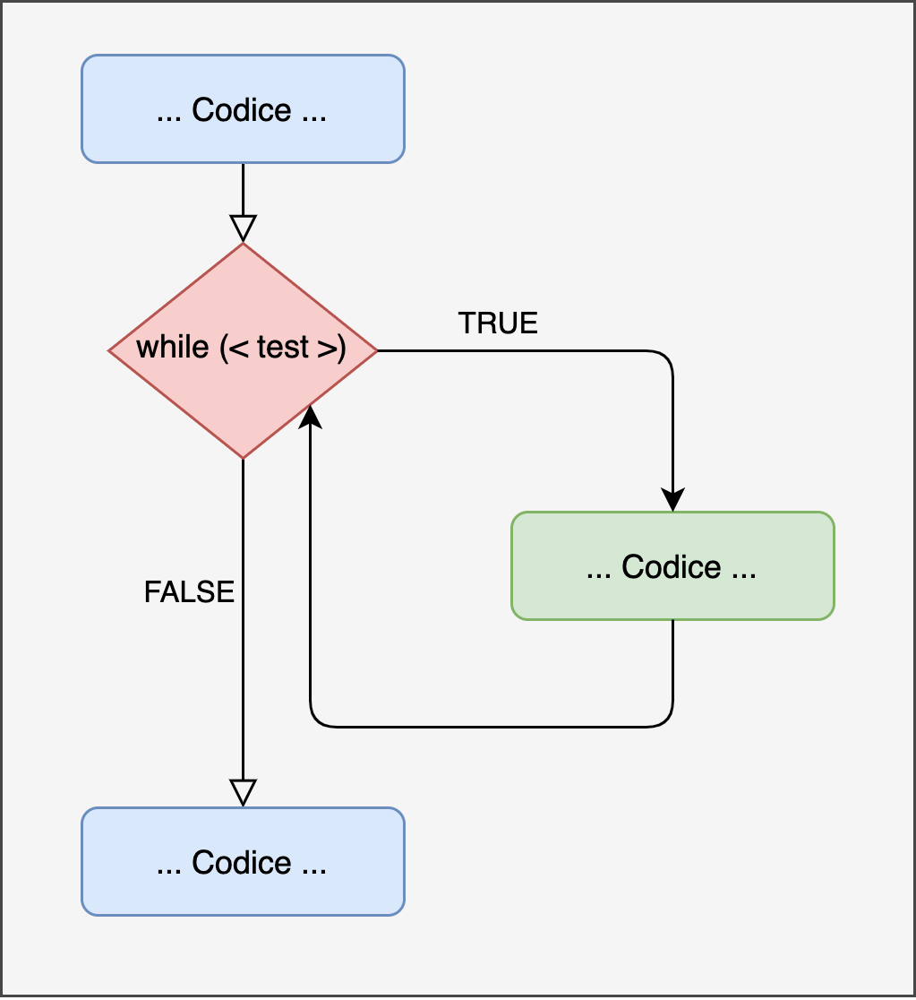

# Programmazione Iterativa {#loop}


Working in progress.


## Loop

### For

<div class="figure" style="text-align: center">

<p class="caption">(\#fig:plot-for-loop)Rappresentazione for loop</p>
</div>

#### Struttura For Loop {-}


```r
for (i in c(...)) {
    <codice-da-eseguire>
}
```

#### Esempio {-}

- Loop con valori vettore

```r
# numerico
for (i in c(2,4,6,8)){
  print(i)
}
## [1] 2
## [1] 4
## [1] 6
## [1] 8

# caratteri
for (name in c("Alessio", "Beatrice", "Carlo")){
  print(paste0("Ciao ", name))
}
## [1] "Ciao Alessio"
## [1] "Ciao Beatrice"
## [1] "Ciao Carlo"
```

- Loop con indici di posizione

```r
my_vector <- c(93, 27, 46, 99)

# i in 1:length(my_vector)
for (i in seq_along(my_vector)){
  print(my_vector[i])
}
## [1] 93
## [1] 27
## [1] 46
## [1] 99
```

:::{.trick title="seq_along() " data-latex="[Next e Break]"}


```r
my_vector <- c(93, 27, 46, 99)
my_NULL <- NULL

1:length(my_vector)
## [1] 1 2 3 4
1:length(my_NULL)
## [1] 1 0

seq_along(my_vector)
## [1] 1 2 3 4
seq_along(my_NULL)
## integer(0)

seq_len(length(my_vector))
## [1] 1 2 3 4
seq_len(length(my_NULL))
## integer(0)
```

:::


#### Utilizzi {-}

- Loop con aggiornamento variabile risultato

```r
my_values <- c(2,4,6,8)

# Calcolare somma valori
my_sum <- 0      # inizializzo valore
for (i in seq_along(my_values)){
  my_sum <- my_sum + my_values[i]
}

my_sum
## [1] 20
```

- Loop salvando il risultato ad ogni iterazione


```r
# Calcola la somma di colonna
my_matrix <- matrix(1:24, nrow = 4, ncol = 6)

# Metodo non efficiente (aggiungo valori)
sum_cols <- c()
for( i in seq_len(ncol(my_matrix))){
  sum_col <- sum(my_matrix[, i])   # calcolo i esima colonna
  sum_cols <- c(sum_cols, sum_col) # aggiungo il risultato
}

sum_cols
## [1] 10 26 42 58 74 90

# Metodo efficiente (aggiorno valori)
sum_cols <- vector(mode = "double", length = ncol(my_matrix))
for( i in seq_along(sum_cols)){
  sum_col <- sum(my_matrix[, i])   # calcolo i esima colonna
  sum_cols[i] <-  sum_col # aggiorno il risultato
}

sum_cols
## [1] 10 26 42 58 74 90
```


### While

Eseguire il codice fintanto che non si realizza una data condizione.
 
<div class="figure" style="text-align: center">

<p class="caption">(\#fig:plot-while-loop)Rappresentazione while loop</p>
</div>

#### Struttura While Loop {-}


```r
while (<test>) {
    <codice-da-eseguire>
}
```

#### Esempio {-}

- Semplice countdown

```r
count <- 5

while(count >= 0){
  print(count)
  count <- count - 1 # aggiorno variabile
}
## [1] 5
## [1] 4
## [1] 3
## [1] 2
## [1] 1
## [1] 0
```

- Attenzione ai loop indefiniti. E' importante assicurasi di aggiornara correttamente la variabile usata per il test.

```r
count <- 5

# Attenzione loop infinito
while(count >= 0){
  print(count)
  # count <- count - 1 
}
```

### Next e Brake

Nell'esecuzione delel ierazioni potremmo incontrare alcune condizioni per cui vogliamo passare all'interazione successiva o terminare l'esecuzioen del loop. In R tali operazioni posso essere eseguite rispettivamene coni comandi `next` e `break`.

- `next` - passa all'iterazione successiva
- `break` - interrompiesecuzione loop

#### Esempio {-}

- con for loop

```r
my_vector <- 1:6

for (i in seq_along(my_vector)){
  if (my_vector[i] == 3) next
  
  if (my_vector[i] == 5) break
  print(my_vector[i])
}
## [1] 1
## [1] 2
## [1] 4
```

- con while loop

```r
count <- 7

while(count >= 0){
  count <- count - 1
  if (count == 5) next
  
  if (count == 2) break
  
  print(count)
}
## [1] 6
## [1] 4
## [1] 3
```

### Esercizi {-}

1. Scrivi una funzione che calcoli la media di un vettore numerico usando un for loop.
2. Scrivi una funzione che dato un vettore numerico restituisca il valore massimo e  minimo usando un for loop (attenti al valore di inizializzazione).
3. Scrivi una funzione che per ogni iterazione generi $n$ osservazioni da una normale (funzione `rnorm()`) con media $mu$ e deviazione standard $sigma$, salva la media di ogni campione. I parametri della funzione saranno $n$, $mu$, $sigma$ e $iter$ (numero di iterazioni). 

## Apply Family

Quando dobbiamo eseguire le stese funzioni su una sequenza di elementi possiamo utilizzare alcune speciali funzioni della famiglia apply:

- `apply` - dato un dataframe (o matrice) esegue la stessa funzione su ogni riga o colonna
- `tapply` - dato un vettore di valori esegue la stessa funzione su ogni gruppo che è satato definito
- `lapply` - esegue la stessa funzione per ogni elemento di una lista. Restituisce ancora una lista
- `sapply` - esegue la stessa funzione per ogni elemento di una lista. Restituisce se possibile un oggetto seplificato (un vettore, una matrice o un array)
- `vapply`- analogo a `sapply` ma richiede di definire il tipo di dati restituiti

Queste funzioni permettono di implementare in modo semplice ed immediato dei loop. 


### apply


```r
apply(X = , MARGIN = , FUN = , ...)
```

#### Esempi {-}

- Semplici funzioni

```r
my_matrix <- matrix(1:24, nrow = 4, ncol = 6)

# Per riga
apply(my_matrix, MARGIN = 1, FUN = sum)
## [1] 66 72 78 84

# Per colonna
apply(my_matrix, MARGIN = 2, FUN = sum)
## [1] 10 26 42 58 74 90
```

- Funzioni complesse

```r
# Coefficiente di Variazione
apply(my_matrix, MARGIN = 2, FUN = function(x){
  mean <- mean(x)
  sd <- sd(x)
  
  return(round(sd/mean,2))
})
## [1] 0.52 0.20 0.12 0.09 0.07 0.06
```

### tapply


```r
tapply(X = , INDEX = , FUN = , ...)
```

#### Esempi {-}


```r
my_data <- data.frame(
  y = sample(c(2,4,6,8,10), size = 32, replace = TRUE),
  gender = factor(rep(c("F", "M"), each = 16)),
  class = factor(rep(c("3", "5"), times = 16))
)

head(my_data, n = 4)
##   y gender class
## 1 4      F     3
## 2 8      F     5
## 3 8      F     3
## 4 6      F     5

# Media y per classe
tapply(my_data$y, INDEX = my_data$class, FUN = mean)
##     3     5 
## 6.875 5.750

# Media y per classe e genere
tapply(my_data$y, INDEX = list(my_data$class, my_data$gender), FUN = mean)
##      F   M
## 3 7.25 6.5
## 5 6.00 5.5
```

### lapply


```r
lapply(X = , FUN = , ...)
```

#### Esempi {-}


```r
my_list <- list(
  sample_norm = rnorm(10, mean = 0, sd = 1),
  sample_unif = runif(15, min = 0, max = 1),
  sample_pois = rpois(20, lambda = 5)
)

str(my_list)
## List of 3
##  $ sample_norm: num [1:10] -1.964 -1.448 1.019 -1.421 -0.605 ...
##  $ sample_unif: num [1:15] 0.546 0.409 0.961 0.662 0.365 ...
##  $ sample_pois: int [1:20] 8 6 6 6 6 4 4 1 8 5 ...

# Media 
lapply(my_list, FUN = mean)
## $sample_norm
## [1] -0.8324701
## 
## $sample_unif
## [1] 0.5621297
## 
## $sample_pois
## [1] 4.9
```

### sapply


```r
sapply(X = , FUN = , ... )
```

#### Esempi {-}


```r
# Media 
sapply(my_list, FUN = mean)
## sample_norm sample_unif sample_pois 
##  -0.8324701   0.5621297   4.9000000
```

### vapply


```r
vapply(X = , FUN = , FUN.VALUE =  ,... )
```

#### Esempi {-}


```r
# Media 
vapply(my_list, FUN = mean, FUN.VALUE = numeric(length = 1L))
## sample_norm sample_unif sample_pois 
##  -0.8324701   0.5621297   4.9000000
```

:::{.warning title="sapply() vs vapply()" data-latex="[sapply() vs vapply()]"}

`sapply()` non restituisce sempre la stessa tipologia di oggetto mentre `vapply()` richiede sia specificato il tipo di l'output di ogni iterazione.


```r
x1 <- list(
  sample_unif = c(-1, runif(15, min = 0, max = 1)),
  sample_norm = rnorm(5, mean = 0, sd = 1),
  sample_pois = rpois(20, lambda = 5)
)
x2 <- list(
  sample_gamma = c(-1, rgamma(10, shape = 1)),
  sample_unif = c(-2, runif(15, min = 0, max = 1)),
  sample_pois = c(-3, rpois(20, lambda = 5))
)

negative_values <- function(x) x[x < 0]
sapply(x1, negative_values) 
## $sample_unif
## [1] -1
## 
## $sample_norm
## [1] -0.9836134 -0.2519641 -1.0558786
## 
## $sample_pois
## integer(0)
sapply(x2, negative_values) 
## sample_gamma  sample_unif  sample_pois 
##           -1           -2           -3

vapply(x1, negative_values, FUN.VALUE = numeric(1))
## Error in vapply(x1, negative_values, FUN.VALUE = numeric(1)): values must be length 1,
##  but FUN(X[[2]]) result is length 3
vapply(x2, negative_values, FUN.VALUE = numeric(1)) 
## sample_gamma  sample_unif  sample_pois 
##           -1           -2           -3
```

:::

## Replicate

Permette di ripetere una data funzione un numero fissato di volte salvando i risultati


```r
replicate(n = , expr = )
```

#### Esempi {-}


- Semplice

```r
sample_info <- replicate(n = 1000,{
  my_sample <- rnorm(n = 20, mean = 0, sd = 1)
  my_mean <- mean(my_sample)
  
  return(my_mean)
})

str(sample_info)
##  num [1:1000] -0.3468 -0.2149 0.0215 0.2966 -0.4224 ...
```

- Complesso

```r
sample_info <- replicate(n = 1000,{
  my_sample <- rnorm(n = 20, mean = 0, sd = 1)
  my_mean <- mean(my_sample)
  my_sd <- sd(my_sample)
  
  return(data.frame(mean = my_mean, 
                    sd = my_sd))
}, simplify = FALSE)


sample_info <- do.call("rbind", sample_info)

str(sample_info)
## 'data.frame':	1000 obs. of  2 variables:
##  $ mean: num  0.00125 -0.28726 -0.19768 -0.46685 0.24827 ...
##  $ sd  : num  1.288 1.051 0.838 1.066 1.157 ...
head(sample_info)
##           mean        sd
## 1  0.001247319 1.2877841
## 2 -0.287264181 1.0510169
## 3 -0.197681457 0.8377152
## 4 -0.466854627 1.0664321
## 5  0.248266127 1.1567373
## 6  0.438984975 0.8064642
```

